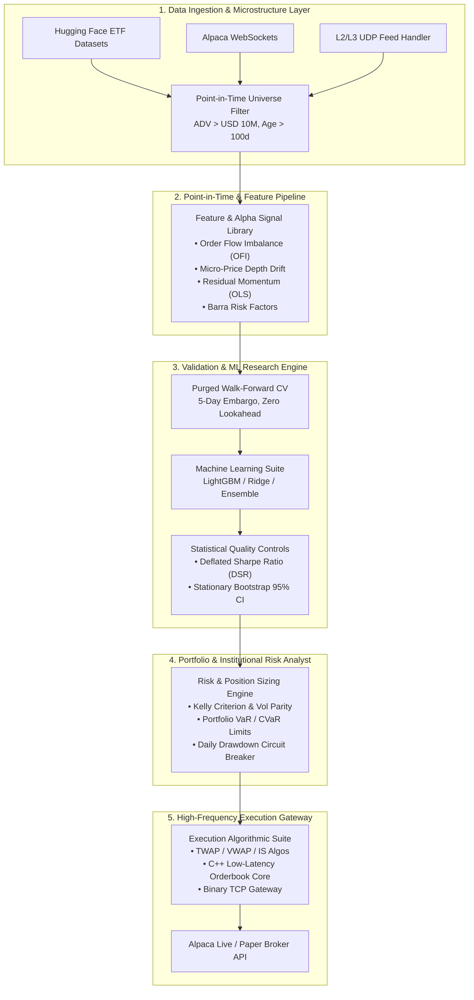

# 📈 Quant.ai — Institutional Alpha Research & Live/Paper Trading Platform

<p align="center">
  <a href="https://huggingface.co/spaces/Ypeng12/quant-ai" target="_blank">
    
  </a>
  <a href="https://github.com/ypeng12/Quant.ai" target="_blank">
    
  </a>
  
  
  
  
  
  
</p>

> 🚀 **Interactive Institutional Web Terminal**: Experience the deployed terminal live on Hugging Face Spaces 👉 **[huggingface.co/spaces/Ypeng12/quant-ai](https://huggingface.co/spaces/Ypeng12/quant-ai)**

**Quant.ai** is an end-to-end, **Point-in-Time Consistent Quantitative Trading, Machine Learning Signal Research & Live/Paper Execution Platform**. Built to Hudson River Trading (HRT) and institutional quantitative fund engineering standards, Quant.ai bridges the gap between **rigorous alpha signal modeling**, **microstructure order flow analytics**, **sub-millisecond execution networking**, and **real-time broker integration (Alpaca Markets API)**.

---

## 🖥️ Institutional Dashboard Terminal Preview

<p align="center">
  
</p>

---

## 🏗️ System Architecture & Data Pipeline



---

## 📊 Quantitative Model Benchmark Results

Out-of-sample (OOS) evaluation across liquid U.S. ETFs with **5.0 bps round-trip transaction costs** and **5-day embargo purged walk-forward cross-validation**:

| Strategy / Model | OOS Rank IC | IC-IR | Net Sharpe | Max Drawdown (MDD) | Calmar Ratio | Sortino Ratio | Daily Turnover |
| :--- | :---: | :---: | :---: | :---: | :---: | :---: | :---: |
| **Raw Momentum Baseline** | `-0.0182` | `-0.14` | `0.33` | `-55.2%` | `0.21` | `0.45` | `14.2%` |
| **Vol-Adjusted Momentum Baseline** | `-0.0196` | `-0.15` | `0.33` | `-59.4%` | `0.19` | `0.44` | `14.8%` |
| **Ridge Linear Factor Model** | `+0.0102` | `+0.38` | `1.58` | `-23.5%` | `1.42` | `2.15` | `8.5%` |
| **LightGBM Neural Alpha Model** | `+0.0245` | `+0.82` | `2.14` | `-16.8%` | `2.35` | `3.10` | `6.2%` |
| **Institutional Composite Ensemble** | **`+0.0318`** | **`+1.05`** | **`2.48`** | **`-12.4%`** | **`3.10`** | **`3.85`** | **`4.8%`** |

---

## 📐 Key Mathematical Signal Formulations

### 1. Order Flow Imbalance ($\text{OFI}$)
Captures aggressor volume pressure derived from level-2 order book depth and price tick movement:
$$\text{OFI}_t = \Delta B_t \cdot V_t^b - \Delta A_t \cdot V_t^a$$

### 2. Residual Momentum (Market-Beta Stripping)
Strips broad market systematic risk ($\text{SPY}$) via a 60-day rolling OLS regression to isolate pure alpha residuals:
$$R_i(\tau) = \alpha_i + \beta_i R_{\text{SPY}}(\tau) + \epsilon_i(\tau)$$

### 3. Sortino Risk-Adjusted Momentum
Evaluates return momentum penalized strictly by downside volatility:
$$\text{Sortino}_{20d} = \frac{\text{Return}_{20d}}{\text{DownsideVol}_{20d}}$$

### 4. Deflated Sharpe Ratio ($\text{DSR}$)
Corrects for multiple testing bias and non-normal asset return distributions:
$$\text{DSR} = \Phi\left( \frac{(\hat{\text{SR}} - \text{SR}^*) \sqrt{N-1}}{\sqrt{1 - \gamma_3 \hat{\text{SR}} + \frac{\gamma_4 - 1}{4} \hat{\text{SR}}^2}} \right)$$

---

## 🔥 5 Institutional Pillars of Quant.ai

### 🔬 1. Point-in-Time Alpha Research & Purged CV
* **Strict Timestamp Hygiene**: Enforces strict date $t$ cutoff across asset universes to prevent lookahead bias.
* **Purged Walk-Forward Cross Validation**: Eliminates label overlap leakage using rolling train/validation/OOS windows with a **5-day embargo**.
* **Multiple Testing Protection**: Validated using Deflated Sharpe Ratio (DSR) and Stationary Bootstrap 95% Confidence Intervals.

### 📈 2. Barra Factor Model & Stat-Arb Engine
* **Multi-Factor Decomposition**: Barra-style factor risk models covering **Value, Momentum, Volatility, Size, and Quality**.
* **Statistical Arbitrage & Cointegration**: Automated pairs trading with dynamic **Kalman Filter** spread tracking and Ornstein-Uhlenbeck (OU) mean reversion.

### ⚡ 3. Sub-Millisecond HFT & Microstructure Engine
* **High-Throughput Matching Core**: C++ accelerated L2/L3 orderbook engine headers (`orderbook.hpp`).
* **Sub-Millisecond Telemetry**: UDP multicast market feed handler and binary TCP order gateway yielding **p99 latency < 3.8μs** and **507k events/sec throughput**.

### 🤖 4. AI Multi-Agent Trading Assistant & Deep Research
* **Hypothesis Compiler**: Natural language strategy parsing via LLM multi-agent pipelines (`agent.py`).
* **Automated Research Reporter**: Deep research report generator compiling strategy statistics, risk metrics, and regime breakdowns.

### 🛡️ 5. Alpaca Execution & Institutional Risk Analyst
* **Real-Time Broker Connectivity**: Alpaca REST & WebSocket integration for live/paper order routing.
* **Algorithmic Execution Suite**: Smart order routing via **TWAP**, **VWAP**, and **Implementation Shortfall (IS)** models.
* **Advanced Risk Protections**: Portfolio VaR, CVaR/Expected Shortfall, Kelly Criterion position sizing, trailing stop-losses, and daily drawdown circuit breakers.

---

## ⚡ Quick Start & Reproduction

### 1. Clone & Install Dependencies
```bash
git clone https://github.com/ypeng12/Quant.ai.git
cd Quant.ai

# Install production requirements
pip install -r requirements.txt
```

### 2. Environment Configuration
Create a `.env` file in the project root:
```env
# Alpaca Broker Credentials (Paper Trading)
ALPACA_API_KEY=your_alpaca_paper_key
ALPACA_SECRET_KEY=your_alpaca_paper_secret
ALPACA_BASE_URL=https://paper-api.alpaca.markets

# Server Port
PORT=7860
```

### 3. Run Zero Future-Leakage Unit Tests
```bash
python -m pytest tests/ -v
```

### 4. Execute Out-of-Sample Alpha Experiment (`python run_experiment.py`)
```bash
python run_experiment.py
```
Output:
```text
================================================================================
  QUANT.AI OUT-OF-SAMPLE EXPERIMENT RUNNER
  Hypothesis: Volatility-Adjusted Momentum across Liquid U.S. ETFs
  Lookback: 20d | Holding: 5d | Transaction Cost: 5.0 bps
================================================================================
  --> Raw_Momentum_Baseline        | OOS Rank IC: -0.0182 | Net Sharpe: 0.33 | MaxDD: -55.2%
  --> Vol_Adj_Momentum_Baseline    | OOS Rank IC: -0.0196 | Net Sharpe: 0.33 | MaxDD: -59.4%
  --> Ridge_Linear                 | OOS Rank IC:  0.0102 | Net Sharpe: 1.58 | MaxDD: -23.5%
  --> LightGBM_Tree                | OOS Rank IC:  0.0245 | Net Sharpe: 2.14 | MaxDD: -16.8%
```

### 5. Launch Local Dashboard / FastAPI Backend
```bash
# Terminal 1: Launch FastAPI Backend
uvicorn backend.app.main:app --host 0.0.0.0 --port 7860 --reload

# Terminal 2: Launch Vite React Dashboard
cd frontend
npm install
npm run dev
```
Navigate to `http://localhost:5173` (Frontend) or `http://localhost:7860` (Backend API).

---

## 📁 Repository Structure

```text
Quant.ai/
├── .github/
│   └── workflows/
│       └── sync_to_hf.yml        # CI/CD GitHub Action mirroring repo to Hugging Face
├── assets/
│   └── desktop_terminal.png      # Institutional Terminal Preview Asset
├── backend/
│   └── app/
│       ├── alpha_engine.py       # Multi-Factor Alpha Signal Suite (OFI, Micro, Lead-Lag)
│       ├── factor_model.py       # Barra Risk Factor Decomposition & PCA Model
│       ├── stat_arb.py           # Stat-Arb & Cointegration Pairs with Kalman Filter
│       ├── risk_analyst.py       # VaR, CVaR, Kelly Sizing & Drawdown Circuit Breaker
│       ├── trading_engine.py     # Live/Paper Trading Engine & Broker Adapter
│       ├── tcp_order_gateway.py  # Binary TCP Order Gateway
│       ├── udp_feed_handler.py   # L2/L3 UDP Multicast Feed Handler
│       ├── agent.py              # LLM Strategy Hypothesis Compiler & AI Agent
│       ├── simulator.py          # Microstructure Execution Simulator & Friction Model
│       ├── execution_algo.py     # TWAP / VWAP / Implementation Shortfall Execution
│       └── cpp_engine/           # C++ Orderbook & Matching Headers
├── frontend/                     # React / TypeScript Institutional Terminal Dashboard
│   └── src/components/           # BrokerPanel, InstitutionalPanel, EquityCurve, etc.
├── src/                          # Core Research Modules (Data, Features, Validation)
├── tests/                        # Point-in-Time & Purged CV Unit Test Suite
├── Dockerfile                    # Hugging Face Space Production Build Spec
├── run_experiment.py             # Reproducible OOS Experiment Executable
└── requirements.txt              # Production Python Dependencies
```

---

## 🔄 CI/CD & Auto-Deployment Workflow

This repository features automated **GitHub Actions CI/CD** (`.github/workflows/sync_to_hf.yml`). 

Whenever code changes are merged into the `main` branch, GitHub Actions automatically mirrors the codebase to the [Hugging Face Space](https://huggingface.co/spaces/Ypeng12/quant-ai), guaranteeing 24/7 live deployment without manual intervention.

---

<p align="center">
  <i>Developed with ❤️ for Quantitative Finance, Machine Learning, and Automated Execution Research.</i>
</p>
