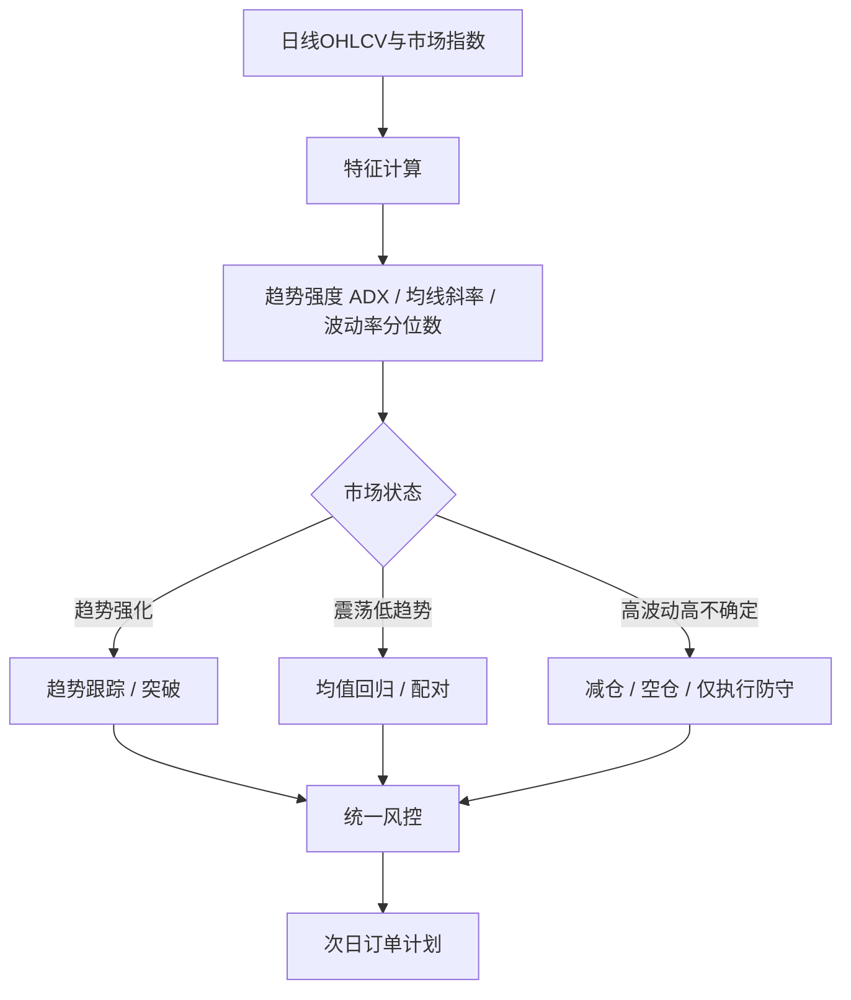
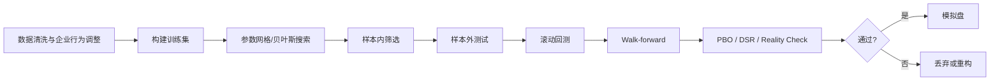

# 日线为主的全自动炒股软件开发分析报告

## 执行摘要

你的目标是做一套“以日线为主、手工式交易风格、但完全自动执行”的股票交易系统，并把目标表达为**长期平均每天净赚 500 美元**。从系统工程角度看，这个目标可以被拆成三个问题：一是是否存在**长期正期望**；二是资金规模能否把这个期望放大到 500 美元/日；三是系统是否能在**回测—模拟盘—实盘**迁移过程中不被交易成本、执行偏差、制度约束和过拟合吞噬。学术和工程证据都支持“趋势、动量、短期反转、配对/相对价值”这些策略族在特定市场与样本下曾经有效，但也同时显示，参数搜索、样本内挑选和数据窥探会显著放大虚假优势，因此回测与上线治理和策略本身同等重要。citeturn12search8turn12search5turn12search6turn14search0turn13search3turn15search0turn15search1

如果把“平均每天净赚 500 美元”近似成“每年净赚 12.5 万美元”，那么**资金规模**几乎决定了目标的现实性。按近似计算，本金 5 万美元对应约 250% 年化净收益目标，本金 10 万美元对应约 125%，本金 25 万美元对应约 50%，本金 50 万美元对应约 25%，本金 100 万美元对应约 12.5%。前两档对日线股票系统通常过于激进；25 万美元以上仍然困难，但开始进入“可以通过多策略、严格风控、稳定执行去争取”的区间；50 万到 100 万美元更符合“日线主导、低频执行、追求稳健”的现实路径。这个结论不代表保证收益，而是提醒你：**目标收益最终必须和本金、容忍回撤、杠杆、交易品种与可做空能力一起设计**。

本报告的核心结论有四条。第一，**K 线形态不要直接当“神谕”**，应当把 K 线拆解为可度量特征，例如实体占比、上下影线、缺口、趋势上下文、量能确认，再与指标和风险规则组合使用。第二，针对“日线为主”的软件，最值得优先编码的不是几十个花式模型，而是三组主策略：**趋势/突破、低 ADX 环境下的均值回归、以及带市场过滤的波段/动量**。第三，任何参数建议都只能作为**起始网格**，不能把“历史最优点”直接上线；你必须做样本外检验、滚动回测、Walk-forward、PBO/DSR 检测和成本压力测试。第四，实盘成功与否，往往不是因为指标公式，反而是因为**数据口径、除权复权、交易日历、回报对账、异常告警、回滚机制和合规边界**是否处理完整。citeturn15search0turn15search1turn15search18turn30search4turn21view1

从开发优先级看，我建议你按以下顺序落地：先做**单市场、单币种、单边做多**版本；先上**一到两个可解释策略**，而不是“全家桶”；先做**严格风控与回测框架**，再堆叠指标；最后再扩到配对交易、指数对冲和日内/日线混合执行。对于股票现货，制度差异也非常关键：A 股普通股票存在“买入证券在交收前不得卖出，除非属于当日回转交易品种”的约束，而上交所、深交所又对程序化交易设有报告和管理规则；美股则有 9:30–16:00 ET 常规交易时段、保证金和日内保证金要求、税务申报和数据订阅限制。你的架构必须从一开始就把这些差异做成**市场适配层**，而不是写死在策略内部。citeturn43search5turn25view1turn19view10turn41search2turn41search4turn16search0

## 关键目标与约束

下表把你已经明确和“未指定”的项目，转成开发规格。

| 项目 | 当前状态 | 工程含义 |
|---|---|---|
| 目标收益 | 平均每天净赚 500 美元 | 必须把目标分解为：日均净值增长目标、最大可接受回撤、所需资金规模、策略容量 |
| 风险容忍度 | 未指定 | 不能直接给仓位上限；默认应从保守值开始，例如单笔风险 0.25%–0.75% 权益 |
| 交易品种 | 未指定 | 代码必须做市场抽象层：A 股/美股/ETF/指数 ETF/可转债/港股各自交易规则不同 |
| 资金规模 | 未指定 | 决定目标收益可行性，也决定是否需要杠杆、是否需要多策略并行 |
| 是否允许杠杆 | 未指定 | 必须把杠杆开关、融资利率、保证金规则、强平逻辑写成配置项 |
| 交易时段 | 日线为主 | 信号主周期建议为日线；下单可选择收盘、次日开盘、次日 VWAP、条件单或分批执行 |

如果你做的是**A 股普通股票**，上交所现行规则明确，投资者买入的证券在交收前不得卖出，但实行当日回转交易的品种除外；上交所现行竞价交易时段为 9:15–9:25 开盘集合竞价，9:30–11:30 与 13:00–14:57 连续竞价，14:57–15:00 收盘集合竞价。若采用程序化交易，交易所的程序化交易管理实施细则已于 2025 年生效，且深交所规则明确把**个人投资者**也纳入程序化交易投资者范围，首次进行程序化交易前须履行报告义务。citeturn43search5turn18search3turn25view1turn24search2

如果你做的是**美股**，纳斯达克常规交易时段为周一至周五 9:30–16:00 ET；保证金方面，FINRA 概览页说明 Reg T 一般允许客户借入新开仓股票买入价的 50%，而自 2026 年 6 月 4 日起，FINRA Rule 4210 已切换到新的**日内保证金**框架，日内保证金要求取代了旧的 PDT 规则逻辑。也就是说，美股若允许杠杆，你必须把保证金检查和经纪商风控回报实时纳入系统，而不是只在日终核算。citeturn19view10turn41search2turn41search4turn41search7

基于这些约束，建议你的第一版系统采用下面这种“最小可行交易域”：

| 维度 | 第一版建议 |
|---|---|
| 市场 | 先二选一：A 股或美股，不建议首版跨市场 |
| 标的池 | 先做流动性较好的 50–300 只股票或 ETF 白名单 |
| 方向 | 先做单边长仓；若做空，再单独加借券/融券层 |
| 周期 | 信号用日线；执行可选次日开盘/限价/VWAP |
| 持有期 | 2–40 个交易日的波段化持有，避免一开始就做超长趋势或高频 |
| 策略数 | 先 1–2 个主策略 + 1 个统一风控引擎 |
| 回测口径 | 默认使用复权收盘生成信号、原始价执行、成本单独建模 |

## K线形态与技术指标

### K线应先被拆成特征，而不是先背名字

行业里常见的 K 线“形态名词库”非常庞大。TA-Lib 的 Pattern Recognition Functions 本身就列出了大批模式识别接口，包括 Doji、Hammer、Engulfing、Morning Star、Evening Star、Three White Soldiers、Three Black Crows、Tasuki Gap、Rising/Falling Three Methods 等几十类模式。工程上最稳妥的做法，不是先追求“全叫得出名字”，而是先把 K 线拆成**稳定、可复用、可组合**的数值特征，再在此基础上构建形态检测器。citeturn32view0turn31view1turn31view3

建议你先统一定义一组基础特征：

| 特征名 | 定义 | 作用 |
|---|---|---|
| `range` | `high - low` | 当日波动区间 |
| `body` | `abs(close - open)` | 实体大小 |
| `body_ratio` | `body / max(range, eps)` | 强弱实体占比 |
| `upper_shadow` | `high - max(open, close)` | 上影线 |
| `lower_shadow` | `min(open, close) - low` | 下影线 |
| `upper_ratio` | `upper_shadow / max(body, eps)` | 上影线相对实体比例 |
| `lower_ratio` | `lower_shadow / max(body, eps)` | 下影线相对实体比例 |
| `gap_up` | `low > prev_high` | 向上缺口 |
| `gap_down` | `high < prev_low` | 向下缺口 |
| `trend_up_ctx` | `ema20 > ema50 and slope(ema20,5)>0` | 上升趋势上下文 |
| `trend_down_ctx` | `ema20 < ema50 and slope(ema20,5)<0` | 下降趋势上下文 |
| `rv` | `volume / sma(volume,20)` | 量能确认 |

一个可以直接移植的基础工具层伪代码如下：

```pseudo
function candle_features(bar, prev_bar, ema20, ema50, vol_ma20):
    range = max(bar.high - bar.low, EPS)
    body = abs(bar.close - bar.open)
    upper_shadow = bar.high - max(bar.open, bar.close)
    lower_shadow = min(bar.open, bar.close) - bar.low

    return {
        bull: bar.close > bar.open,
        bear: bar.close < bar.open,
        range: range,
        body: body,
        body_ratio: body / range,
        upper_ratio: upper_shadow / max(body, EPS),
        lower_ratio: lower_shadow / max(body, EPS),
        gap_up: bar.low > prev_bar.high,
        gap_down: bar.high < prev_bar.low,
        rv: bar.volume / max(vol_ma20, EPS),
        trend_up_ctx: ema20 > ema50 and slope(ema20, 5) > 0,
        trend_down_ctx: ema20 < ema50 and slope(ema20, 5) < 0
    }
```

### 常见日线 K 线形态与量化判定

下表覆盖了**最值得先编码**的主流日线形态。阈值不是唯一标准，而是为了便于落地为代码；你之后可以把这些阈值做成配置项，配合 Walk-forward 优化，而不是硬编码成“真理”。

| 形态 | 心理学含义 | 建议量化判定 |
|---|---|---|
| 长阳线 | 买方全天主导，趋势延续概率上升 | `bull and body_ratio >= 0.6 and upper_ratio <= 0.3 and lower_ratio <= 0.3` |
| 长阴线 | 卖方全天主导，弱势延续概率上升 | `bear and body_ratio >= 0.6 and upper_ratio <= 0.3 and lower_ratio <= 0.3` |
| 十字星 Doji | 多空犹豫，拐点或中继，需结合上下文 | `body_ratio <= 0.1` |
| 锤头 Hammer | 下探后被强力拉回，常见于下跌末端 | `lower_ratio >= 2.0 and upper_ratio <= 0.5 and body_ratio <= 0.35 and trend_down_ctx` |
| 上吊线 Hanging Man | 上涨后的“锤头”，常是风险预警 | 同锤头，但要求 `trend_up_ctx` |
| 倒锤头 Inverted Hammer | 下跌后试探反攻 | `upper_ratio >= 2.0 and lower_ratio <= 0.5 and body_ratio <= 0.35 and trend_down_ctx` |
| 射击之星 Shooting Star | 上涨后冲高回落，卖压出现 | 与倒锤相同，但要求 `trend_up_ctx` |
| 光头光脚 Marubozu | 极强单边推进 | `body_ratio >= 0.8 and upper_ratio <= 0.1 and lower_ratio <= 0.1` |
| 纺锤线 Spinning Top | 有波动但收盘拉回中性，方向不明 | `0.1 < body_ratio < 0.35 and upper_ratio > 0.5 and lower_ratio > 0.5` |
| 看涨吞没 Engulfing | 强反包，常见于反转起点 | 前一根为阴线，后一根为阳线，且 `curr.open <= prev.close and curr.close >= prev.open` |
| 看跌吞没 Engulfing | 强反包下压 | 前一根为阳线，后一根为阴线，且 `curr.open >= prev.close and curr.close <= prev.open` |
| 刺透 Piercing | 下跌后强力回补，偏反转 | 前阴后阳；后一根收盘进入前阴实体 50% 以上但未完全吞没 |
| 乌云盖顶 Dark Cloud Cover | 上涨后被打回，偏反转 | 前阳后阴；后一根收盘跌入前阳实体 50% 以上 |
| 孕线 Harami | 波动收缩，方向待确认 | 当前实体完全落在前一根实体内部 |
| 启明星 Morning Star | 三日见底结构 | 大阴 + 小实体犹豫 + 大阳并收回第一根实体至少 50% |
| 黄昏星 Evening Star | 三日见顶结构 | 大阳 + 小实体犹豫 + 大阴并跌回第一根实体至少 50% |
| 红三兵 | 多头连续推进，趋势强化 | 连续三根阳线，收盘逐步抬高，回撤小 |
| 三只乌鸦 | 空头连续推进，趋势恶化 | 连续三根阴线，收盘逐步下移，反抽小 |
| 上升三法 / 下降三法 | 强趋势中的整理后延续 | 外层长实体 + 中间若干逆向小实体 + 最后一根顺势突破 |
| 缺口突破/竭尽缺口 | 价格重定价，需配量能与上下文 | `gap_up` 或 `gap_down`，并要求 `rv >= 1.5` 与趋势上下文一致 |

这些模式都能直接映射到 TA-Lib 已公开的模式接口命名，例如 `CDLDOJI`、`CDLHAMMER`、`CDLENGULFING`、`CDLMORNINGSTAR`、`CDLEVENINGSTAR`、`CDL3WHITESOLDIERS`、`CDL3BLACKCROWS`、`CDLRISEFALL3METHODS`、`CDLTASUKIGAP` 等；如果你希望最大覆盖，可以把“本报告阈值版模式检测器”与“TA-Lib 整数输出版模式检测器”并行实现，前者便于自定义，后者便于做基准对照。citeturn32view0turn31view1turn31view2turn31view3

下面给出几个最常用的可编码伪代码模板：

```pseudo
function is_hammer(f):
    return f.lower_ratio >= 2.0
       and f.upper_ratio <= 0.5
       and f.body_ratio <= 0.35
       and f.trend_down_ctx

function bullish_engulfing(prev, curr):
    return prev.close < prev.open
       and curr.close > curr.open
       and curr.open <= prev.close
       and curr.close >= prev.open

function morning_star(b1, b2, b3):
    first_big_down = b1.close < b1.open and abs(b1.close-b1.open)/(b1.high-b1.low) >= 0.6
    second_small = abs(b2.close-b2.open)/(b2.high-b2.low) <= 0.25
    third_big_up = b3.close > b3.open and abs(b3.close-b3.open)/(b3.high-b3.low) >= 0.6
    reclaim = b3.close >= b1.open - 0.5 * abs(b1.open - b1.close)
    return first_big_down and second_small and third_big_up and reclaim
```

### 主流技术指标、公式、信号与参数建议

SMA、EMA、MACD、RSI、布林带、ADX、ATR、OBV 这些“老指标”之所以还常用，不是因为它们神奇，而是因为它们分别从**趋势、动量、波动率、方向强度和量价确认**这几个维度提供了稳定特征。Sierra Chart 的官方技术指标参考给出了 SMA、EMA、MACD、RSI、Bollinger Bands、ADX、ATR、OBV 等公式；其中 SMA 为区间均值，EMA 使用 \(2/(n+1)\) 平滑因子，MACD 是快慢 EMA 差，RSI 基于涨跌均值比，布林带是均线加减标准差，ADX 由 DMI/DI 推导，ATR 来自 True Range 的均值，OBV 则是按涨跌方向累加/扣减成交量。citeturn40view0turn39view0turn19view2turn34view2turn33view1turn35view2turn36view0turn37search7turn38view1

| 指标 | 核心公式/特征 | 典型信号 | 日线起始参数建议 | 简洁伪代码 |
|---|---|---|---|---|
| SMA | 区间均值；更平滑，滞后更大 | 短均线上穿长均线；均线斜率转正 | `10/20/50/100/200` | `sma[t]=mean(close[t-n+1:t])` |
| EMA | 对近期更敏感；平滑因子 `2/(n+1)` | 适合做趋势状态与动态支撑阻力 | `9/20/50/100` | `ema[t]=a*close[t]+(1-a)*ema[t-1]` |
| MACD | `EMA_fast - EMA_slow`，再求信号线 | 金叉/死叉、零轴上方/下方、柱体扩张 | `12,26,9` 起步；优化网格可测 `8–15,20–35,5–12` | `macd=ema12-ema26; sig=ema(macd,9)` |
| RSI | 涨跌幅相对强度，0–100 区间 | 超卖/超买、50 中轴、背离 | 经典 `14`；短反转可试 `2/3/5`，趋势可试 `14/21` | `rsi=100-100/(1+avg_up/avg_down)` |
| 布林带 | `SMA ± k*std` | 触下轨反弹、挤压后突破、中轨回归 | `20,2` 起步；可测 `10/20/30` 与 `1.5/2/2.5` | `mid=sma20; up=mid+k*std20; dn=mid-k*std20` |
| ATR | True Range 的均值，衡量波动 | 止损距离、仓位缩放、过滤低波动假突破 | `14` 常用；止损乘数 `1.5–3.0` | `atr=sma(tr,14)` |
| ADX + DI | 趋势强度而非方向 | `ADX>20/25` 认为趋势环境增强；`+DI/-DI` 给方向 | `14` 常用 | `adx=wwma(dx,14)` |
| OBV | 上涨日加量、下跌日减量 | 量价背离、突破确认 | `OBV` 配合 `OBV_MA(10/20)` | `obv += vol if close>prev_close else -vol` |
| Donchian | N 日最高/最低通道 | 趋势突破、海龟系统 | `20/55` 常用 | `upper=max(high,n); lower=min(low,n)` |
| Keltner | EMA 中轨 ± ATR 通道 | 与布林挤压组合看波动释放 | `20 EMA, 2 ATR` | `up=ema20 + 2*atr20` |
| ROC / Momentum | 过去 N 日涨幅 | 动量排序、过滤弱票 | `20/60/120/252` | `roc=close/close[-n]-1` |
| 相对量能 RVOL | 当前量/均量 | 突破确认、假信号过滤 | `vol / SMA(vol,20)` | `rv=vol/sma(vol,20)` |

下面给出一组建议直接落地的指标函数模板：

```pseudo
function sma(series, n): return rolling_mean(series, n)

function ema(series, n):
    a = 2.0 / (n + 1.0)
    ema[0] = series[0]
    for t in 1..len(series)-1:
        ema[t] = a * series[t] + (1 - a) * ema[t-1]
    return ema

function macd(close, fast=12, slow=26, sig=9):
    fast_line = ema(close, fast)
    slow_line = ema(close, slow)
    macd_line = fast_line - slow_line
    signal = ema(macd_line, sig)
    hist = macd_line - signal
    return macd_line, signal, hist

function rsi(close, n=14):
    up = max(close[t]-close[t-1], 0)
    dn = max(close[t-1]-close[t], 0)
    rs = ma(up, n) / max(ma(dn, n), EPS)
    return 100 - 100 / (1 + rs)

function atr(high, low, close, n=14):
    tr = max(high-low, abs(high-prev_close), abs(low-prev_close))
    return ma(tr, n)

function adx(high, low, close, n=14):
    +dm = max(high-prev_high, 0) if high-prev_high > prev_low-low else 0
    -dm = max(prev_low-low, 0) if prev_low-low > high-prev_high else 0
    tr = ...
    +di = 100 * wilder_sum(+dm,n) / max(wilder_sum(tr,n), EPS)
    -di = 100 * wilder_sum(-dm,n) / max(wilder_sum(tr,n), EPS)
    dx = 100 * abs(+di - -di) / max(+di + -di, EPS)
    adx = wilder_ma(dx, n)
    return +di, -di, adx
```

参数优化时，不要直接寻找“历史收益最高”的点，而要看**稳定区**。一个参数组合如果在 12/26/9、10/24/8、14/30/10 一片区域里都差不多有效，可信度远高于某个孤立尖峰。PBO 和 DSR 文献正是为了解决“你是不是只是把参数拟合到了噪声上”这个问题。citeturn15search0turn15search1

## 量化策略清单

### 先做“市场状态识别”，再选择策略

对日线系统而言，最常见的错误不是策略太少，而是**在错误的市场状态使用了错误的策略**。趋势策略怕震荡；均值回归怕单边；突破策略怕低流动和假信号；配对交易怕协整关系失效。因此建议你先实现一个**Regime Router**，把市场粗分为趋势、震荡、极端波动/风控收缩三类，再决定启用哪个子策略。



趋势跟踪、时间序列动量和简单均线过滤在长期跨市场研究中显示出可持续性；横截面动量在股票市场的 3–12 个月区间也有长期文献支持；短期反转和配对交易同样有经典研究基础。下面的胜率、回撤区间并不是“官方数字”，而是基于这些文献揭示的收益形态与实盘工程经验做的**保守推断**，目的是给你提供代码参数的起点，而不是给出保证。citeturn12search8turn12search5turn12search6turn14search0turn13search1turn13search3

| 策略族 | 核心逻辑 | 入场规则 | 出场/止损/止盈 | 适用市场 | 优点 | 缺点 | 经验胜率/回撤区间 |
|---|---|---|---|---|---|---|---|
| 趋势跟踪 | 顺中期趋势持有，吃大波段 | `EMA20>EMA50>EMA200` 且 `ADX>20`，回踩均线转强或创 20/55 日新高 | 跌破 `EMA20/EMA50`、或 `2–3 ATR` 追踪止损；通常不设固定止盈 | 单边趋势、行业领涨阶段 | 正偏收益，大单盈利能覆盖多次小亏 | 震荡期来回打脸 | 胜率约 35%–50%，组合级 MDD 常见 15%–35% |
| 均值回归 | 偏离均线/布林后向均值回归 | `ADX<18`、`close<BB_lower`、`RSI2<10`，最好配流动性和指数不崩 | 回到中轨/5–10 日均线即走；`1.5 ATR` 止损；加时间止损 | 横盘震荡、恐慌后的短弹 | 胜率较高、持仓时间短 | 容易被单边趋势碾压 | 胜率约 50%–65%，MDD 常见 10%–25% |
| 中期动量 | 买强者，回避弱者 | 标的池按 60/120/252 日收益排序，只买高排名且站上长均线者 | 跌出排名、跌破长均线、或转弱止盈 | 板块轮动、抱团行情 | 容易做成选股器 | 轮动突变时回撤快 | 胜率约 40%–55%，MDD 常见 15%–30% |
| 突破策略 | 价格脱离箱体，量能放大 | `close > donchian_high(20/55)` 且 `RVOL>1.5`，可配 `ADX` | 假突破回落、跌破短通道、`2 ATR` 止损 | 波动收缩后释放、业绩/事件驱动 | 简单、可解释、易自动化 | 假突破多 | 胜率约 35%–50%，MDD 常见 12%–30% |
| 指数对冲波段 | 个股 alpha + 指数 beta 对冲 | 多头信号成立，同时按 beta 对冲股指/ETF | 多头失效或 beta 变化时同步平仓 | 大盘高波动、又想压系统回撤 | 回撤更可控 | 执行复杂，需更强数据 | 胜率约 45%–60%，MDD 常见 8%–20% |
| 配对交易 | 价差偏离后收敛 | 先做相关/协整筛选，再在 spread z-score 超阈值时反向开仓 | `z=0` 附近回补；`|z|` 继续扩大即止损 | 同行业、高相关、相对价值行情 | 市场方向依赖低 | 关系失效时很伤 | 胜率约 50%–65%，MDD 常见 8%–20% |
| 波段交易 | 趋势中做回撤，震荡中做边界 | 上升趋势里等回踩 `EMA20 + RSI回落`；下降趋势镜像做空或回避 | 回到前高/通道中上轨止盈；破结构点止损 | 日线主导、手工风格最像 | 解释性强，适合“人工风格自动化” | 规则边界多，易主观化 | 胜率约 45%–60%，MDD 常见 10%–25% |
| 日内/日线混合 | 日线定方向，日内优化执行 | EOD 生成交易计划；次日开盘、VWAP、分时量能确认后执行 | 以日线失效为主，日内只做执行停损 | 股票容量较大、想降低冲击成本 | 能改善成交均价 | 系统复杂度上升 | 胜率取决于母策略，MDD 通常略低于裸日线执行 |

下面给出每个策略都能直接复用的一套“统一信号骨架”。你只需要替换 `entry_condition`、`exit_condition` 和 `regime_filter`。

```pseudo
function run_strategy(bar, features, state, cfg):
    if state.kill_switch:
        return NO_ACTION

    if not position_exists(bar.symbol):
        if regime_filter(features, cfg)
           and entry_condition(features, cfg)
           and liquidity_filter(features, cfg)
           and market_filter(features.market, cfg):
            stop_price = compute_initial_stop(bar, features, cfg)
            qty = size_by_risk(account, bar.close, stop_price, cfg)
            return BUY(qty, bar.symbol, stop_price)
    else:
        if exit_condition(features, cfg) or hard_stop_hit(bar, position):
            return SELL_ALL(bar.symbol)
        else:
            maybe_trail_stop(position, features, cfg)
    return NO_ACTION
```

再给出适合首版上线的几个具体模板。

```pseudo
# 趋势跟踪
entry = close > donchian_high(55) and ema20 > ema50 and ema50 > ema200 and adx > 20
exit  = close < ema20 or close < donchian_low(20)
stop  = entry_price - 2.5 * ATR(14)

# 均值回归
entry = adx < 18 and close < bb_lower(20,2) and rsi(2) < 10 and rv < 2.5
exit  = close >= bb_mid(20) or rsi(2) > 70
stop  = entry_price - 1.5 * ATR(14)
time_stop = 5 bars

# 波段回踩
entry = ema20 > ema50 and close between ema20 and ema20-1*ATR and rsi(5) rising from < 40
exit  = close >= recent_swing_high or close < ema50
stop  = recent_swing_low - 0.5 * ATR
```

对你这种“人工式风格”的目标，我建议**优先顺序**是：先做“波段回踩 + 趋势突破”的双模块；第二步再加“低 ADX 的均值回归”作为震荡期替补；第三步才上配对和指数对冲。这样更符合日线交易软件的可维护性。

## 风控与资金管理

对自动交易系统来说，**风控不是策略的附属品，而是第一策略**。同样的进场信号，在不同的仓位、相关性约束、撤退机制和成本模型下，最终实盘表现可能天差地别。A 股程序化交易规则要求程序化交易投资者满足可用性、安全性和合规性要求，不得影响系统安全和正常交易秩序；美股若使用保证金，FINRA 和 Reg T 会共同决定初始和日内保证金要求。这意味着你的风控层至少要有三层：**交易前风控、持仓中风控、账户级风控**。citeturn25view1turn41search2turn41search4

### 建议直接写入代码的风控规则

| 风控项 | 建议起始值 | 代码含义 |
|---|---|---|
| 单笔最大风险 | 权益的 `0.25%–0.75%` | 用于根据止损距离反推股数 |
| 单票最大市值占比 | `5%–12%` | 防止单股黑天鹅 |
| 单行业最大敞口 | `20%–30%` | 防止板块同涨同跌放大回撤 |
| 同时持仓数 | `4–12` | 控制组合相关性与复杂度 |
| 组合级最大毛敞口 | 无杠杆先 `<=100%` | 首版尽量不满杠杆 |
| 组合级软回撤阈值 | `6%–8%` | 触发后风险减半 |
| 组合级硬回撤阈值 | `10%–12%` | 停止新开仓，仅允许减仓/平仓 |
| 日内执行损失阈值 | `1R` 或 `1%` 权益 | 若你有日内执行层，达到就停单 |
| 连续亏损熔断 | `5–7` 笔 | 连亏后把风险系数下调 50% |
| 异常波动停机 | 成交异常/数据断流/API 失败 | 立即进入保护模式 |

仓位控制建议至少同时支持以下三种算法。

| 算法 | 公式 | 适用场景 | 风险提示 |
|---|---|---|---|
| 固定比例风险 | `qty = equity * risk_pct / stop_distance` | 首版最推荐 | 简单稳健 |
| 波动率目标 | `weight ∝ 1 / volatility` | 多标的组合 | 需要稳定波动估计 |
| 分数 Kelly | `f = edge / variance` 再乘 `0.25` | 有较成熟胜率/赔率估计时 | 对参数极敏感，不建议满 Kelly |

固定比例风险是最适合首版系统的。它把“你愿意为这笔想法亏多少钱”作为第一原则，而不是“这只票该买多少股”。伪代码如下：

```pseudo
function size_by_risk(account, entry_price, stop_price, cfg):
    risk_dollar = account.equity * cfg.risk_per_trade
    stop_distance = abs(entry_price - stop_price)
    raw_qty = floor(risk_dollar / max(stop_distance, EPS))
    max_qty_by_value = floor(account.equity * cfg.max_position_pct / entry_price)
    qty = min(raw_qty, max_qty_by_value)
    return max(qty, 0)
```

账户级熔断建议写得更硬，而不是留给主观判断：

```pseudo
function account_kill_switch(account, perf, cfg):
    if perf.max_drawdown_from_peak >= cfg.hard_dd:
        return HARD_STOP
    if perf.current_month_drawdown >= cfg.monthly_dd_limit:
        return REDUCE_RISK_50
    if perf.consecutive_losses >= cfg.max_consecutive_losses:
        return REDUCE_RISK_50
    if perf.api_errors >= cfg.api_error_limit or perf.data_stale:
        return PROTECTIVE_MODE
    return NORMAL
```

### 成本、滑点、杠杆与保证金

回测成本必须**比你现在想象的更保守**。IBKR 的官方佣金页显示，美国股票/ETF 的 IBKR Pro Fixed 为每股 0.005 美元、最低每单 1 美元；Tiered 则按月成交量分档，起始可低至每股 0.0035 美元、最低每单 0.35 美元。Alpaca 对部分零售账户提供美股 API 免佣，但官方也明确某些合作安排不一定享受免佣，且仍可能有经纪业务费用或监管费用。工程上应把这些经纪商公告当作**成本下限**，而不是回测成本上限。citeturn28search0turn28search3turn28search1turn28search11

建议你的成本模型这样写：

| 成本项 | 回测建议 |
|---|---|
| 佣金 | `max(固定每单, 每股佣金, 百分比佣金)` 三者择高 |
| 滑点 | 大盘股日线单次 2–5 bps 起步；中小盘 5–20 bps 起步 |
| 跳空风险 | 开盘执行额外加一层“开盘冲击滑点” |
| 税费/监管费 | 写成市场适配模块，按卖出/双边规则配置 |
| 借券费/融资利息 | 若做空或杠杆，必须单独建模 |
| 部分成交 | 低流动性标的禁止“理想一次性全成”假设 |

若做美股杠杆，初始保证金要服从 Reg T 的一般 50% 框架，且 2026 年起日内保证金要求会在盘中监控账户风险；若做 A 股程序化交易，则除了融资融券业务本身，还要额外考虑交易所程序化报告和交易行为边界。也就是说，**杠杆不能只是一个乘数配置**，它必须伴随融资利率、日内/隔夜买入力、强平检查、API 回报风控和合规告警。citeturn41search2turn41search4turn41search7turn25view1

## 回测与参数优化

### 数据要求与样本治理

你需要的不是“能画图的数据”，而是**能经得起实盘审计的数据**。Polygon/Massive 的股票接口提供可按日和自定义周期获取的 OHLC 与成交量数据，并且提供 splits/dividends 端点以支持历史价格调整；IBKR 则提醒，API 的历史数据必须满足实时 Level 1 订阅要求，而且历史数据会过滤某些脱离 NBBO 的成交类型，因此历史成交量与实时/盘口视角可能不一致。QuantConnect 的文档也明确提醒，带有幸存者偏差、历史不足或清洗不充分的数据会导致劣化交易表现。citeturn21view3turn21view2turn30search3turn21view1turn30search4turn30search15

| 数据需求 | 为什么必须有 |
|---|---|
| 原始 OHLCV + 复权价 | 原始价用于执行，复权价用于信号与统计 |
| 拆股/分红/送配事件 | 不处理会扭曲收益、ATR、通道突破、止损距离 |
| 退市/停牌/换代码历史 | 避免幸存者偏差 |
| 交易日历/时区 | 决定日线切片口径与次日执行窗口 |
| 指数/基准数据 | 计算 beta、相对强弱、市场过滤 |
| 成交量与流动性字段 | 防止小票“纸面收益、实盘不成交” |
| 做空与融资可用性 | 若支持空头，这项是硬约束 |
| 点时成分信息 | 若做指数成分轮动，必须 point-in-time |

如果你做中文市场研究，Tushare Pro、RQData、JoinQuant 都是常见工程入口。Tushare 官方文档显示其 `daily` 日线数据在交易日每日 15:00–17:00 之间更新；RQData 官方文档强调它提供整齐的历史数据 API；JoinQuant 的 API 文档则说明当选择天频率时，算法会在每根日线 bar 运行一次。这些平台适合作为研究/原型，但真正上实盘时，仍应以**你实际下单经纪商的行情口径**做最终一致性验证。citeturn22search3turn22search2turn22search11turn22search4turn23search7

### 回测流程与过拟合检测

推荐你把研究流程固定成下面这个管道，而不是每次“手工试参数”。



建议流程如下：

| 阶段 | 建议做法 |
|---|---|
| 初筛 | 用 1–2 个核心参数族，先找有没有正期望的“区域” |
| 样本内/样本外 | 不低于 60/40；更稳妥可用滚动 3 年训练 + 1 年测试 |
| 滚动回测 | 每隔 1–3 个月重训一次，观察参数漂移 |
| Walk-forward | 每个窗口都只把过去数据给模型，不能偷看未来 |
| 过拟合检测 | 计算 PBO、DSR；必要时做 White’s Reality Check |
| 成本压力测试 | 把滑点、佣金、跳空冲击翻倍/三倍 |
| 稳健性测试 | 随机打乱部分交易顺序、随机剔除部分样本、蒙特卡洛重排 |

Bailey 与 López de Prado 的 PBO 论文专门提出了用 CSCV 估计回测过拟合概率；DSR 则用于修正多重测试与非正态收益下的 Sharpe 夸大；Hsu、Hsu 与 Kuan 则用 White’s Reality Check 重新检查技术分析规则在数据窥探校正后的有效性。这三类方法应该出现在你的研究流水线上，而不是只出现在论文笔记里。citeturn15search0turn15search1turn15search18

一个可以直接写入研究引擎的 Walk-forward 伪代码如下：

```pseudo
function walk_forward(data, train_len, test_len, param_grid):
    results = []
    start = 0
    while start + train_len + test_len <= len(data):
        train = data[start : start + train_len]
        test  = data[start + train_len : start + train_len + test_len]

        best_params = select_params(train, param_grid, objective="net_profit_after_cost_and_dd_penalty")
        test_perf = backtest(test, best_params)

        results.append({
            train_start: train.start_date,
            train_end: train.end_date,
            test_start: test.start_date,
            test_end: test.end_date,
            params: best_params,
            perf: test_perf
        })
        start += test_len
    return aggregate(results)
```

### 开源框架与常用工具

不同框架的优势非常不一样。VectorBT 的官方文档强调它完全基于 pandas/NumPy、由 Numba/Rust 加速，适合“在几秒内测试成千上万组策略”；LEAN/QuantConnect 明确定位为研究、回测与实盘一体化的开源引擎；Backtrader 的官方文档强调易用性和策略对象组织；vn.py 提供 CTA 回测、价差交易等模块，适合中文生态；RQAlpha Plus 则明确支持回测、模拟和实盘运行。citeturn20view2turn20view3turn20view0turn19view15turn23search1turn23search5turn23search12

| 框架 | 最适合的用途 | 不足 |
|---|---|---|
| VectorBT | 指标研究、参数穷举、超快回测、策略热力图 | 事件驱动交易细节要自己补很多 |
| Backtrader | 结构清晰、上手快、单策略到组合回测 | 大规模参数搜索不如向量化工具快 |
| LEAN | 研究、回测、优化、实盘一体化；多数据和券商连接 | 学习曲线略陡 |
| vn.py | 中文交易网关生态、CTA/价差/多模块 | 股票生态和券商接入要看具体环境 |
| RQAlpha Plus | 中文量化平台流，回测到模拟/实盘链路顺 | 与平台生态绑定较深 |
| Zipline | 经典教材型回测引擎，有滑点和订单延迟建模 | 当前生态相对弱一些 |

对你这个项目，我建议的组合是：**VectorBT 做参数扫描 + Backtrader 或 LEAN 做事件回测 + 独立风控层 + 独立订单路由器**。如果你确定主战场在中文市场，可以考虑 **RQData/RQAlpha Plus 或 vn.py** 作为主栈候选。

## 实盘部署与代码清单

### 数据源、下单接口与生产架构

在美股公开 API 生态里，Alpaca 与 IBKR 是最实用的两类路线。Alpaca 的 Trading API 文档说明可监控、下单、撤单，并提供唯一订单标识；其 Market Data API 提供实时与历史数据，实时股票流通过 WebSocket 暴露不同 feed，例如 SIP、IEX、delayed SIP 等。IBKR 的 TWS API 文档覆盖了实时与历史行情请求、下单与监控，但其 Market Data Subscriptions 页面明确要求 API 市场数据通常需要 Level 1 订阅、IBKR Pro 账户、最低资金要求与 Market Data API Acknowledgement。对研究数据而言，Massive/Polygon 的 Aggregates 与 Splits/Dividends 端点很适合做历史回测；对中文研究数据，Tushare、RQData、JoinQuant 适合做研究原型。citeturn19view11turn19view12turn19view13turn21view4turn19view14turn21view0turn21view1turn21view2turn21view3turn22search3turn22search2turn22search4


如果你面向 A 股，系统必须额外包含“**程序化交易报告与券商接口适配**”层。深交所规则明确，首次进行程序化交易前应先报告，重大变更也須报告；报告内容还包括资金规模、杠杆来源、最高申报速率、单日最高申报笔数、交易软件名称与开发主体等。换句话说，你的软件本身就可能成为**被监管对象的一部分**，因此版本管理、软件标识、责任人信息和日志留痕都不能是“以后再说”的事情。citeturn25view1

### 需要在代码中直接写入的模块清单

下面这张表，就是建议你直接建立的代码目录与函数接口。

| 模块 | 函数接口示例 | 输入 | 输出 | 关键说明 |
|---|---|---|---|---|
| 数据拉取 | `load_bars(symbols, start, end, timeframe, adjustment)` | 标的、起止时间、周期、复权模式 | `BarFrame[]` | 必须支持原始价与复权价双口径 |
| 企业行为 | `apply_corporate_actions(bars, splits, dividends)` | Bars、拆股、分红 | 调整后 Bars | 信号与执行口径分离 |
| 交易日历 | `get_calendar(market)` | 市场代码 | 交易日序列/会话 | A 股与美股日历不能共用 |
| 特征引擎 | `compute_features(bars, cfg)` | Bars、参数 | `FeatureFrame` | 输出 K 线特征 + 指标 |
| 状态识别 | `classify_regime(features, market_state, cfg)` | 特征、指数/波动 | `RegimeState` | 决定启用哪类策略 |
| 信号引擎 | `generate_signals(features, regime, positions, cfg)` | 特征、状态、持仓 | `Signal[]` | 只负责“想法”，不决定股数 |
| 仓位引擎 | `size_positions(signals, account, risk_cfg)` | 信号、账户、风控 | `OrderIntent[]` | 根据止损距离反推规模 |
| 风控闸门 | `risk_gate(order_intents, account, positions, limits)` | 订单意图、账户、仓位 | 过滤后订单 | 可一票否决任何信号 |
| 订单路由 | `route_orders(order_intents, broker_cfg)` | 订单意图、券商配置 | `BrokerOrder[]` | 适配 Alpaca/IBKR/券商 API |
| 成交模拟 | `simulate_fills(order, bars, cost_cfg)` | 订单、行情、成本 | `Fill[]` | 回测必须独立实现，不可偷懒 |
| 对账模块 | `reconcile(local_positions, broker_positions, fills)` | 本地仓位、券商仓位 | `ReconReport` | 实盘每天必须做 |
| 监控模块 | `monitor(metrics, thresholds)` | PnL、延迟、API 状态 | `Alert[]` | 钉钉/邮件/短信/Telegram |
| 审计日志 | `write_audit_log(event)` | 事件对象 | 日志记录 | 满足回放与合规需要 |
| 回滚模块 | `rollback(strategy_version)` | 策略版本号 | 成功/失败 | 实盘事故的最后保险 |

建议统一的数据对象定义如下：

```pseudo
type Bar = {
    symbol: string,
    ts: datetime,
    open: float,
    high: float,
    low: float,
    close: float,
    volume: float,
    adj_close: float?,
    trade_date: string,
    market: string
}

type Signal = {
    symbol: string,
    side: "BUY" | "SELL" | "SHORT" | "COVER",
    reason: string,
    score: float,
    planned_entry: float,
    initial_stop: float,
    planned_exit: float?,
    strategy_id: string
}

type OrderIntent = {
    symbol: string,
    side: string,
    qty: int,
    order_type: "MKT" | "LMT" | "VWAP" | "MOC",
    tif: string,
    limit_price: float?,
    stop_price: float?,
    client_order_id: string
}
```

### 可直接复用的主流程伪代码

```pseudo
function daily_main(trade_date):
    bars = load_bars(universe, lookback_start(trade_date), trade_date, "1d", adjustment="both")
    features = compute_features(bars, indicator_cfg)
    regime = classify_regime(features, market_state=features.index, cfg=regime_cfg)

    signals = generate_signals(features, regime, positions, strategy_cfg)
    order_intents = size_positions(signals, account, risk_cfg)
    approved_orders = risk_gate(order_intents, account, positions, limits)

    save_trade_plan(trade_date + 1, approved_orders)
    write_audit_log({
        date: trade_date,
        signals: len(signals),
        approved: len(approved_orders),
        account_equity: account.equity
    })
```

如果你做“日线生成信号、次日执行”，则次日开盘前再跑一次执行引擎：

```pseudo
function next_day_execute(trade_date):
    plans = load_trade_plan(trade_date)
    if data_is_stale() or api_is_degraded():
        enter_protective_mode()
        return

    for p in plans:
        live_order = create_broker_order(p, broker_cfg)
        submit_order(live_order)
```

### 示例参数表

这些不是最终参数，而是**首轮上线前的起始配置**。

| 参数键 | 建议初值 | 说明 |
|---|---|---|
| `ema_fast` | `20` | 趋势识别快线 |
| `ema_slow` | `50` | 趋势识别慢线 |
| `ema_filter` | `200` | 长趋势过滤 |
| `adx_len` | `14` | 趋势强度 |
| `adx_trend_th` | `20` | 趋势阈值 |
| `rsi_short_len` | `2` | 短反转 |
| `rsi_short_buy` | `10` | 短反转超卖 |
| `bb_len` | `20` | 布林带长度 |
| `bb_k` | `2.0` | 布林带倍数 |
| `atr_len` | `14` | 波动率 |
| `atr_stop_mult` | `1.5–2.5` | 止损倍数 |
| `donchian_breakout` | `20` 或 `55` | 突破通道 |
| `risk_per_trade` | `0.005` | 单笔风险 0.5% |
| `max_position_pct` | `0.08` | 单票 8% |
| `soft_dd` | `0.07` | 软回撤 7% |
| `hard_dd` | `0.12` | 硬回撤 12% |
| `max_consecutive_losses` | `5` | 连亏熔断 |
| `min_rvol_for_breakout` | `1.5` | 突破量能过滤 |

### 模拟盘到实盘迁移步骤

| 阶段 | 目标 | 放行条件 |
|---|---|---|
| 离线研究 | 找到有稳健性的参数区 | 样本外为正、成本敏感性不过度脆弱 |
| 事件回测 | 验证撮合、滑点、订单状态机 | 成本后仍有边际，回撤在可接受范围内 |
| 模拟盘 | 验证数据口径与订单回报一致性 | 本地仓位与券商仓位对账稳定，报警闭环完整 |
| Shadow Live | 实盘看信号但不真钱下单 | 两周以上“计划单”和真实行情一致 |
| 小资金实盘 | 验证真实成交、跳空和风控 | 1–2 个月无重大执行事故 |
| 扩容 | 从 10% 风险预算放到 100% | 逐级提升，不允许一步到位 |

## 参考来源与合规风险提示

### 推荐优先参考来源

下表按“官方/原始论文/中文权威资料优先”的原则整理了你最值得持续跟踪的来源。由于不能直接贴裸链接，点击引用即可进入原文。

| 类别 | 推荐来源 | 用途 |
|---|---|---|
| 交易所规则 | 上交所交易规则、程序化交易实施细则；深交所程序化交易实施细则与盘后交易规则 citeturn43search5turn18search3turn25view1turn19view9 | 确认交易时段、回转交易限制、程序化报告义务 |
| 美股监管 | FINRA Rule 4210、FINRA Margin Topic、IRS Topic 409 citeturn41search4turn41search2turn41search7turn16search0 | 保证金、日内风险、税务口径 |
| 指标公式 | Sierra Chart Technical Studies Reference；TA-Lib Pattern Recognition citeturn40view0turn39view0turn19view2turn34view2turn33view1turn35view2turn36view0turn38view1turn32view0 | 指标与 K 线模式的公式与标准接口 |
| 学术原始文献 | Moskowitz/Ooi/Pedersen 时间序列动量；Hurst/AQR 趋势跟踪百年证据；Faber 趋势过滤；Jegadeesh/Titman 动量；Gatev 配对交易；Bailey PBO/DSR citeturn12search8turn12search5turn12search6turn14search0turn13search3turn15search0turn15search1 | 评估策略是否有长期研究基础 |
| 回测框架 | LEAN、VectorBT、Backtrader、vn.py、RQAlpha Plus、JoinQuant citeturn20view0turn20view2turn19view15turn23search1turn23search5turn23search12turn23search3 | 研究、回测、模拟盘、实盘框架选择 |
| 数据接口 | Alpaca、IBKR、Massive/Polygon、Tushare、RQData、JoinQuant citeturn19view12turn19view13turn19view11turn21view4turn19view14turn21view0turn21view2turn21view3turn22search3turn22search2turn22search4 | 历史与实时数据、下单与回报 |

### 风险与合规提示

首先是**市场风险**。趋势、动量、反转、配对这些策略即便在长期研究里有效，也都会经历长时间失效、风格切换和深度回撤。你的软件不应追求“每天都赚 500 美元”，而应追求**长期期望值为正、回撤受控、容量可扩展**。这也是为什么本报告一直把目标拆成资金规模、风险预算和策略容量。citeturn12search8turn12search5turn13search3

其次是**模型风险**。回测过拟合、样本内挑选和多重测试偏差会让你高估策略质量。没有样本外、滚动、Walk-forward、PBO 和 DSR 的“漂亮回测”，在统计上往往不够可信。citeturn15search0turn15search1turn15search18

再次是**实现风险**。企业行为处理错误、幸存者偏差、历史/实时数据口径不一致、订单状态机错误、API 鉴权失效、行情延迟、对账失败，都会让实盘结果和回测完全脱钩。IBKR 官方就明确提醒 API 历史数据有订阅要求且历史成交量与实时数据可能不同；QuantConnect 也明确提醒，数据若存在幸存者偏差或清洗不足，会造成糟糕交易表现。citeturn21view0turn21view1turn30search4turn30search15

最后是**法律、交易所规则与税务风险**。若你做 A 股并自动生成/发送指令，交易所规则已把这类行为纳入程序化交易管理，个人投资者也在范围内，首次交易前和重大变更时应履行报告义务；若你做美股并使用保证金，Reg T 与 FINRA 的日内保证金规则会直接影响你的可用买入力和风控；若有盈利，税务处理必须按所在地税法申报，美国可先从 IRS Topic 409 着手，境内则需结合券商与税务机关最新口径，特殊情形如限售股等另有规则。以上内容属于工程与合规研究，不构成法律、税务或个性化投资建议。citeturn25view1turn41search2turn41search4turn16search0turn16search10