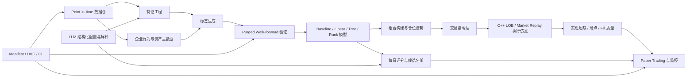
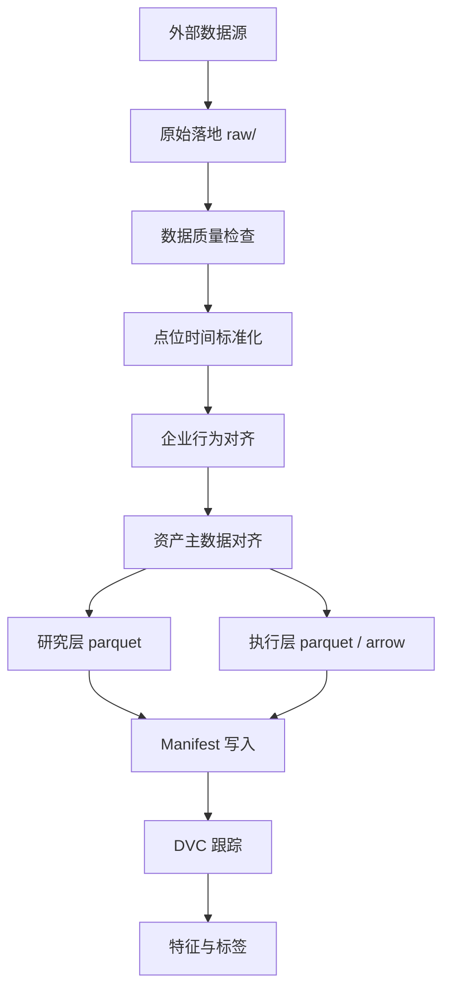

# Quant.ai 的 10/10 HRT 风格 Algorithm Developer 实施蓝图

## 执行摘要

这份方案把 Quant.ai 明确定位为一个**点位时间一致的美股横截面 Alpha 研究与执行仿真平台**，目标不是做“会说股票故事的 AI App”，而是做一套能经得住 HRT 风格追问的研究系统：它要能在**当时可获得的数据**上构造特征，预测**未来 1 日与 5 日的相对收益/排名**，用**purged + embargoed** 的时间序列验证框架做样本外测试，再把目标仓位交给**已有 C++ LOB / market replay 引擎**去估算成交、滑点、实现短缺和回测到实盘的落差。HRT 官方对 Algorithm Developer 的描述，本质上就是“用数学、统计、数据分析和 C++/Python 去构建和改进驱动交易的模型”，并在研究与交易基础设施上迭代；其学生项目页也明确把该岗位定义为对大量市场数据做严谨统计分析并产出预测交易模型。citeturn23search2turn23search3

如果只保留一个核心设计原则，应当是：**研究层用调整后、点位时间一致的数据；执行层用原始 trades/quotes/LOB 与企业行为流单独处理。** Alpaca 的股票 bars 接口支持按 `asof` 日期查询符号，并支持 `raw`、`split`、`dividend`、`spin-off`、`all` 等多种调整方式；其独立 corporate actions 接口也能按时间段取回企业行为。与此同时，Alpaca 明确提示 symbol/CUSIP 可能变化、资产主数据会每日刷新；这些都意味着“今天的股票池”和“历史上当时可见的股票池”不能混为一谈。citeturn8search15turn8search0turn16search19

从工程优先级看，最重要的不是花哨模型，而是**数据真、标签干净、验证严、执行成本可信、实验可复现**。经典研究已经反复说明：动量效应在横截面上长期存在，但金融回测极易因为多重试验、选择偏差、幸存者偏差和时间泄漏而夸大结果；Brown 等关于 survivorship bias 的研究与 Bailey、López de Prado 关于 Deflated Sharpe Ratio 的论文，正是这一风险的典型提醒。对 Quant.ai 来说，最有价值的成果不是“训练出一个很高的 Sharpe”，而是“建立一套能证明 Sharpe 没被高估的流程”。citeturn15view4turn20view1turn14view2

因此，最终推荐的里程碑是：**用 7 周做出一个可复现、可审计、可 paper-trade 的版本**。它的最小可交付结果应包括：一个点位时间数据仓、横截面特征与标签流水线、walk-forward + purge/embargo 验证器、至少四类模型基线、组合与成本模型、与 C++ 执行引擎的联调、每日 paper-trading、Rank IC/校准/漂移监控，以及一条命令可以重跑完整 OOS 实验的工程骨架。Alpaca 的 historical bars / trades / quotes、market calendar、paper trading 与 order/event API，加上 Hugging Face 的可版本化数据加载与 `revision` 固定、DVC 的数据版本控制、GitHub Actions 的 Python CI，已经足够支持这条路线。citeturn8search15turn8search17turn16search6turn11search5turn11search13turn10search0turn9search1turn9search2

下表给出整套系统的实施优先级。

| 模块 | 目标 | 优先级 | 为什么 |
|---|---|---:|---|
| 点位时间数据层 | 解决漏未来、企业行为、股票池漂移、版本固定 | P0 | 数据错，后面全错 |
| 标签与验证 | 保证 OOS 可信，控制过拟合 | P0 | 决定项目是否“研究级” |
| Baseline + 线性/树/排序模型 | 建立逐层可解释的研究阶梯 | P0 | 面试最常追问这里 |
| 组合与成本模型 | 把预测变成可执行收益 | P0 | “能不能赚”不等于“能不能成交” |
| C++ 执行仿真联调 | 区分信号收益与执行收益 | P1 | 这是你区别于普通项目的关键 |
| 监控与 paper trading | 建立 backtest-to-live 反馈闭环 | P1 | HRT 风格项目必须有 |
| LLM 配置与解释层 | 限定在结构化配置与解释，不直接下单 | P2 | 加分项，不应喧宾夺主 |

这套优先级来自 HRT 岗位要求、Alpaca/交易数据接口能力、以及金融机器学习中对验证严谨性的核心要求。citeturn23search3turn8search15turn11search13turn14view2turn2search20

## 项目边界与关键假设

这份方案默认把 Quant.ai 做成**中低频、收盘后生成次日计划、持有 1 到 5 个交易日**的美股研究系统，而不是高频做市系统。这样做的原因很现实：HRT 风格项目强调“预测 + 执行 + 统计严谨性”，但你当前最强的可实现组合，是**日频/分钟级研究 + 分钟到盘口级执行仿真**，而不是直接追逐纳秒级生产撮合。Nasdaq TotalView-ITCH 和 NYSE Integrated Feed 的官方文档都说明，直接交易所 feed 可以提供逐笔/逐订单深度与有序事件流，但那类数据和基础设施成本很高，更适合作为执行层和少量样本日的 replay，而非第一版全量研究数据。citeturn14view0turn14view1

默认假设如下表所示。

| 假设项 | 建议默认值 | 说明 |
|---|---|---|
| 交易对象 | 150–300 只高流动性美股 + 少量行业 ETF | 例如 S&P 100、Nasdaq 100 去重后，再加 SPY/QQQ/XLK/SMH 等 |
| 预测频率 | 每个交易日收盘后 | 以 close\_t 构造特征，next open 执行 |
| 预测目标 | 未来 1 日、5 日相对收益/排名 | 对市场或行业基准做超额收益 |
| 执行起点 | `t+1` 开盘或 `t+1` 首个可交易 bar/mid | 明确引入一天行动滞后 |
| 模型形态 | baseline → 线性/逻辑 → GBDT → 排序模型 | 先简单后复杂 |
| 实盘阶段 | 仅 paper trading + tiny live gate | 第一版不自动大规模实单 |
| LLM 权限 | 生成结构化配置、解释结果、总结失败 | 禁止直接决定实时仓位或绕过风险门 |

这些假设与 HRT 官方对 Algorithm Developer 的描述一致：岗位本质是建立和维护交易模型，依托统计与技术能力，而不是做零售投顾式聊天机器人。citeturn23search3turn23search2

系统总架构建议如下。


```mermaid
flowchart LR
    A[Point-in-time 数据仓] --> B[特征工程]
    A --> C[企业行为与资产主数据]
    B --> D[标签生成]
    C --> D
    D --> E[Purged Walk-forward 验证]
    E --> F[Baseline / Linear / Tree / Rank 模型]
    F --> G[组合构建与仓位控制]
    G --> H[交易指令层]
    H --> I[C++ LOB / Market Replay 执行仿真]
    I --> J[实现短缺 / 滑点 / Fill 质量]
    F --> K[每日评分与候选名单]
    J --> L[Paper Trading 与监控]
    K --> L
    M[LLM 结构化配置与解释] --> B
    M --> K
    N[Manifest / DVC / CI] --> A
    N --> E
    N --> L
```

这张图的关键含义是：**研究、组合、执行、监控四层必须分离，但 manifest/版本系统要贯穿全链路**。DVC 官方文档明确把数据和模型版本绑定到 Git 工作流中；Hugging Face `load_dataset` 的 `revision` 则允许把外部数据依赖固定到 tag、branch 或 commit hash。两者结合，才有资格说“结果可复现”。citeturn9search1turn10search0

## 数据层与点位时间处理

### 为什么点位时间一致是 Quant.ai 的根基

金融研究里最常见、也最容易被忽视的问题，不是模型，而是**时间错位**。如果用今天仍然存在的股票池回测过去，就引入了 survivorship bias；如果用复权后的收盘价做研究，却又把同一价格当作历史可成交价格做执行仿真，就把企业行为处理和实际成交混淆了。Brown 等在经典研究中指出，只观察“活到样本末尾”的管理人或资产，会制造出虚假的持续表现；幸存偏差不只会抬高均值，还会扭曲横截面排序。citeturn20view1

因此，Quant.ai 需要把“研究价格”和“执行价格”完全分开。研究层应该允许使用按 split/dividend/spin-off 调整后的价格序列，以便稳定构造动量、波动率和未来收益标签；执行层则应使用原始 trades、quotes 与 order book 事件，并由企业行为流来解释持仓数量、参考价和符号变化。Alpaca 的 bars 接口把这两个世界分得很清楚：你可以指定是否调整价格，也可以通过 `asof` 追溯符号在某一日期的状态；其 corporate actions 接口则单独返回企业行为事件。citeturn8search15turn8search0turn16search19

### 数据源分层与角色划分

建议把数据源分成四层：**研究层、日更层、执行层、审计层**。研究层用于大样本日频建模；日更层用于每日收盘后更新；执行层用于分钟、quote、trade 或少量订单簿 replay；审计层用于企业行为、资产状态、日历与版本元数据。

| 数据源 | 适合粒度 | 优势 | 关键限制 | 在 Quant.ai 中的角色 |
|---|---|---|---|---|
| Hugging Face `paperswithbacktest/Stocks-Daily-Price` | 日频 | 7000+ 美股、含 `adj_close`、适合快速研究 | 数据集为第三方维护；部分数据集可能 gated；通常不是点位时间资产主数据 | 研究层历史日频训练集 |
| Hugging Face `paperswithbacktest/ETFs-Daily-Price` | 日频 | 3000+ ETF，便于基准与行业轮动研究 | 同样是第三方维护，需自行做审计 | 研究层 ETF/行业基准集 |
| Alpaca bars / trades / quotes / assets / corp actions / calendar | 日频到逐笔 | 官方 API 边界清晰，支持 `asof`、adjustments、资产状态、企业行为、交易日历、paper trading | 历史覆盖与 feed 类型受计划影响；并非全量交易所订单簿 | 日更层、审计层、执行层基础 |
| yfinance | 日频到分钟 | 批量抓取非常方便；原型速度快 | 官方文档强调仅供研究/教育用途；分钟数据只覆盖最近 60 天 | 开发早期补充源，不作为最终真值 |
| Nasdaq TotalView-ITCH / NYSE Integrated Feed | 订单簿级 | 官方逐订单/深度数据与有序消息语义 | 获取和处理成本高 | 执行层与 C++ replay 核心样本 |

表中关于数据接口能力、限制和版本机制的事实，分别来自 Hugging Face 数据集卡与文档、Alpaca 官方 API 文档、yfinance 官方文档以及 Nasdaq/NYSE 官方 feed 规范。citeturn13search2turn0search2turn10search0turn8search15turn16search1turn0search1turn0search13turn14view0turn14view1

实际落地时，最稳妥的策略是：**HF 做历史回溯研究，Alpaca 做每日增量与审计，交易所直连 feed 只用于执行仿真和少量重点样本日**。这种分层的好处是成本与可信度平衡：HF 帮你快速起盘，Alpaca 给你官方 API 约束和企业行为/资产状态补全，交易所 feed 则专门服务于你最需要“硬核证明”的 C++ 执行层。citeturn13search2turn8search15turn14view0turn14view1

### 股票池、企业行为与点位时间主数据

资产主数据至少应包含：`symbol`、稳定内部 `asset_id`、`cusip` 或外部映射、首次可交易日、终止/退市日、交易所、行业/板块、是否 overnight tradable、是否 active/tradable、企业行为链。Alpaca 的 Assets API 提供资产主列表与状态字段，且官方文档明确提醒 symbol/CUSIP 可能变化，资产主数据应每日刷新。citeturn16search1turn16search19

点位时间股票池的基本规则建议是：

\[
\mathcal{U}_t=\left\{i:\; active_{i,t}=1,\; tradable_{i,t}=1,\; price_{i,t} > 5,\; ADV_{20,i,t} > 50\text{M USD},\; age_{i,t}\ge 252 \right\}
\]

其中 `age` 表示上市后至少有 252 个交易日历史，目的是减少新股上市早期的极端行为对模型造成不稳定影响。这不是学术上的唯一选择，但在实现层面非常实用：它直接降低了缺失值比例、换手摩擦和样本分布漂移。资产状态、交易日历和早收盘信息都可以从 Alpaca 的 calendar/clock 与 assets 接口里拿到。citeturn11search5turn11search1turn16search1

企业行为处理建议采用双账本：

\[
P^{research}_{t} = Adj(P_t; \text{split, dividend, spin-off})
\]

\[
P^{exec}_{t} = Raw(P_t)
\]

持仓数量则由企业行为事件驱动动态调整：

\[
Q^{post}_{t} = Q^{pre}_{t}\times \text{split\_ratio}_{t}
\]

如果研究层只使用 `adj_close`，但仍把 `open/high/low/close` 视为原始价格，就会造成“收益用了复权、特征没复权”的混搭错误。更稳妥的做法是保存统一的 adjustment factor：

\[
a_t=\frac{AdjClose_t}{Close_t}
\]

并在研究层对 OHLC 统一乘以 \(a_t\)；但执行层必须继续保留 raw OHLC / quotes / trades。Alpaca 的 bars 调整参数和 corporate actions 文档，使这一分层实现起来相对直接。citeturn8search15turn8search1turn8search7

### Manifest、版本固定与一条命令复现

每一个实验都必须绑定一个 manifest。建议最少包含下列字段：

```json
{
  "dataset_id": "us_equity_daily_v1",
  "source": "hf+alpaca",
  "hf_repo": "paperswithbacktest/Stocks-Daily-Price",
  "hf_revision": "<commit_hash>",
  "alpaca_asof": "2026-07-26",
  "adjustments": ["split", "dividend", "spin-off"],
  "universe_rule": "price>5 & adv20>50m & age>=252",
  "calendar": "NYSE",
  "feature_set": "alpha_v1.2",
  "label_horizons": [1, 5],
  "cv_scheme": "purged_walk_forward_v2",
  "cost_model": "tc_v1",
  "git_commit": "<repo_sha>",
  "random_seed": 42
}
```

Hugging Face 官方文档支持用 `revision` 直接锁定数据集的 tag、branch 或 commit；DVC 官方文档则提供 Git 之上的数据版本控制；GitHub Actions 官方文档提供了标准化的 Python 构建与测试工作流。把这三者串起来，才能真正做到“今天重跑的 OOS 曲线，和你简历上的数字一致”。citeturn10search0turn9search1turn9search2

建议的数据流水线如下。


```mermaid
flowchart TD
    A[外部数据源] --> B[原始落地 raw/]
    B --> C[数据质量检查]
    C --> D[点位时间标准化]
    D --> E[企业行为对齐]
    E --> F[资产主数据对齐]
    F --> G[研究层 parquet]
    F --> H[执行层 parquet / arrow]
    G --> I[Manifest 写入]
    H --> I
    I --> J[DVC 跟踪]
    J --> K[特征与标签]
```

### 数据层伪代码、默认参数与常见坑

下面是一段建议的伪代码骨架：

```python
def build_research_dataset(asof_date: str, hf_revision: str):
    raw_hf = load_hf_daily_prices(revision=hf_revision)
    assets = load_alpaca_assets(asof=asof_date)
    corp = load_alpaca_corporate_actions(until=asof_date)
    calendar = load_market_calendar("NYSE")

    prices = validate_ohlcv(raw_hf, calendar)
    prices = map_symbols_to_internal_ids(prices, assets, asof_date)
    prices = apply_research_adjustments(prices, corp, mode=["split", "dividend", "spin-off"])
    universe = build_point_in_time_universe(prices, assets, rules=UNIVERSE_RULES)

    manifest = write_manifest(
        hf_revision=hf_revision,
        asof=asof_date,
        adjustments=["split", "dividend", "spin-off"],
        universe_rules=UNIVERSE_RULES,
    )
    save_parquet(prices, universe, manifest)
    return manifest
```

默认参数建议如下：交易日历用 `NYSE`；`ADV20 > 50M USD`；`price > 5`；上市满 `252` 个交易日；研究层 adjustment 用 `all` 或显式 `split,dividend,spin-off`；执行层一律 `raw`；数据质量检查必须覆盖重复键、负价格/负成交量、`low <= open/close <= high`、缺失交易日占比、企业行为前后异常跳变以及 symbol 映射冲突。Alpaca bars、assets、calendar 和 corporate actions 文档都支持这些检查边界。citeturn8search15turn16search1turn11search5turn8search0

最大的坑有四个。第一，只用当前存活股票回测；第二，把调整后价格用于执行成本；第三，不保存 `asof` 和 `revision`；第四，在日频研究中忽略早收盘和停牌。Alpaca 的 FAQ 与 market data 文档已经明确提醒 inactive/halt/OTC 等状态会影响可用性，交易所 feed 规范也说明旁路消息里包含交易状态、撤单、纠错、停牌等控制信息。citeturn16search3turn14view0turn14view1

## 特征、标签与验证统计

### 特征工程的理论框架

Quant.ai 应该首先做**横截面可解释特征**，而不是堆几十个 TA 指标。Jegadeesh 与 Titman 的经典研究表明，中期相对强弱/动量在横截面上具有可预测性；对你这个项目来说，更有价值的是把动量、波动率、成交量冲击和行业相对强弱做成一套**按日横截面标准化**的研究矩阵。citeturn15view4

推荐的第一版特征族如下。

| 特征族 | 公式 | 建议默认值 | 说明 |
|---|---|---|---|
| 动量 | \(mom^{(k)}_{i,t}=\ln(P_{i,t}/P_{i,t-k})\) | \(k\in\{5,20,60\}\) | 用研究层调整后价格 |
| 波动率 | \(\sigma^{(k)}_{i,t}=\sqrt{252}\cdot std(r_{i,t-k+1:t})\) | \(k\in\{20,60\}\) | 年化日波动 |
| 波动调整动量 | \(vmom^{(k)}_{i,t}=mom^{(k)}_{i,t}/(\sigma^{(k)}_{i,t}+\epsilon)\) | \(\epsilon=10^{-6}\) | 避免纯高波动股票占优 |
| 相对强弱 | \(rs^{(k)}_{i,t}=mom^{(k)}_{i,t}-mom^{(k)}_{b(i),t}\) | 基准为 SPY 或 sector ETF | 预测超额收益更一致 |
| 成交量冲击 | \(volz_{i,t}=z(\ln DollarVol_{i,t})\) | 20 日窗口 | Dollar volume 优于纯 volume |
| 价格位置 | \(dist\_high^{(k)}_{i,t}=P_{i,t}/\max(P_{i,t-k+1:t})-1\) | \(k=20,60\) | 突破与回撤程度 |
| 跳空 | \(gap_{i,t}=\ln(Open_{i,t}/Close_{i,t-1})\) | 1 日 | 可辅助短期反转 |
| ATR 风险 | \(atr_{i,t} = ATR_{14}/Close_t\) | 14 日 | 给仓位与止损用 |

上述公式本身是实现建议；动量作为核心研究起点，则有经典文献支持。citeturn15view4

### 横截面标准化、稳健 z-score 与行业中性化

日内或跨期直接比较原始特征几乎总会出问题，因为横截面分布会随市场状态变化。建议对每个交易日做横截面 winsorize 与标准化。若想降低极端值影响，可以优先使用中位数和 MAD：

\[
z^{robust}_{i,t}=0.6745\cdot \frac{x_{i,t}-median_t(x)}{MAD_t(x)+\epsilon}
\]

其中

\[
MAD_t(x)=median_t\left(\left|x_{i,t}-median_t(x)\right|\right)
\]

如果你要做行业中性化，最简单有效的方法是先在行业内去中心、再做行业内标准化：

\[
x^{sec}_{i,t} = x_{i,t} - \frac{1}{|S(i,t)|}\sum_{j\in S(i,t)}x_{j,t}
\]

\[
z^{sec}_{i,t} = \frac{x^{sec}_{i,t}}{std_{j\in S(i,t)}(x_{j,t})+\epsilon}
\]

实际工程里，行业中性化最好用 GICS/sector ETF 映射来做，不必一开始就上复杂风格回归。默认建议是：先按大行业做去均值和 z-score；第二版再做 beta-neutral 或多因子残差化。这个取舍的好处是足够稳、可解释、容易调试。行业 ETF 和市场基准可以由 HF ETF 数据或 Alpaca ETF 行情维护。citeturn0search2turn13search2

### IC、Rank IC 与横截面评估公式

对横截面模型而言，**Rank IC 比绝对方向准确率更重要**。推荐定义为：

\[
IC_t = corr\left(rank(\hat{y}_{i,t}),\; rank(y_{i,t})\right)
\]

若用 Spearman 相关，则每日得到一个 \(IC_t\)。再关注：

\[
\overline{IC} = \frac{1}{T}\sum_{t=1}^T IC_t
\]

\[
IR_{IC} = \frac{\overline{IC}}{std(IC_t)}
\]

实践上，若 `mean Rank IC` 长期为正、且在成本后 `top-minus-bottom` 组合仍显著优于基准，这比单个模型的回归 \(R^2\) 更有意义。横截面排序理论与量化策略构建都强调“先排得准，再构组合”；XGBoost/LightGBM 的 learning-to-rank 实现也是围绕 query-group 内排序而非点预测展开。citeturn4search15turn19search0turn5search1

### 标签设计

最重要的标签原则只有一句话：**特征在 \(t\) 可见，标签只能从 \(t+1\) 开始计算**。如果日频特征用的是收盘数据 \(close_t\)，则执行友好的未来 \(h\) 日超额收益标签应从 `t+1 open` 或 `t+1 first tradable mid` 开始，而不是从 `close_t` 开始。

推荐标签定义为：

\[
y^{(h)}_{i,t} = r^{exec,(h)}_{i,t+1} - r^{exec,(h)}_{b(i),t+1}
\]

若用 next-open 到 horizon close 的对数收益，则

\[
r^{exec,(h)}_{i,t+1}
=
\ln\left(\frac{P^{exec,end}_{i,t+h}}{P^{exec,start}_{i,t+1}}\right)
\]

对行业中性标签，可将 \(b(i)\) 设为该股票所属行业 ETF；对市场中性标签，则设为 SPY 或 QQQ。这个标签比“明天涨跌”更适合横截面选股，因为它天然和组合构建相连。citeturn8search15turn0search2

建议同时保留三类标签：

| 标签类型 | 形式 | 适合模型 | 优点 | 风险 |
|---|---|---|---|---|
| 回归 | 连续 \(y^{(h)}_{i,t}\) | 线性回归、GBDT 回归 | 可直接转 expected return | 噪声大、极端值多 |
| 分类 | 是否进入前 q 分位 | 逻辑回归、二分类 GBDT | 易校准、便于风险门 | 丢失幅度信息 |
| 排序 | 每日 query group 排序标签 | LambdaRank / LambdaMART | 与投资决策最一致 | 实现更复杂 |

XGBoost 的官方 ranking 教程明确要求样本按 query group 排序，并用 `qid` 指示组；默认 objective 是基于 LambdaMART 的 `rank:ndcg`。LightGBM 的 `LGBMRanker` 也明确把 ranking 作为独立问题处理。对 Quant.ai 而言，**第一阶段推荐先做回归和分类，第二阶段增加排序模型**。citeturn19search0turn5search1turn5search9

### 损失函数与建模目标的匹配

若标签是连续超额收益，首选损失应是对异常值更稳的 Huber 或带样本权重的 MSE：

\[
\mathcal{L}_{MSE}=\frac{1}{N}\sum_i w_i(y_i-\hat y_i)^2
\]

若目标是“是否进入次日/5日 Top decile”，则用 binary cross-entropy：

\[
\mathcal{L}_{logit}=-\frac{1}{N}\sum_i \left[y_i\log p_i + (1-y_i)\log(1-p_i)\right]
\]

若目标是横截面排序，则用 pairwise ranking loss。一个直观形式是对同日组内的正负对 \((i,j)\) 做 logistic pairwise：

\[
\mathcal{L}_{rank}=\sum_{(i,j)\in \mathcal{P}_t}\log\left(1+\exp\left(-(\hat s_i-\hat s_j)\right)\right)
\]

其中 \(\mathcal{P}_t\) 表示同一交易日、真实收益 \(y_i > y_j\) 的样本对。XGBoost 和 LightGBM 的 ranking 模型实际上会用 NDCG/Lambda 框架对这类 pairwise 梯度做代理。citeturn19search0turn5search1turn19search6

### Purged / embargoed walk-forward 验证

普通 `KFold` 不适合金融时间序列，哪怕 `TimeSeriesSplit` 也只能保证过去训练未来，不会自动处理**标签区间重叠**。Scikit-learn 官方文档自己就强调 `TimeSeriesSplit` 的前提是时间有序、且测试集时间在训练集之后；但在金融里，如果标签覆盖未来 5 天，那么测试期之前几天的训练样本也可能“看到”测试窗口的收益信息。citeturn6search1

因此建议使用 **walk-forward + purge + embargo**。设样本 \(i\) 的标签区间为 \([t_i, t_i+h]\)。对于测试窗口 \(\mathcal{T}\)，应从训练集删除所有满足：

\[
[t_i, t_i+h]\cap \mathcal{T}\neq \emptyset
\]

的样本，这叫 purge；然后在测试窗口后再空出一段 embargo 区间 \(\delta\)，删除所有落在 \((\max \mathcal{T}, \max \mathcal{T}+\delta]\) 的训练样本。López de Prado 的 Purged K-Fold/CPCV 思路就是为了解决这个重叠泄漏问题；后续研究也继续把 CPCV 作为降低 backtest overfitting 风险的重要框架。citeturn2search4turn2search20turn2search14

推荐默认折法如下：

- 训练窗：3 年
- 验证窗：6 个月
- 测试窗：6 个月
- 标签 horizon：1 日、5 日
- embargo：5 个交易日
- 每个 horizon 单独验证

伪代码如下：

```python
def purged_walk_forward(dates, label_horizon=5, train_days=756, val_days=126, test_days=126, embargo_days=5):
    windows = []
    start = 0
    while start + train_days + val_days + test_days < len(dates):
        train = dates[start : start + train_days]
        val = dates[start + train_days : start + train_days + val_days]
        test = dates[start + train_days + val_days : start + train_days + val_days + test_days]

        train = purge_overlap(train, val, test, label_horizon)
        train = apply_embargo(train, test, embargo_days)

        windows.append((train, val, test))
        start += test_days
    return windows
```

### Block bootstrap、置信区间与 Deflated Sharpe

金融序列的收益、IC、换手和滑点都存在依赖结构，不能把每日观测当作 iid。Politis 与 Romano 的 stationary bootstrap 通过**随机长度、几何分布长度的块采样**来重采样依赖时间序列，适合给 IC、Sharpe、平均超额收益和 top-minus-bottom 组合收益构造更稳健的置信区间。citeturn15view3turn3search8

建议默认使用 stationary bootstrap：

\[
L \sim Geometric(p), \quad E[L]=1/p
\]

如果是日频 OOS 收益和 IC，默认 `E[L]=5` 或 `10` 个交易日都合理；如果是分钟级执行成本，可从 `20` 到 `60` 个一分钟 bar 做敏感性分析。最核心的统计输出不应只有一个点估计，而应包含：

\[
CI_{95\%}(\overline{IC}),\quad CI_{95\%}(Sharpe),\quad CI_{95\%}(TopDecile\ Return)
\]

同时，把 t 检验建立在 bootstrap 分布上，而不是简单 iid 标准误。citeturn15view3turn3search7

Sharpe 相关推断则建议使用 Probabilistic Sharpe Ratio / Deflated Sharpe Ratio 框架。Bailey 与 López de Prado 提出的 DSR，核心是把多重试验与收益非正态性一起纳入校正；直观上，它回答的不是“观测到的 Sharpe 高不高”，而是“在你试了这么多模型之后，这个 Sharpe 还有多大概率不是偶然的”。其核心可写为：

\[
PSR(SR^*)=
\Phi\left(
\frac{(\widehat{SR}-SR^*)\sqrt{T-1}}
{\sqrt{1-\hat{\gamma}_3\widehat{SR}+\frac{\hat{\gamma}_4-1}{4}\widehat{SR}^2}}
\right)
\]

而 DSR 则令基准 \(SR^*\) 改为多重试验下噪声策略可能达到的阈值 \(SR_0\)。在 Quant.ai 里，建议把“试过多少组超参数、多少模型、多少特征组合”记入 manifest，再计算 DSR。citeturn14view2turn2search1

## 模型、组合与执行模拟

### 模型阶梯

Quant.ai 不应直接上深度模型。最好的 HRT 风格叙事，是一条**逐层增强、逐层对照**的模型阶梯：先做 rule-based baseline，再做线性模型，再做树模型，再做排序模型。这样每一步都可解释、可否证、可比较。

| 模型 | 目标 | 默认损失 | 主要优点 | 主要缺点 | 默认用途 |
|---|---|---|---|---|---|
| Momentum baseline | 排序/打分 | 规则 | 最可解释，天然基线 | 容量低 | 所有实验必须保留 |
| Ridge / Lasso 回归 | 连续超额收益 | MSE/Huber | 解释性强，易做系数审计 | 线性假设强 | 第一主力基线 |
| 逻辑回归 | Top quantile 分类 | Log loss | 易校准、概率输出清晰 | 丢信息 | 风险门、候选筛选 |
| LightGBM / XGBoost 回归 | 连续收益 | Huber / L2 | 处理非线性强、训练快 | 易过拟合 | 第二主力模型 |
| LightGBM Ranker / XGBoost rank:ndcg | 排序 | LambdaRank / NDCG | 直接对齐选股排序 | 训练与评估更复杂 | 第二阶段升级 |

LightGBM 和 XGBoost 的官方文档都把 ranking 作为一等公民任务；XGBoost 官方 ranking 教程尤其适合你的 daily cross-section 设定，因为每个交易日天然可作为一个 `qid` query group。citeturn5search1turn19search0turn5search2

### 线性、树与排序模型的具体建议

线性模型不是“低级版本”，而是**解释和约束的锚**。对于回归标签，建议先做带 `L2` 正则的 ridge，再补 `L1`/elastic net 用于特征筛选；对分类标签，建议做带 class weights 的逻辑回归。Scikit-learn 官方文档对逻辑回归与时间序列切分是成熟稳定的，且非常便于和你后续的 CI / pytest 接起来。citeturn6search1turn5search3

树模型建议从 LightGBM 开始：训练速度快、对表格因子特征表现稳定，并且有 `LGBMRanker`。默认可从以下参数开始：

- `learning_rate = 0.05`
- `num_leaves = 31`
- `max_depth = -1`
- `min_data_in_leaf = 300`
- `feature_fraction = 0.7`
- `bagging_fraction = 0.7`
- `lambda_l1 = 0`
- `lambda_l2 = 1`
- `n_estimators = 2000`
- `early_stopping_rounds = 100`

排序模型方面，若 daily query group 平均只有 150–300 只股票，则 pairwise/listwise 的收益很可能体现在**Top decile 组合质量**而不是整体 RMSE。建议先用二值 relevance 标签，例如当日真实收益进入前 20% 记为 1，否则 0；第二版再尝试分级 relevance，比如前 10%/20%/中位/后 20%。LightGBM 和 XGBoost 的 ranking 文档都支持这一路线。citeturn5search1turn5search9turn19search0

### 正则化、特征选择、校准与超参数搜索

特征选择建议遵循三层规则。首先，基于业务删除显然重复或共线过高的特征；其次，对线性模型看稳定系数与 bootstrap 置信区间；第三，对树模型看 permutation importance，但只在**真正的 OOS holdout** 上计算。Scikit-learn 的 permutation importance 文档明确提醒：它衡量的是打乱单特征后模型分数下降的幅度，适合做黑箱模型的后验解释。citeturn6search2turn6search6

如果使用分类模型输出概率，必须做校准。Scikit-learn 官方 calibration 文档支持 sigmoid/Platt scaling 与 isotonic regression。经验上，小样本或概率偏差近似单调时优先 sigmoid；样本较多且非线性失真明显时再用 isotonic。Quant.ai 的默认建议是：**逻辑回归通常不二次校准；树分类模型做 sigmoid 校准；排序模型不直接做概率校准，而是对 top bucket 的历史命中率做经验校准表。**citeturn5search0

超参数搜索不要做成无限试验机。Optuna 是一个非常合适的工程选择，但搜索要嵌套在训练窗内部，不得把最终测试窗用于选参。建议默认每类模型只开 `30–60` 次试验，并把 trial 数、搜索空间和最佳 trial 一起写入 manifest。Optuna 官方文档与项目主页都支持这种 study/trial 工作流。citeturn6search0turn6search4

### 组合构建与仓位管理

模型分数不等于仓位。第一版组合构建建议采用**排序打分 + 波动率缩放 + 行业/市场约束**。设模型输出为 \(s_{i,t}\)，过去 20 日波动率为 \(\hat\sigma_{i,t}\)，则未约束权重可定义为：

\[
\tilde w_{i,t}=\frac{s_{i,t}}{\hat\sigma_{i,t}+\epsilon}
\]

再对其做横截面去均值和 gross 归一化：

\[
w_{i,t}= \frac{\tilde w_{i,t}-\overline{\tilde w_t}}{\sum_j |\tilde w_{j,t}-\overline{\tilde w_t}|}
\]

如果你只做 long-only，则把负权重截断为 0 再归一化；若做研究级 long-short，可再加 sector neutrality 和 beta neutrality 投影。第一版完全可以把“可交易版本”设成 long/avoid/cash，而把 long-short 只保留在研究层。citeturn4search15turn4search9

仓位管理建议把 volatility targeting 和 fractional Kelly 分开。最稳的方法是先做资产级波动率缩放，再在组合层加一个很小的 Kelly 系数。Kelly 的核心思想来自 John Kelly 的经典论文，即在估计收益和风险可控的前提下最大化长期增长率；但在实务里，**从不建议全 Kelly**。citeturn4search3

矩阵形式的 Kelly 权重为：

\[
w^{Kelly} = \Sigma^{-1}\mu
\]

但考虑估计误差，建议只使用 fraction \(c\)：

\[
w = c \cdot \Sigma^{-1}\mu,\quad c\in[0.1,0.25]
\]

第一版默认可用 `c = 0.1`，并叠加硬约束：单票权重上限 `2%–5%`，行业敞口上限 `20%–25%`，单日换手上限 `25%–50%`，极端 ATR 风险票自动降权。这样做的好处是：哪怕预测正确率一般，组合也不会因为估计误差而把自己炸掉。citeturn4search3turn4search20

### 交易成本、滑点与实现短缺

预测模型的收益必须先经过成本。建议用一个**层级化成本模型**：

\[
TC_{i,t} = Fee_{i,t} + SpreadCost_{i,t} + Impact_{i,t} + Delay_{i,t}
\]

最基础的半价差成本：

\[
SpreadCost_{i,t}=\frac{1}{2}spread_{i,t}\cdot |q_{i,t}|
\]

再加一个基于参与率/ADV 的冲击项。借鉴 Almgren–Chriss 的思想，可从一个简化函数开始：

\[
Impact_{i,t}= \alpha \sigma_{i,t}\sqrt{\frac{|q_{i,t}|}{ADV_{i,t}}} + \beta \frac{|q_{i,t}|}{ADV_{i,t}}
\]

其中 \(\alpha,\beta\) 需要用你的 replay 样本估计；第一版可从经验值启动，再逐周校准。Almgren–Chriss 论文的核心就是在交易成本和价格风险之间找最优执行轨迹，Perold 的 Implementation Shortfall 则提供了评估“理论决策价格”和“实际成交结果”之间差距的统一框架。citeturn20view0turn18search2turn18search17

实现短缺可以写成：

\[
IS = side \cdot \frac{\bar{P}_{fill}-P_{decision}}{P_{decision}} + fees
\]

其中 `side=+1` 表示买单、`side=-1` 表示卖单。进一步可拆成：

- **delay cost**：从生成信号到下单前，价格移动带来的损失；
- **execution cost**：相对 decision price 的成交偏离；
- **opportunity cost**：未成交部分最终放弃带来的损失。

这三个指标都应在 daily monitor 中单独记录。Perold 与后续实现短缺文献都以此为核心。citeturn18search2turn18search7

### 执行仿真与 C++ 引擎集成

这是 Quant.ai 变成“10/10 项目”的决定性部分。Nasdaq TotalView-ITCH 官方规范明确提供逐订单、带归因的全深度数据，包含 Add/Modify/Delete/Replace/Trade/NOII 等消息；NYSE Integrated Feed 官方规范则提供按撮合引擎顺序发布的深度订单、成交、开收盘失衡、状态更新等消息。你已有的 C++ 引擎如果已经能稳定回放、维护簿、检查不变量，那么接下来要补的是**我的订单如何进入簿、如何排队、何时成交、成交了多少**。citeturn14view0turn14view1

建议的订单模型分三层：

| 层次 | 支持订单 | 第一版建议 |
|---|---|---|
| 研究层 | 目标仓位 / 目标数量 | 必做 |
| 仿真层 | market、limit、cancel/replace、IOC、MOO/LOO | market + limit 先做，开盘单可后补 |
| 纸交易层 | Alpaca `market`/`limit`/`stop`/`stop_limit`/`trailing_stop` | 先用 `market` 和 `limit` |

Alpaca 订单文档显示，股票支持 `market`、`limit`、`stop`、`stop_limit`、`trailing_stop`，并支持 `bracket`、`oco`、`oto` 等 order class；其 paper trading 文档说明该环境使用真实市场数据并模拟成交。对于日频系统，这已经足以完成“模型 → 订单 → 成交 → 回写监控”的闭环。citeturn16search8turn11search13

LOB fill 模型的第一版建议尽量保守。对于被动限价单，若你在价格 \(p\)、时间 \(t\) 报单，先记录当时同价位前方可见队列：

\[
Q^{ahead}_{t,p} = visible\_depth_{t,p}
\]

随后在 replay 中累计同价位前方被执行或撤销的数量，直到：

\[
Q^{ahead}_{t,p} \le 0
\]

下一个向该价位打到的对手量才可视为你的可成交量。这个模型有一个重要优点：它不会错把“价格触碰”当成“我一定成交”。它的缺点也很明显：不会捕捉隐藏流动性、优先级细节或交易所特定规则；但第一版宁愿偏保守，也不要高估 fill。citeturn14view0turn14view1

建议的集成方式如下：

```python
# Python research -> C++ execution bridge
signals = model.predict(cross_section_features_t)
orders = portfolio_to_orders(signals, current_positions, risk_limits)

write_arrow("orders.arrow", orders)
run_cpp_replay(
    market_data_path="lob_events.bin",
    orders_path="orders.arrow",
    output_path="fills.arrow"
)

fills = read_arrow("fills.arrow")
metrics = compute_execution_metrics(fills, decision_prices, quotes)
```

在工程边界上，推荐让 Python 负责“研究、组合、风控、可解释输出”，让 C++ 负责“事件回放、订单簿状态、排队/成交、时延与不变量”。这样既保留你当前 Python 生态在研究端的效率，又能把 C++ 的价值集中在最 hard-core 的执行证明上。citeturn14view0turn14view1turn23search3

## 监控、LLM 与工程复现

### 监控体系

一个像 HRT 风格的项目，如果没有监控，就还只是离线研究。监控建议分成四类：**信号质量、概率校准、输入分布漂移、回测到实盘差异**。

首要指标是 Rank IC 和 top-bucket 收益。建议每日记录：

\[
IC_t,\quad Top5Ret_t,\quad Top10Ret_t,\quad TopDecileMinusBottomDecile_t
\]

并同时记录按市场状态分层的结果，例如 `risk-on / risk-off`、高波动 / 低波动、行业强弱轮动等。这样你才能知道模型是“普遍有效”还是“只在某一 regime 有效”。这一做法与横截面系统策略研究的一般方法一致。citeturn4search15turn4search9

若模型输出概率，建议做 reliability curve、Brier score 与分桶命中率监控。Scikit-learn 的 calibration 模块为此提供了标准化工具。实际阈值建议为：过去 20 个交易日，若高置信区间的真实命中率持续低于预测概率 10 个百分点以上，则标记为校准退化。citeturn5search0

输入漂移可以从简单而稳健的方法开始。推荐默认同时监控：

- PSI（Population Stability Index）
- KS 统计量
- 关键特征的均值/方差与分位数漂移
- 缺失率、极值率、行业覆盖率变化

默认经验阈值可以设为 `PSI > 0.2` 触发黄灯、`PSI > 0.3` 触发红灯；但真正决定是否停模型的，不应是单日阈值，而是**连续若干天的漂移 + 策略绩效同时恶化**。这部分公式可以自行实现，不依赖外部库。citeturn11search5turn16search1

最重要的一类监控是**backtest-to-live gap**。Paper trading 与 Alpaca 订单事件接口可以帮助你持续记录：

- decision price vs submitted price
- submitted vs filled
- simulated fill vs paper fill
- backtest 预测 hit rate vs live/paper hit rate
- 估计成本 vs 实际/仿真成本

Alpaca 的 paper trading 官方文档说明，它用真实市场数据驱动模拟成交；trade events API 则能持续推送订单状态变化。对 Quant.ai 来说，这正好可以作为真实 replay 和 broker 级模拟之间的对照层。citeturn11search13turn11search24

### LLM 的正确角色

LLM 在 Quant.ai 里应该是**配置与解释器**，不是“拍脑袋交易员”。最合适的职责有三类：

第一，**结构化研究配置**。用户自然语言输入“测试半导体股 20 日相对强弱对未来 5 日超额收益的预测能力”，LLM 只负责把它转换成受限 JSON：

```json
{
  "universe": "semiconductor_us_large_cap",
  "features": ["mom_20", "rs_spy_20", "vol_20", "atr_14"],
  "label": "future_5d_excess_return_vs_spy",
  "model": "lightgbm_ranker",
  "rebalance": "daily",
  "execution_anchor": "next_open"
}
```

这类用法最适合配合 JSON Schema 与 Pydantic。JSON Schema 官方文档把它定义为用于约束和验证 JSON 结构的声明式语言；Pydantic 官方文档则明确支持从模型导出 JSON Schema，并使用 `model_validate` / `model_validate_json` 做验证。OpenAI 的 structured outputs 文档也说明，模型输出可被约束到开发者提供的 schema。citeturn12search1turn12search0turn12search2turn12search8

第二，**结果解释**。它可以解释“为什么今天 AMD 排名高于 NVDA”，但解释只能引用已算出的特征、分数、风险和历史监控结果，而不能让 LLM 自己生成新的价格观点。最稳妥的实现方式是 retrieval-style：先把模型输出和特征快照作为 context 提供给 LLM，再要求它只在这些字段上总结。这样可以把幻觉风险压到最低。citeturn12search5turn12search3

第三，**故障归因与实验检索**。例如让 LLM 做“过去 20 个交易日中，失败的 top score 推荐分别失败在什么 regime、什么行业、什么成本条件下”。这本质上是自然语言 BI，而不是预测。

必须明确禁止的内容只有两条：**LLM 不能直接产出未验证订单；LLM 不能绕过 risk engine。** 这是 guardrail 的核心。可以通过输入白名单、schema 验证、枚举字段、只读下单权限和两阶段确认来实现。citeturn12search1turn12search7turn12search11

### 可复现性、测试与 CI

Quant.ai 要达到“10/10”，复现性必须是产品特性，而不是 README 口号。建议坚持三条工程铁律：

其一，**一条命令重跑完整 OOS**。例如：

```bash
make oos REPORT_DATE=2026-07-26
```

它应自动完成：拉取数据版本、构造特征、生成标签、训练所有模型、做 walk-forward、产出报告、生成 paper trading watchlist。

其二，**notebook 只能做分析，不是生产真值**。所有关键结果都必须来自 `src/` 中可调用的模块和配置文件；notebook 只消费 manifest 和中间结果。

其三，**CI 必须验证研究边界条件**。GitHub Actions 官方文档已经给出标准 Python test workflow；DVC 则负责数据与模型版本。citeturn9search2turn9search1

建议的测试清单如下：

| 测试类别 | 必测内容 | 失败后果 |
|---|---|---|
| Schema 测试 | LLM 输出、配置文件、manifest 合法 | 直接阻断运行 |
| 数据测试 | 重复键、负价格、企业行为前后异常、symbol 映射冲突 | 阻断构建数据集 |
| 无未来测试 | 任意样本的特征时间戳 < 标签起点 | 阻断训练 |
| CV 测试 | train/test 无重叠、purge 与 embargo 生效 | 阻断评估 |
| 模型测试 | baseline 与主模型在小样本上能跑通 | 阻断合并 |
| 执行测试 | C++ replay 的簿不变量、成交守恒、determinism | 阻断发布 |
| 监控测试 | 指标计算、告警阈值、日报模板生成 | 阻断日报 |

Hugging Face 数据仓库的 dataset card/README 机制也很适合保存数据说明；官方文档明确把 README.md 视为 dataset card，可记录数据内容、来源、偏差和使用方法。对 Quant.ai 而言，这非常适合拿来做“内部数据集卡”。citeturn22search0turn22search3turn22search5

建议的仓库结构如下：

```text
quant-ai/
├── configs/
│   ├── data/
│   ├── features/
│   ├── models/
│   ├── cv/
│   └── trading/
├── data/
│   ├── raw/
│   ├── research/
│   ├── execution/
│   └── manifests/
├── src/
│   ├── data/
│   ├── features/
│   ├── labels/
│   ├── validation/
│   ├── models/
│   ├── portfolio/
│   ├── execution/
│   ├── monitoring/
│   └── llm/
├── cpp/
│   ├── replay/
│   ├── lob/
│   └── tests/
├── reports/
├── notebooks/
├── tests/
├── dvc.yaml
├── Makefile
└── .github/workflows/ci.yml
```

默认落地建议是：Python 侧用 `pyproject.toml` + `pytest` + `ruff` + `mypy`；C++ 侧用 `CMake` + `ctest`；CI 至少跑 Python 单测、关键快测 replay、不含全量训练的小样本 smoke test。官方 GitHub Actions 教程已经足够覆盖这一层。citeturn9search2

## 七周冲刺计划

下面给出一份严格按周验收的冲刺表。它假设你的现有 C++ replay/LOB 已经能处理基础事件流，只需继续联调和扩展。

| 周次 | 目标 | 交付物 | 验收标准 |
|---|---|---|---|
| 第 1 周 | 点位时间数据层 | `RESEARCH_SPEC.md`、数据 schema、manifest v1、HF+Alpaca ingestion | 能固定 `revision` 与 `asof` 重建研究数据；质量测试全绿 |
| 第 2 周 | 特征与标签 | `features_v1.py`、`labels_v1.py`、行业中性化、robust z-score | 任意样本通过“无未来”测试；能生成 1d/5d 标签 |
| 第 3 周 | 验证框架与 baseline | purged walk-forward、embargo、stationary bootstrap、momentum baseline | 能输出完整 OOS fold 结果、Rank IC 与置信区间 |
| 第 4 周 | 主模型阶梯 | ridge/logit、LightGBM、XGBoost、初版 ranker、Optuna 搜索 | 有统一模型比较表；每类模型 trial 记录进 manifest |
| 第 5 周 | 组合、成本与执行联调 | 仓位引擎、TC model v1、IS 指标、Python→C++ 桥接 | 可从目标权重得到 replay fill；输出实现短缺与滑点分解 |
| 第 6 周 | 监控与 paper trading | Alpaca paper trading、alerts、daily report、calibration/drift monitor | 每日自动生成 watchlist 与监控日报；paper 结果落库 |
| 第 7 周 | 硬化与展示 | 4–6 页研究报告、演示视频、README、CI/DVC 完整打通 | 一条命令重跑 OOS；简历数字可复现；报告可直接面试讲解 |

这一计划之所以可行，是因为大部分能力都来自现成官方接口：HF 的版本固定、Alpaca 的 market data / paper trading / orders / assets / corporate actions / calendar，以及 GitHub Actions + DVC 的复现栈。真正耗时的不是“写 API 调用”，而是把 purge/embargo、执行延迟、成本估计和监控闭环做对。citeturn10search0turn11search13turn16search8turn16search1turn8search0turn11search5turn9search1turn9search2

最终验收时，建议你按下面的标准自查：

- 任何一张 OOS 图都能追溯到 manifest、数据 revision、Git commit。
- 能清楚说明研究层价格与执行层价格为何不同。
- 能解释为什么普通 `TimeSeriesSplit` 不够，为什么要 purge/embargo。
- 能拿出至少一个失败模型，并解释它为什么失败。
- 能把“预测 alpha”与“执行 alpha”分开汇报。
- 能展示 20–30 个交易日以上的 paper trading 历史。
- 能把 LLM 的作用限制在结构化配置和解释，不把它当交易信号本身。

### 优先阅读来源

下表按“你真正该先看什么”排序，而不是按学术历史排序。

| 主题 | 最优先来源 | 用途 |
|---|---|---|
| HRT 岗位定义 | HRT Algorithm Developer 招聘页与 Student Opportunities 页面 citeturn23search2turn23search3 | 明确项目故事要对齐什么能力 |
| Alpaca 数据真相 | bars / trades / quotes / assets / corporate actions / calendar / paper trading 文档 citeturn8search15turn8search17turn16search6turn16search1turn8search0turn11search5turn11search13 | 实现数据层、纸交易、审计层 |
| Hugging Face 版本固定 | `load_dataset(..., revision=...)` 与 dataset card 文档 citeturn10search0turn22search0 | 固定外部数据依赖与自建数据卡 |
| yfinance 边界 | 官方文档与 `download` 说明 citeturn0search1turn0search13 | 只把它当研究/原型工具 |
| 交易所深度 feed | Nasdaq TotalView-ITCH、NYSE Integrated Feed 规范 citeturn14view0turn14view1 | 支持 C++ LOB / replay 设计 |
| 动量研究起点 | Jegadeesh & Titman 1993 citeturn15view4 | 为第一版特征和 baseline 定锚 |
| 验证与过拟合控制 | Purged CV/CPCV、DSR、Stationary Bootstrap citeturn2search4turn2search20turn14view2turn15view3 | 让 OOS 结果可信 |
| 执行理论 | Perold 1988、Almgren–Chriss 2000 citeturn18search2turn20view0 | 成本、实现短缺、最优执行的理论底座 |
| 排序模型实现 | LightGBM Ranker、XGBoost Learning to Rank 文档 citeturn5search1turn19search0 | 第二阶段做 cross-sectional ranker |
| 结构化 LLM | JSON Schema、Pydantic、Structured Outputs 文档 citeturn12search1turn12search0turn12search2 | 只让 LLM 做受限配置与解释 |
| 工程复现 | DVC 与 GitHub Actions 官方文档 citeturn9search1turn9search2 | 把“能跑”升级为“可复现” |

这份蓝图的核心结论可以压缩成一句话：**把 Quant.ai 做成一个点位时间一致、OOS 严格、可执行、可监控、可复现的美股 Alpha 研究与执行平台；把 LLM 限定在 schema 化配置和解释层；把你现有的 C++ 引擎变成真正的执行证据。** 这样，它才会像 HRT 风格的 Algorithm Developer 项目，而不是“加了股票界面的 ML Demo”。citeturn23search3turn14view0turn14view1turn14view2turn11search13turn9search1