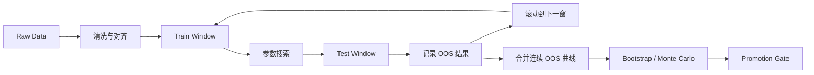

# Quant.ai 小账户生存模式深度研究报告

## Executive Summary

如果 Quant.ai 的目标是为 **$800 小账户**构建“生存模式”，那么系统设计的第一原则不应是“提高交易频率”或“追求单笔暴利”，而应是 **把研究层的试错成本转移到回测、样本外、蒙特卡洛与 paper trading，把 live 端的错误成本压缩到极小且可承受的范围**。对美股与美股期权而言，这一结论尤其重要：OCC 与 SEC 都明确强调，标准化期权涉及显著风险，买方可能损失全部权利金，卖方在某些结构下可能承担更高甚至不对称的风险；Alpaca 与 IBKR 也都明确说明，paper trading 只是模拟，不能覆盖真实市场里的滑点、排队位置、市场冲击和部分成交等问题。与此同时，Bailey、White、Sharpe、Black-Scholes、Merton 等一系列原始文献与方法论共同指向一个结论：**真正可上线的小账户策略，必须依赖严格的 no-lookahead、next-bar execution、walk-forward、bootstrap/Monte Carlo、成本建模、参数稳定性检验与 live gate 晋级规则，而不是靠单一 K 线形态或少量“好看”的回测结果。** 因此，本文推荐的 Quant.ai 架构是：**Research Lab → Strategy Tournament → Promotion Gate → Paper Gate → Live Tiny Gate → Execution Adapter**，并以 **股票现金账户/分数股 + 少量定义风险期权** 作为更现实的早期实现路径。citeturn0search0turn0search1turn21view0turn22view4turn6search0turn6search1turn7search2turn10search0turn10search1

## 必须参考的资料

下表按主题列出 **优先级最高**、最适合作为 Quant.ai 开发规范与研究文档底座的资料。为符合“优先官方/原始来源”的要求，监管、券商接入、期权基础、数据源与学术方法部分尽量使用官方站点、原始论文或出版社页面。citeturn0search0turn1search4turn17search0turn17search1turn20search2

### 期权基础与监管

| 资料 | 为什么重要 | 语言 | 来源 |
|---|---|---|---|
| OCC《Characteristics and Risks of Standardized Options》 | 美股标准化期权最核心的风险披露文件；任何买卖期权前都应先读，尤其是 exercise、assignment、到期、风格差异与复杂策略风险。 | 英文 | citeturn0search0turn0search4turn9search4 |
| SEC《Investor Bulletin: An Introduction to Options》 | 从监管角度概述期权买方/卖方风险，适合作为产品风险免责声明与用户教育材料。 | 英文 | citeturn0search1 |
| SEC《Investor Bulletin: Opening an Options Account》 | 适合梳理开户、披露、合规问卷与 suitability 逻辑。 | 英文 | citeturn0search9 |
| FINRA Options 页面 | 适合作为产品说明、适当性、投资者教育与风险说明的补充。 | 英文 | citeturn3search9turn9search6 |
| OCC《Primer: Exercise and Assignment》 | 解释 exercise/assignment 流程；对 short leg、spread 提前指派、到期自动行权处理至关重要。 | 英文 | citeturn9search3turn9search16 |
| OCC《Standard Assignment Procedure》 | 适合写入风控与结算文档，说明 assignment 并非“按你意愿发生”，而是清算流程的一部分。 | 英文 | citeturn9search0 |

### 期权定价、希腊字与波动率

| 资料 | 为什么重要 | 语言 | 来源 |
|---|---|---|---|
| Black & Scholes《The Pricing of Options and Corporate Liabilities》 | 现代期权定价的起点；Quant.ai 的 theoretical value、Greek 解释与偏离检测都应以此为根。 | 英文 | citeturn10search0turn10search18 |
| Merton《Theory of Rational Option Pricing》 | 将期权定价扩展为更一般的无套利框架；对 dividend、American/European 理解更稳。 | 英文 | citeturn10search1turn10search22 |
| Cboe《Learning the Greeks》 | 面向实务解释 Delta、Gamma、Theta、Vega、Rho；便于把希腊字转成风险规则。 | 英文 | citeturn26search0 |
| Cboe Hanweck Implied Volatility and Greeks | 说明市场级 Greek/IV 计算需要高质量输入、离散股息、borrow 成本与曲面建模。 | 英文 | citeturn26search2 |
| Cboe Options Calculator | 适合作为 Quant.ai 的“理论价格/Greek 校验器”参考。 | 英文 | citeturn10search2turn26search4 |
| Cboe VIX 页面与 term structure 相关文章 | 用于大盘波动 regime、contango/backwardation、short-dated vol 风险过滤。 | 英文 | citeturn5search0turn5search16 |

### 期权策略与结构

| 资料 | 为什么重要 | 语言 | 来源 |
|---|---|---|---|
| Cboe《Common Options Trading Strategies》 | bull call spread、bear put spread 等定义风险结构的官方入门材料。 | 英文 | citeturn19search0 |
| Cboe 关于 vertical spread 的文章 | 说明 vertical/debit spread 如何降低 premium、delta、theta、vega 暴露。 | 英文 | citeturn19search12turn19search14turn19search17 |
| Cboe 0DTE 资源页 | 说明 0DTE 常见结构与风险集中点；对“是否允许 0DTE”决策很关键。 | 英文 | citeturn19search2 |
| Cboe Facts About Options | 对 risk-defined vertical spread 的 margin/风险界定有直观解释。 | 英文 | citeturn19search5 |

### 风险管理、回测方法与过拟合

| 资料 | 为什么重要 | 语言 | 来源 |
|---|---|---|---|
| Bailey 等《The Probability of Backtest Overfitting》 | 直接针对策略选择过拟合；适合写入 Strategy Tournament 的淘汰逻辑。 | 英文 | citeturn6search0turn6search3 |
| White《A Reality Check for Data Snooping》 | 解决参数搜索和规则海选带来的 data snooping 问题。 | 英文 | citeturn6search1turn6search15 |
| Bailey & López de Prado《The Deflated Sharpe Ratio》 | 当你尝试了很多策略/参数后，普通 Sharpe 会乐观偏高；DSR 是更现实的晋级工具。 | 英文 | citeturn7search1turn7search4 |
| Sharpe《The Sharpe Ratio》 | 风险调整收益的经典原始定义。 | 英文 | citeturn7search2 |
| López de Prado《Advances in Financial Machine Learning》 | CPCV、purging、embargo、金融时间序列验证方法的现代参考书。 | 英文 | citeturn20search2turn20search14turn7search3 |
| Almgren & Chriss《Optimal Execution of Portfolio Transactions》 | 交易成本与冲击建模的基础。即使小账户冲击较小，也应借鉴其“临界不等于免费”的思想。 | 英文 | citeturn8search0turn8search6 |
| Perold 的 implementation shortfall 脉络 | 适合把“信号价格”和“实际成交价格”区分开来，建立执行评估。 | 英文 | citeturn8search1 |

### 券商与实盘接入

| 资料 | 为什么重要 | 语言 | 来源 |
|---|---|---|---|
| Alpaca Trading API / Paper Trading / Options Docs | 你的目标架构已明确包含 Alpaca；官方文档覆盖 paper/live、options levels、order types、portfolio history、events SSE。 | 英文 | citeturn21view0turn21view1turn21view2turn21view3turn21view6turn21view7 |
| IBKR TWS API / Client Portal API | 适合做第二执行适配器；支持更广泛的订单、市场与账户结构。 | 英文 | citeturn22view0turn1search15 |
| IBKR Paper Trading 文档 | 说明 paper 账户继承 live 权限/数据订阅，同时存在执行差异与限制。 | 英文 | citeturn22view4turn22view0 |
| Charles Schwab Developer Portal | 若考虑原 TD Ameritrade 体系的新接入，应优先核对 Schwab 的 Individual Trader API 与 OAuth 文档。 | 英文 | citeturn23search0turn23search1turn23search2turn23search10 |

### 数据、研究与经典书籍

| 资料 | 为什么重要 | 语言 | 来源 |
|---|---|---|---|
| John Hull《Options, Futures, and Other Derivatives》 | 衍生品定价、希腊字、套利与风险管理的经典主教材。 | 英文 | citeturn20search9turn20search12 |
| Ernest Chan《Quantitative Trading》 | 更贴近独立开发者与小型量化系统搭建。 | 英文 | citeturn20search1turn20search13 |
| OptionMetrics IvyDB | 做历史期权回测时，EOD IV/Greeks/quotes 的学术与机构级标配。 | 英文 | citeturn16search5turn16search8turn16search10 |
| ORATS Historical Options Data | 偏实务和 API 可接入；适合策略研究、波动率与 Greek 驱动回测。 | 英文 | citeturn3search1turn3search7turn3search13 |
| FRED / SEC EDGAR / BLS / BEA | 宏观过滤、财报/公司事实、经济日历的官方免费来源。 | 英文 | citeturn17search0turn17search1turn17search2turn17search3 |

## 信号与评分体系

**设计前提**：目标交易所、券商与标的范围均为“未指定”；考虑到你当前的应用方向、Alpaca/IBKR 资料与美股期权文献最完整，下面的规则默认面向 **美国上市股票与美国上市期权**。对于 $800 小账户，推荐把信号体系拆成 **市场状态过滤 → 个股/ETF 可交易性过滤 → 方向得分 → 执行可行性过滤** 四层，而不是让某个 K 线形态直接触发下单。期权部分更要如此，因为希腊字、IV、bid-ask 与合约流动性会让“方向对但仍亏钱”的场景显著增多。citeturn21view0turn26search0turn26search2turn11search2turn11search4turn11search18turn12search0turn12search8

### 因子分组与推荐权重

推荐把总分做成 **0–100 分**，并采用 **门槛式 + 评分式** 的混合机制：

- **先过滤**：若大盘状态、流动性、价差、财报日前后、合约等级不满足，直接 `NO TRADE`。
- **再评分**：只对通过过滤的标的打分。
- **上线门槛**：  
  - Research / Tournament 候选：`score >= 70`  
  - Paper 候选：`score >= 80`  
  - Live Tiny Gate：`score >= 85`  

这能把“研究可看看”和“真钱可碰一碰”明确分开，避免 UI 上把普通 setup 误导成 live 信号。其思想与 Bailey/White/DSR 一致：**选择过程越多，最后那条线上线规则越要严。** citeturn6search0turn6search1turn7search1turn7search4

### 推荐因子明细

下表的指标定义主要参考 ATR、ADX、RSI、MACD、OBV、量价关系等常见技术指标资料；`shift(1)` 与阈值部分则是面向 **no-lookahead + $800 生存模式** 的实现建议。关键原则只有一个：**若你在 bar 收盘后才知道这个值，就必须按 next-bar 执行；若你比较的是“过去 N 根最高/最低”，就应先 `shift(1)` 再与当前 bar 比较。** citeturn11search2turn11search4turn11search18turn12search0turn12search8turn21view0turn8search1

| 因子 | 计算方法 | 常用参数 | 是否 `shift(1)` | 窗口/样本 | 推荐阈值 | 小账户重要性 | 推荐分值 |
|---|---|---|---|---|---|---|---:|
| 大盘趋势过滤 | SPY/QQQ 的 `Close vs EMA20/50/200` | 20/50/200 | 不必单独 shift；但必须 next-bar 执行 | 日线 200 根以上 | 多头：`Close > EMA20 > EMA50 > EMA200`；空头反之 | 避免在大盘逆风里做单票方向 | 0–15 |
| 趋势强度 | ADX | 14 | 同上 | 至少 100 根 | `ADX >= 25` 强趋势；20–25 中性 | 小账户只适合“方向明确”的行情 | 0–10 |
| 动量 | RSI 或 MACD | RSI 14；MACD 12/26/9 | 不额外 shift；next-bar 执行 | 60–200 根 | 多头：RSI 55–70；空头：30–45 | 筛掉弱趋势与衰竭段 | 0–10 |
| 波动扩张 | ATR%、ATRP、HV/realized vol percentile | ATR 14；百分位 60/120 日 | 不额外 shift；percentile 用历史滚动窗口 | 60–120 日 | `ATR_pct_rank >= 60%` | 没有波动，小账户很难覆盖成本 | 0–15 |
| 量能确认 | RVOL、OBV 斜率、成交额 | RVOL 20 | 不额外 shift；成交额当日可用但 next-bar 执行 | 20–60 日 | `RVOL >= 1.5` 优；`>=1.2` 可研究 | 没有流动性，止损与 fills 都会变坏 | 0–10 |
| 结构性突破 | Donchian / N-day high-low breakout | 20/55 | **要**，即 `rolling.max().shift(1)` | 20/55 日 | `Close > DonchianHigh20_shift1` | 最适合日线趋势跟随 | 0–15 |
| 趋势一致性 | `EMA20 slope`、`EMA50 slope` 同向 | 10–20 日 slope | 不额外 shift | 20–60 日 | slope 同向且为正/负 | 避免均线缠绕 | 0–5 |
| K 线形态 | 锤子、吞没、晨星、跳空等 | 1–3 根形态 | 不单独 shift，但 **绝不单独下单** | 最近 3–5 根 | 只在趋势/突破背景下加分 | 形态单独胜率不稳，只能做“证据之一” | 0–5 |
| 宏观/大盘波动过滤 | VIX 水平、term structure、重大宏观日历 | VIX、1M–3M 结构等 | 日级过滤 | 20–60 日 | 高风险事件日可直接 `NO TRADE` | 小账户最怕 overnight/gap 风险 | 0–10 |

### 推荐评分规则

建议用下面的 **分段映射**，而不是把原始指标直接线性归一到 100：

| 组件 | 推荐映射 |
|---|---|
| 趋势排列 | 满足多头/空头完整排列给 15 分；只满足 20>50 或 20<50 给 8 分；否则 0 |
| ADX | `<20` 给 0；20–25 给 5；`>=25` 给 10 |
| ATR 百分位 | `<40%` 给 0；40–60% 给 7；`>=60%` 给 15 |
| RVOL | `<1.2` 给 0；1.2–1.5 给 5；`>=1.5` 给 10 |
| Donchian 突破 | 有效突破给 15；仅接近突破给 7；否则 0 |
| RSI/MACD | 与方向一致给 10；矛盾给 0 |
| K 线形态 | 仅在方向一致时加 2–5 分；逆势形态扣 2–5 分 |
| 事件惩罚 | 财报前 3–5 个交易日、极宽价差、低 OI 合约、宏观大事件日，直接扣至 0 或触发 `NO TRADE` |

**实务建议**：K 线只占 **5 分以内**。Quant.ai 的 UI 可以继续展示所有形态，但 live gate 应把它们降权，否则会回到“形态驱动的主观交易器”，而不是“研究驱动的执行系统”。这是小账户尤其应避免的路径，因为小账户最不可承受的是 **高频误报 + 高频止损**。citeturn12search7turn11search6turn6search0turn7search1

## 期权生存模式

对 $800 小账户来说，期权并不是“不可以”，但它必须被看作 **一种受严格预算约束的定义风险工具**，而不是提高杠杆的快捷方式。SEC 明确指出，期权买方可能损失全部 premium；OCC 也反复强调，期权不适合所有投资者。在券商维度，Alpaca 把 long call/put 放在 **Level 2**，而 spreads 放在 **Level 3**；这意味着“你想做的结构”未必一开始就能做，也未必能在所有账户/地区马上做。citeturn0search1turn9search4turn21view2turn21view3

### 小账户最可行的期权路径

**按可行性排序**，最适合 Survival Mode 的 live 路径通常是：

| 路径 | 是否推荐 | 原因 |
|---|---|---|
| 长仓股票/ETF 或分数股 | 强烈推荐 | 风险最透明，Greek 不存在，回测与执行最容易对齐。Alpaca 支持最低 $1 分数股，但当前只允许 market order。citeturn21view1 |
| Long Call / Long Put | 有条件推荐 | 最大亏损 = premium；适合强方向突破，但 theta/gamma/IV 更难管理。Alpaca Level 2 可做。citeturn21view2turn21view3 |
| Debit Vertical Spread | 强烈推荐 | 同向参与但能降低 premium、delta、theta、vega 暴露；更适合小账户。Alpaca Level 3 才支持。citeturn19search0turn19search12turn21view3 |
| Calendar / Diagonal | 研究层可做，live 早期不推荐 | 需要期限结构、IV term structure、双腿不同到期日历史数据与复杂成交建模；对小账户过于复杂。citeturn5search16turn26search2turn16search2 |
| 裸卖 call/put、短 gamma 结构 | 不推荐 | assignment、margin、尾部风险与 overnight 事件风险都不适合生存模式。citeturn0search1turn9search3turn19search5 |
| 0DTE | 研究层观察，可选；live 早期不推荐 | 短端 gamma/theta 极端，fills 与排队更敏感。Cboe 0DTE 资源显示其策略以 spread 和复杂结构居多，并不适合“新手小账户自动化”直接上线。citeturn19search2turn26search0 |

### 合约选择规则

推荐把 Quant.ai 的 options screener 固化为以下量化规则：

| 维度 | 推荐规则 | 说明 |
|---|---|---|
| DTE | **30–60 天** 为默认区间；绝不把 0DTE/1DTE 设为默认 | 留给方向兑现更多时间，减少 theta 与 execution noise |
| Delta | 单腿 long option 取 **0.35–0.55**；debit spread 的 short leg 可取 **0.20–0.35** | 前者兼顾方向敏感度与成本，后者用于融资 |
| IV Rank | long premium 优先 **20–60**；若 `IV Rank > 70`，默认禁做，除非单独事件策略 | 避免一开始就买到极贵波动率 |
| Bid-Ask Spread | **价差 / mid ≤ 8%**，更保守可设 `≤ 5%` | 小账户很容易被价差吃掉 edge |
| Open Interest | **OI ≥ 500**，更优 `≥ 1000` | 低 OI 合约更易出现差价大、跳点多 |
| 日成交量 | **Volume ≥ 100** 张，强烈建议 `≥ 300` | 便于更真实地估计 fills |
| 事件过滤 | 财报前 **3–5 个交易日** 默认禁做普通方向性 long premium | 否则回测和 live 会被 IV crush 扭曲 |

这些阈值并不是监管强制值，而是 **生存模式** 下的工程推荐值；它们背后的逻辑来自 Greek 风险与 paper/live 偏差：Cboe 对 Greeks 的解释指出，Delta、Gamma、Theta、Vega 都会显著影响期权盈亏；Alpaca 的 paper 文档又明确承认，paper 不会反映排队位置、冲击、价格改善、监管费用等现实问题，所以合约流动性阈值必须比“看起来能成交”更保守。citeturn26search0turn21view0

### 可直接量化的期权判据

以下三类规则适合直接写进 Promotion Gate / Live Gate：

**判据一：单腿 long option 风险预算**

\[
\text{contracts}=\left\lfloor \frac{\text{risk budget}}{100\times \text{premium}+ \text{fees} + \text{slippage buffer}} \right\rfloor
\]

当账户为 $800，第一阶段 `risk budget = min(2.5\%\times equity, $25)` 时，若 premium 为 `$0.18`，单张成本约 `$18`，再加 `$2–4` 的费用与滑点缓冲，通常只允许 **1 张**。如果 premium 超过 `$0.25`，则单张名义风险已逼近或超过第一阶段预算。citeturn0search1turn21view3

**判据二：debit spread 最大亏损**

\[
\text{max loss per spread}=100\times \text{net debit}+ \text{fees}
\]

\[
\text{max profit per spread}=100\times(\text{strike width}-\text{net debit})-\text{fees}
\]

\[
\text{reward/risk}=\frac{\text{max profit}}{\text{max loss}}
\]

生存模式建议 `reward/risk >= 1.5` 才允许进入 paper；`>= 2.0` 才允许进入 live tiny。这样做的原因是，小账户无法承受“胜率普通但盈亏比很差”的长时间磨损。citeturn19search0turn19search14turn19search17

**判据三：Greek 风险闸门**

- `|delta| ∈ [0.35, 0.55]`
- `theta / premium <= 3%` 每日
- `vega / premium <= 8%`，若做单腿 long premium 更应从严
- `gamma` 过高且 `DTE < 14` 时，默认 `NO TRADE`

这组规则并非交易所规定，而是把 Cboe 对 Greek 风险的解释变成可量化的“活下去规则”。尤其是 `theta/premium`，它能直接把“看对方向但拖太久仍亏损”的合约挡在 live gate 外。citeturn26search0turn26search2

### 期权回测的最低实现要求

若 Quant.ai 要回测期权，**最低要求** 不应只是“拿 underlying K 线 + Black-Scholes 估价”。最少应包括：

- 历史期权 **bid/ask quote**，而不仅是成交价或理论价。  
- 历史 **IV/Greeks** 或可复现输入。  
- **到期、行权价、合约代码映射** 的 point-in-time 数据。  
- **企业行动、分红、利率、borrow** 的至少近似处理。  
- 对 American/European 风格、提前行权与 assignment 风险的明确假设。  

OptionMetrics、ORATS、Alpaca/Polygon/Databento 都表明，做期权研究真正需要的不只是 bars，还包括 quotes、trades、链、Greek、IV，以及底层 corporate actions。Cboe Hanweck 也明确说明，实时 Greek/IV 计算要考虑离散股息、借券成本与曲面建模。citeturn16search10turn16search2turn3search7turn21view4turn18search6turn15view5turn26search2

### 期权常见陷阱

最容易在 Quant.ai 文档里被忽略、但 live 时最容易出问题的，是下面这些：

| 陷阱 | 为什么危险 | 处理方式 |
|---|---|---|
| Assignment / Early Exercise | short leg 可能被提前指派，spread 被打断；到期周尤其麻烦 | 默认优先 long-only / debit-only；short leg 需到期前强制检查与平仓。citeturn9search3turn9search0 |
| 低流动性合约 | 看起来便宜，实际 spread 极宽 | `spread_pct`、OI、volume 三重门槛。citeturn21view0turn21view4 |
| IV Crush | 方向对但 IV 下跌使 long premium 亏损 | 财报前默认禁做普通 breakout long premium。citeturn26search0turn5search16 |
| 0DTE Gamma 风险 | 微小价格变化即可造成 delta 突变 | live 早期禁用。citeturn19search2turn26search0 |
| Margin 误判 | 小账户以为是“定义风险”，实际券商风控与等级未放行 | 以券商 options levels 为准，绝不绕过。citeturn21view2turn21view3 |

## 回测与验证规范

回测是 Quant.ai 的研究发动机，但也是最容易制造幻觉的环节。Bailey 的 PBO、White 的 Reality Check、DSR 与 CPCV 的共同主题非常一致：**越会搜索参数、越会试规则、越需要更严格的验证工艺。** 对 Survival Mode 而言，这不是“学术洁癖”，而是防止小账户把研究噪声误当作真钱 edge。citeturn6search0turn6search1turn7search1turn7search3

### 回测流程表

| 步骤 | 输入 | 输出 | 关键参数 | 常见陷阱 |
|---|---|---|---|---|
| 数据清洗 | 原始 bars / quotes / corporate actions | 对齐后的 point-in-time 数据集 | 时区、交易日历、拆分/分红调整 | 用到了未来修正数据；漏掉停牌/缺口 |
| Bar 对齐 | 日线/分钟线 + session 定义 | 可计算指标的连续序列 | RTH/ETH、auction bar、T+1 结算背景 | 盘前盘后与正股 session 混淆 |
| 特征计算 | OHLCV、quotes、IV 等 | 指标矩阵 | EMA/ATR/ADX/RSI/MACD、rolling windows | 在 rolling high/low 上忘记 `shift(1)` |
| 信号生成 | 当前 bar 收盘时可得信息 | t 时刻信号 | 截止时间、数据可用性 | 同 bar 知道 close 又按 close 成交 |
| 执行建模 | 信号 + next bar 数据 | 订单与 fills | next open、mid±slippage、partial fill | 理想化同 bar fills；忽略排队位置 |
| 成本建模 | fills、费率、spread | 净收益序列 | commission、fees、slippage buffer | 只扣手续费不扣 spread |
| 组合/仓位 | 信号池 + 风险预算 | 持仓路径 | max positions、notional cap、risk budget | 资金不足时仍按理论份额成交 |
| Walk-forward | 训练窗、测试窗 | 连续 OOS 路径 | train/test 长度、滚动步长 | 每段都重置资金；导致 OOS 曲线失真 |
| Bootstrap / Monte Carlo | 交易序列或 return 序列 | 分布、置信区间、P5/P1 | 重采样次数、block size | 序列独立性假设过强 |
| 参数稳定性 | 参数网格 + OOS 结果 | 稳定区间 | heatmap、plateau 宽度 | 只挑峰值参数，不看邻域稳定 |
| Promotion Gate | 全部验证指标 | 通过/淘汰 | PF、Sharpe、DD、MC P5 等 | 只看总收益，不看可部署性 |

### 核心实现原则

**No-lookahead 与 next-bar execution**  
Alpaca 的 paper 文档明确提醒，真实市场会出现没在回测里见到的问题，包括未成交、价格跳动、网络重试、部分成交等；因此任何使用日线/分钟线收盘值计算的指标，都应默认在 **下一根 bar** 执行。对过去 N 日高低点突破，必须使用 `shift(1)` 的 Donchian/rolling extrema，否则就等于把当前 bar 自己的高低点偷偷放进了“过去 N 日”里。citeturn21view0

**交易成本与滑点建模**  
小账户并不意味着成本可忽略。Perold 的 implementation shortfall 与 Almgren-Chriss 都将“理论成交”和“实际成交”分开处理；Alpaca 也明确写到 paper 不反映 latency slippage、queue position、price improvement 与 regulatory fees。对于日线股价策略，建议至少使用 **half-spread + fixed bps** 作为基准滑点；对期权则建议使用 **`max(0.5×spread, premium×2%~5%)`** 作为入场滑点缓冲。citeturn8search0turn8search1turn21view0

**样本外合并必须连续**  
walk-forward 的正确输出不该是“每一段都从 30000 或 100000 重新开始”的漂亮统计，而是 **连续资金曲线**。否则 Promotion Gate 看到的不是策略路径，而是多个独立测试片段的拼表格结果。Bailey 对 hold-out 与过拟合问题的讨论，正是为什么不能只看单段样本外 Sharpe 的原因。citeturn6search3turn7search4

### 至少应实现的量化判据

**判据一：执行基准**

- 股票：`fill_price = next_bar_open + sign * max(half_spread, 5 bps)`  
- 期权：`fill_price = min(ask, mid + 0.25*spread)` 买入；卖出反向  
- 若 `spread_pct > 8%`，则记为“不合格 fill”，默认不成交

这是把 paper/live 差异显式塞进回测，而不是让回测默默帮你成交。citeturn21view0turn15view5turn21view4

**判据二：Monte Carlo / Bootstrap**

- `N >= 1000` 次重采样  
- `P5(max_drawdown) <= 1.2 × baseline_max_dd`  
- `P5(cagr or total return) > 0` 才能进入 Promotion Gate  
- 对 live tiny，建议进一步要求 `P1(terminal return) > -15%`

这类阈值不是监管给出的硬值，而是把小账户“不能承受长时间回撤”的约束前置到研究层。其思想与 PBO/DSR 一致：不只看均值，还要看尾部。citeturn6search0turn7search1

**判据三：参数稳定性**

- 只要最终参数是 heatmap 里的“孤峰”，就降级为 `research only`
- 只有当最优参数周围 **至少 1–2 格邻域** 都表现接近，才可进入 paper
- 若换训练窗后最佳参数漂移过大，默认不晋级

White 的 data snooping 框架与 DSR 的核心启发就是：**最亮眼的参数，往往也是最经不起复检的参数。** citeturn6search1turn7search4

### 回测/验证时间线建议

## 晋级门槛与风控仓位

### Strategy Tournament 与 Promotion Gate 门槛

下面给出一套 **偏保守** 的 Survival Mode 推荐阈值。它们不是市场通用标准，而是专门面向 **小账户、少仓位、必须把真实误差压到极低** 的上线门槛。依据主要来自 PBO/DSR/Reality Check 的思想，以及 Alpaca/IBKR 对 paper/live 差异的明确披露。citeturn6search0turn6search1turn7search1turn21view0turn22view4

| 指标 | Tournament 入围 | Promotion Gate | Paper → Live Tiny | 为什么小账户要更严 |
|---|---:|---:|---:|---|
| 最小历史交易数 | 100 | 150 | 150 + 最近 30 笔 paper 完整 | 样本太少时，几笔运气足以制造假 edge |
| 样本外交易数 | 25 | 40 | 40 + 连续 paper 路径 | live 前必须看 OOS，不看只会放大过拟合 |
| Profit Factor | `>=1.20` | `>=1.30` | `>=1.35` | 小账户容错低，PF 太薄很难覆盖执行偏差 |
| Sharpe | `>=0.6` | `>=0.8` | `>=1.0` 或 DSR 通过 | 选策略时不能只看总收益 |
| Max Drawdown | `<=18%` | `<=12%` | `<=8%`（merged OOS） | $800 的 15% 回撤就是实打实的伤害 |
| OOS Win Rate | 不硬卡 | `>=48%` 且盈亏比达标 | `>=50%` 或平均 R 值达标 | 胜率不是全部，但太低会让心理与资金都扛不住 |
| Avg Win / Avg Loss | `>=1.3` | `>=1.5` | `>=1.8` | 小账户需要靠盈亏比弥补有限试错次数 |
| MC P5 终值 | 正值优先 | `>-8%` | `>-5%` | 防止尾部把账户打残 |
| 参数稳定性 | 邻域可接受 | 必须是 plateau | plateau + 窗口漂移可控 | 小账户不能拿“精调峰值”冒险 |
| Paper 通过率 | 不要求 | 20 笔 paper | 30 笔 paper、0 次 critical mismatch | 真钱前必须先跑通流程 |

### Paper Trade 到 Live Gate 的晋级条件

推荐把晋级做成 **四个门**：

| 阶段 | 必须满足 |
|---|---|
| Research Pass | no-lookahead、next-bar execution、成本建模、OOS 合并、MC/Bootstrap 完整 |
| Tournament Pass | 指标达到入围阈值，参数稳定性合格 |
| Promotion Gate | merged OOS、P5、DSR、事件过滤全部合格 |
| Paper Gate | 至少 30 笔 paper；order reject < 1%；无 critical reconciliation mismatch；日志完整；无人工补救交易 |
| Live Tiny Gate | 第一阶段每笔风险 $20–$25；最多 1 个仓位；连续亏损 2 次即退回 paper |

这个“退回机制”非常关键。Survival Mode 不应把 live 看成“从此一路向上”，而应把它看成 **需要不断重新证明自己没坏掉** 的状态机。citeturn21view0turn22view4turn22view0

### 仓位与风险预算公式

**股票/ETF 仓位**

\[
\text{risk budget}=\min(\alpha \times \text{equity}, \text{absolute cap})
\]

\[
\text{shares}_{raw}=\left\lfloor \frac{\text{risk budget}}{|entry-stop|} \right\rfloor
\]

\[
\text{shares}_{final}=\min \left(\text{shares}_{raw}, \left\lfloor \frac{\text{max notional}}{entry} \right\rfloor \right)
\]

推荐：
- 第一笔：`\alpha = 2.5%`，`absolute cap = $25`
- 后续 early stage：`\alpha = 3%`，`absolute cap = $40`
- `max notional = 25%–35% of equity`
- `max open positions = 1`

**长仓期权**

\[
\text{contracts}=\left\lfloor \frac{\text{risk budget}}{100\times premium + fee\_buffer + slippage\_buffer} \right\rfloor
\]

**Debit Spread**

\[
\text{contracts}=\left\lfloor \frac{\text{risk budget}}{100\times net\_debit + fee\_buffer} \right\rfloor
\]

### 仓位示例

| 账户规模 | 品种 | Entry | Stop / Max Loss | 风险预算 | 原始仓位 | Notional 限制后 | 备注 |
|---:|---|---:|---:|---:|---:|---:|---|
| $800 | 股票 | $50 | $47 | $24 | 8 股 | 若 notional cap=35%，则最多 5 股 | 风险法给 8 股，但名义金额 $400 过高 |
| $800 | 股票 | $100 | $96 | $24 | 6 股 | 若 notional cap=35%，则最多 2 股 | 小账户更常被 notional cap 主导 |
| $800 | 分数股 ETF | $600 | 外部风控止损 | $24 | 不适用 | 可用约 $200–280 名义额 | 需系统侧 stop，不靠原生份额逻辑 |
| $800 | Long Call | premium $0.18 | premium 全损 | $20–25 | 1 张 | 1 张 | 适合强方向，但 theta/IV 更敏感 |
| $800 | Debit Spread | net debit $0.22 | debit 全损 | $20–25 | 1 张 | 1 张 | 更适合生存模式 |
| $1500 | 股票 | $75 | $70 | $40 | 8 股 | 若 cap=35%，最多 7 股 | 随账户变大，风险法逐渐可发挥作用 |

### 日内/日间停机逻辑

即便你主做日线，系统仍然需要 **日级停机逻辑**：

| 规则 | 推荐值 | 实现要点 |
|---|---|---|
| 每日最大亏损 | `min(1R, 3% equity)` | 触发后禁止当天新增仓位 |
| 每日盈利目标 | `1.5R–2R` 后可选择不再开新仓 | 不是强制平仓目标，而是停止新增风险 |
| 连续亏损停机 | 2 笔 | 进入 2 个交易日 cooldown |
| 账户总回撤熔断 | 8%–12% | 触发后退回 paper 模式 |
| 财报/宏观事件锁 | 事件日前后禁开新普通仓位 | 由日历服务控制 |

这类日级逻辑与其说是为了“提高收益”，不如说是为了 **防系统在坏 regime 里继续机械出手**。小账户最怕的不是一笔小错，而是遇到坏环境后连续小错。citeturn17search2turn17search3turn21view0

## 执行适配层与数据基础设施

### 执行适配层需求清单

Quant.ai 的执行层至少应抽象成如下能力集合，而不是在策略内部直接调用券商 SDK：

| 能力 | 必须实现 / 建议 | 难度 | 说明 |
|---|---|---|---|
| `get_account` / `get_positions` / `get_orders` | 必须实现 | 低 | 账户态与真实仓位是所有风控的输入 |
| `submit_order` / `replace_order` / `cancel_order` | 必须实现 | 低 | 下单生命周期管理 |
| `close_position` / `close_all_positions` | 必须实现 | 低 | 熔断/停机/到期前清仓 |
| `stream_trade_updates` / `stream_order_events` | 必须实现 | 中 | 需要实时状态机；Alpaca SSE 已支持 trade events |
| `reconcile` | 必须实现 | 中 | 本地账本与券商账本逐笔对账；任何 critical mismatch 都要停机 |
| `heartbeat` / connectivity monitor | 必须实现 | 低 | API 断线与 token 失效都要可观测 |
| `simulate_fill` / replay interface | 强烈建议 | 中 | paper broker 与回放测试共用 |
| latency metrics / audit logs | 强烈建议 | 中 | 上线后排故靠它 |
| broker-specific feature flags | 强烈建议 | 中 | 比如 Alpaca options levels、IBKR order routing 差异 |
| multi-broker failover | 可选 | 高 | 账户很小时通常没必要先做 |

Alpaca 官方文档已覆盖 orders、portfolio history、options levels、trade events；IBKR 提供 TWS API（TCP socket）与 Client Portal API（REST）；Schwab 提供基于 OAuth 的 Individual Trader API。也就是说，**文档条件已经成熟，关键不在“能不能接”，而在“是否先把适配层抽象对”。** citeturn21view2turn21view5turn21view6turn21view7turn22view0turn1search15turn23search0turn23search10

### 券商文档与关键注意点

| 券商/接口 | 关键能力 | 关键注意点 | 来源 |
|---|---|---|---|
| Alpaca Trading API | 股票/期权订单、portfolio history、paper/live、公有 market data | Paper 只是模拟；Paper Only 默认只有 IEX 数据；股票支持 bracket/oco/oto，期权目前以 market/limit、day TIF 为主；options level 影响策略可用性。 | citeturn21view0turn21view2turn21view6turn21view7 |
| Alpaca Options Data | option chain、latest quote/trade、Greeks、historical option trades | option chain 的 feed 可能是 `opra` 或 `indicative`；没有正式订阅时默认 indicative。 | citeturn21view4turn18search6 |
| IBKR TWS API | 市场广、订单种类多、socket 连接 | 需要 TWS 或 IB Gateway，paper 存在限制；API 有 pacing/market data line 约束；更适合成熟阶段。 | citeturn22view0turn22view1 |
| IBKR Paper | 模拟环境、可共享 live 市场数据订阅 | paper 账户镜像 live 权限；共享订阅时不能同时在 live 与 paper 上使用同一份实时数据。 | citeturn22view4 |
| Schwab Individual Trader API | OAuth、个人开发者、自有券商账户访问 | 若走 TD/Schwab 体系，新项目应首先核对 Schwab Developer Portal。 | citeturn23search0turn23search2turn23search10 |

### 数据源比较

下表重点比较 **历史价格、分钟/日线、期权链/IV 历史、分时/Level 2、宏观/日历** 等与 Quant.ai 直接相关的数据源。价格与限额变化较快，以下以 2026-07-24 可公开查到的信息为准；若某家公开页为动态定价或联系销售，则明确标注。citeturn15view1turn15view2turn15view3turn15view5

| 数据源 | 覆盖字段 | 延迟/质量 | 公开价格信息 | API/限制特点 | 适合用途 |
|---|---|---|---|---|---|
| Alpaca Market Data | 股票 bars/quotes/trades/snapshots；期权 bars/quotes/trades/chain/Greeks；calendar/clock/corporate actions | Paper Only 账户股票侧只有 IEX；期权链可能走 OPRA 或 indicative | paper 免费；live/data 依计划而定 | 与交易 API 同生态；最快上手 | 执行联调、早期 paper、轻量研究 citeturn21view0turn21view4turn13search1turn18search8 |
| Databento | 股票 L1/L2/L3、tick、OHLCV、auction data；美股期权与更多资产 | 强调 direct feeds、纳秒级时间戳、60+ venues | usage-based；Standard `$199/月`；部分历史 equity 数据 `from $0.40/GB` | 适合严肃研究与微观结构 | 成本建模、滑点研究、L1/L2/L3 回放 citeturn15view1turn15view4turn4search5 |
| Massive / Polygon | 股票与期权 real-time + historical；options 覆盖 17 家美股期权交易所 | 直接接 OPRA 做美股期权；股票/期权开发者生态成熟 | 公开 pricing 页可见但多为动态展示；应上线前核对当前 plan | REST/WebSocket/flat files 完整 | 多资产 API、链路原型、期权 research citeturn15view0turn15view5turn4search4turn4search8 |
| Tiingo | EOD、历史分钟、realtime consolidated snapshots、fundamentals | 对中低频研究够用 | 个人 `$30/月`，商业内部 `$50/月` | 简单平价 | 日线/分钟股票研究、非期权主系统 citeturn15view2turn4search18turn4search22 |
| Alpha Vantage | 股票、期权、技术指标、经济指标、earnings calendar 等 | 更偏轻研究与原型 | premium 从 `$49.99/月`（75 req/min）起 | API 简单但更适合指标/日历层 | 宏观/财报日历、原型、辅助数据 citeturn15view3turn13search0turn13search14 |
| OptionMetrics IvyDB | 历史期权价格、IV、Greeks；EOD 自 1996，intraday 自 2018 | 机构/学术级质量 | 通常需询价/合同 | 历史覆盖深，高质量研究底座 | 期权回测、学术严谨研究 citeturn16search10turn16search2turn16search5 |
| ORATS | 历史 EOD 期权自 2007；1 分钟期权自 2020；Greeks、SMV vols | 偏实务、研究友好 | 公共页提供 pricing 入口；实际以购买页/销售为准 | 指标丰富，适合策略研究 | 期权策略、IV/Greeks 回测 citeturn3search7turn3search13 |
| SEC EDGAR / data.sec.gov | filings、company facts、bulk zip | 官方、免费 | 免费 | 需遵守 fair access | 财报、公司事实、事件过滤 citeturn17search1turn17search9 |
| FRED / BLS / BEA | 宏观序列、经济发布日历 | 官方、免费 | 免费 | FRED 需 API key；BLS/BEA 有官方发布表 | 宏观过滤与事件锁 citeturn17search0turn17search8turn17search2turn17search3 |

### 基础设施建议

对 Survival Mode，数据与基础设施的优先顺序建议如下：

| 模块 | 优先级 | 难度 | 建议 |
|---|---|---|---|
| Point-in-time EOD/分钟股票库 | 必须实现 | 中 | 至少支持 bars、splits、dividends、session calendar |
| 期权链快照与历史 quotes/trades | 必须实现 | 高 | 若暂时做不到，live 初期优先股票/ETF |
| 财报/宏观事件日历 | 必须实现 | 低 | 用于 `NO TRADE` 过滤 |
| Replay 数据层 | 强烈建议 | 中 | 统一回测、paper、故障回放 |
| L2/L3 微观结构数据 | 可选 | 高 | 中频或做执行研究时再上 |
| 新闻/NLP 层 | 可选 | 中 | 可做辅助解释，不建议作为首版核心 alpha |

### 系统流程建议

## 报告监控与开发测试清单

### 日报、周报与交易日志

Quant.ai 不应只输出“买/卖建议”，而应输出 **可审计的研究与执行报告**。Alpaca 已提供 portfolio history 与 trade events，IBKR/Schwab 体系也都有账户与订单事件接口，因此日报/周报应围绕“机会为什么被拒绝、已成交单是否按假设执行、账本是否一致”来设计。citeturn21view5turn21view7turn22view0

#### 日报字段建议

| 字段 | 是否必须 | 说明 |
|---|---|---|
| 交易日期、市场 regime | 必须实现 | `trend_up_high_vol`, `choppy`, `no_trade` 等 |
| 扫描 universe 数量 | 必须实现 | 当天分析覆盖度 |
| 候选策略数 / 通过数 / 拒绝数 | 必须实现 | Tournament 与 Gate 漏斗 |
| Top-5 候选及 setup score | 必须实现 | 研究透明度 |
| 被拒绝原因分布 | 必须实现 | 例如 `spread too wide`、`earnings lock`、`score < 85` |
| 最终 live plan / NO TRADE | 必须实现 | 用户可操作输出 |
| 当日 realized / unrealized PnL | 必须实现 | 风控状态 |
| 账户权益、日级停机状态 | 必须实现 | 是否可继续交易 |
| reconciliation 结果 | 必须实现 | 是否发现仓位/订单不一致 |
| 延迟与异常告警摘要 | 强烈建议 | API/网络/下单层健康检查 |

#### 回测报告模板

| 模块 | 字段 |
|---|---|
| 策略元信息 | 策略名、版本、数据区间、标的池、参数、特征版本 |
| 核心绩效 | CAGR/总收益、Sharpe、Sortino、PF、Win Rate、Avg Win/Loss、Max DD |
| 执行假设 | next-bar 执行、slippage、fees、partial fill 规则 |
| 验证结果 | walk-forward、merged OOS、MC P5/P1、DSR、参数稳定性 |
| 风险结构 | 单笔 R 分布、连续亏损分布、风险暴露随时间变化 |
| 失败场景 | 最大回撤区间、事件日前后表现、低流动性样本表现 |
| 晋级结果 | Research only / Paper / Live Tiny |

#### 交易日志字段

| 字段 | 说明 |
|---|---|
| order_id / client_order_id | 与券商事件对齐 |
| strategy_id / signal_id | 追溯到研究版本 |
| 生成时间 / 提交时间 / 成交时间 | 计算延迟与实现偏差 |
| symbol / contract / side / qty | 基础交易信息 |
| signal_price / expected_fill / actual_fill | 用于 implementation shortfall |
| stop / target / risk_budget / score | 风控与解释 |
| spread_pct / OI / volume / RVOL | 进入时的可交易性状态 |
| reject_reason / replace_count / partial_fill_count | 执行层健康度 |
| close_reason | target / stop / time / event / manual kill |

### 可视化建议

最有价值的图，不是“漂亮的收益曲线”，而是能暴露真问题的图：

| 图表 | 用途 | 优先级 |
|---|---|---|
| Equity Curve | 最基本的净值路径 | 必须实现 |
| Drawdown Curve | 看痛苦而不是只看收益 | 必须实现 |
| Trade-by-Trade Waterfall | 单笔贡献、尾部损失、连续亏损聚集 | 必须实现 |
| Rolling PF / Rolling Sharpe | 看策略是否 regime-dependent | 强烈建议 |
| Parameter Heatmap | 看 plateau，不看孤峰 | 强烈建议 |
| Entry vs Fill Scatter | 看执行退化 | 强烈建议 |
| Reconciliation Timeline | 看账本偏差何时发生 | 强烈建议 |
| Monte Carlo Fan Chart | 看尾部与中位路径 | 强烈建议 |

### 告警规则

| 告警 | 阈值 | 为什么重要 |
|---|---:|---|
| Order reject rate | `>1%` 日内 | 说明券商参数、权限或接口有问题 |
| Reconciliation mismatches | `>=1` critical | 真实仓位与本地不同步时必须停机 |
| Submit→Ack latency | 股票 `>500ms`；期权可更宽 | 长期偏高说明网络或 API 层异常 |
| Fill slippage drift | 连续 5 笔高于回测假设 2 倍 | 说明 live 环境与研究环境脱节 |
| Data freshness lag | bars/quotes 超过预期更新窗口 | 信号可能基于脏数据 |
| Consecutive losses | 2 笔 | 触发 cooldown / 回到 paper |

### 开发与测试清单

| 测试类型 | 必须实现 / 建议 | 难度 | 关键内容 |
|---|---|---|---|
| 单元测试 | 必须实现 | 低 | 指标计算、score 组件、position sizing、gate 逻辑 |
| 数据完整性测试 | 必须实现 | 中 | session、缺失值、拆分分红、point-in-time 合规 |
| 回测回归测试 | 必须实现 | 中 | 同一版本输入下输出稳定；防止“修 bug 修坏收益” |
| 集成测试 | 必须实现 | 中 | data → signal → order → event → ledger 全链路 |
| 模拟实盘回放测试 | 强烈建议 | 中 | 用历史日按时间推进，验证 order state machine |
| Broker sandbox/paper 测试 | 必须实现 | 中 | Alpaca/IBKR/Schwab 各自自检 |
| 拒单、断线、部分成交容错测试 | 强烈建议 | 中 | 最接近真实 live 风险 |
| CI/CD | 强烈建议 | 中 | 每次合并都跑单测、回归与 lint |
| 监控仪表板 | 强烈建议 | 中 | latency、reject、reconciliation、fill quality |
| 混沌/故障注入测试 | 可选 | 高 | 模拟 API timeout、重复事件、断网重连 |

### 模块级优先级建议

| 模块 | 优先级 | 难度 | 说明 |
|---|---|---|---|
| 市场状态过滤、score 引擎、NO TRADE | 必须实现 | 中 | 这是生存模式的核心 |
| 股票日线策略 + next-bar 回测 | 必须实现 | 中 | 最先获得真实可控基线 |
| 风控层、停机层、reconciliation | 必须实现 | 中 | 没有它们就不应接实盘 |
| Alpaca 适配器 + paper broker | 必须实现 | 中 | 最快完成闭环 |
| Promotion Gate + merged OOS + MC | 强烈建议 | 中 | 防止“研究过度乐观” |
| 期权 long-only / debit spread 研究层 | 强烈建议 | 高 | 在股票基线稳定后再推进 |
| IBKR 适配器 | 可选 | 中 | 第二执行通道 |
| Schwab 适配器 | 可选 | 中 | 若你明确要多券商再做 |
| 日内/微观结构/L2/L3 执行研究 | 可选 | 高 | 不要抢在生存模式前面做 |
| NLP/新闻/多因子宏观模型 | 可选 | 高 | 价值高，但不是首版上线阻塞项 |

### 最终落地建议

对 Quant.ai 小账户生存模式，**最值得先做对** 的不是“更多信号”，而是下面这条闭环：**高质量数据 → 方向与可交易性双过滤 → 0–100 评分 → no-lookahead 回测 → merged OOS → Monte Carlo → paper gate → live tiny gate → broker adapter → reconciliation → 可审计报告**。如果要在股票与期权之间排优先级，建议先把 **股票/ETF 的 cash/fractional 生存模式** 做成稳定基线，再把 **long option / debit spread** 作为第二阶段接入，因为期权天然引入了 Greek、IV、行权、assignment、等级审批与更脆弱的成交假设。这样做并不“保守”，而是更符合官方风险披露、券商模拟环境限制以及学术上对过拟合和 data snooping 的长期警告。citeturn0search1turn9search4turn21view0turn21view2turn6search0turn6search1turn7search1turn8search1

## $800 -> $20,000 高爆发期权复利模式专项设计

### 1. 核心逻辑转变：防守生存 -> 阶段梯队复利 (Phase Compound Ladder)

原报告中的 $20/笔 风险预算适合稳健的股票/ETF 存活基线，但要实现 **$800 到 $20,000 (25倍)** 的极速增长目标，必须采用 **动态阶段复利与高盈亏比期权结构**：

| 阶段 | 资金区间 | 单笔最大风险预算 | 推荐期权结构 | 交易策略与目标 |
|---|---|---|---|---|
| Phase 1: 破局期 | $800 -> $2,500 | $100 - $150 (约 12%-18%) | ATM / Slight OTM Debit Vertical Spread 或 20-30 DTE Call/Put | 严格择时，只打 85+ 分高确信度信号；目标盈亏比 1:2.5 以上 |
| Phase 2: 动量期 | $2,500 -> $7,500 | $300 - $500 (约 10%-15%) | Debit Spread + 移动止盈锁利润 | 增加高 Beta 动量突破操作；最大持仓 2 个 |
| Phase 3: 加速期 | $7,500 -> $20,000 | $800 - $1,200 (约 10%) | 动量期权组合 + 极窄移动止损 | 利用已积累利润快速复利，单日最大亏损熔断设为 12% |

### 2. 标的选股逻辑 (SNDK 用户自选 vs Quant AI 自动化筛股)

针对期权高爆发模式，底层标的必须具备 **高 ATR% (高日内/日间波幅) + 极佳期权链流动性**：

- **指定标的模式 (如 SNDK / 存储/半导体动量股)**：
  - **优势**：对个股基本面与行业催化剂有先验认知。
  - **量化进场门槛**：即便指定 SNDK，系统也必须在 ** Donchian 突破/EMA 趋势重合 + RVOL >= 1.5 + IV Rank <= 60% ** 时才允许触发期权买单，避免在横盘期因 Theta 阴跌损耗。
- **Quant AI 极度自信筛股 (High-Conviction Auto-Screener)**：
  - 自动筛选 Universe 中满足：`Beta > 1.6`、`ATR% 百分位 > 70%`、`期权链 Bid-Ask Spread / Mid <= 5%`、`OI >= 1000` 的美股头部动量股（如 NVDA, AMD, SMCI, SNDK/WDC 等）。

### 3. “零差错”底层交易与风控硬保质线 (Zero Operational Error Framework)

1. **绝对禁做市价单 (Limit Orders Only)**：期权 Bid-Ask 差价大，必须使用 `Mid + 25% Spread` 限价挂单，成交保护。
2. **提前清算机制 (No Assignment Risk)**：持仓至 `DTE <= 2` 时强制平仓，绝不持有期权进入到期日，杜绝行权/指派风险。
3. **流动性硬门槛**：单腿/双腿合约 `Bid-Ask / Mid <= 8%`，若流动性不足直接 `NO TRADE`。
4. **即时账本对账 (Reconciliation)**：每 30 秒核对 Broker 仓位与本地状态，异常实时熔断。

## $800 -> $20,000 日内高频超短线 (Intraday Scalping) 架构设计

针对“每天日内、频繁操作”的第二个账户需求，必须解决 **PDT 合规、资金周转、高频滑点与日内防过热** 四大核心瓶颈：

### 1. 账户模式与 PDT 限制破局 (Cash Account + T+1 循环)

- **账户类型**：必须使用 **现金账户 (Cash Account)**。
- **PDT 规避机制**：在 $2.5 万美金以下的 Margin 账户中，5 天内最多 3 次日内交易；但在**现金账户**中，美股期权资金为 **T+1** 交割，且**完全不受 PDT 限制**。
- **资金切片周转**：
  - 将 $800 资金拆分为 **4 份，每份 $200**（或 2 份 $400）。
  - 当天可以连续执行 4 笔日内交易（每次消耗 $200 盘中已交割资金），平仓后的资金次日清晨全额交割复原，实现每天高频滚动交易。

### 2. 日内超短线策略与合约规则 (1M/3M Intraday Engine)

| 维度 | 规则标准 | 说明 |
|---|---|---|
| **时间周期** | 1分钟 / 3分钟 K线 | 抓日内强动量脉冲 |
| **触发信号** | ORB 突破 (开盘前15分钟高低点) + VWAP 沿线推进 + RVOL >= 2.0 | 仅在有爆发力动量时进场，绝不上盘整行情 |
| **首选标的** | SPY, QQQ, NVDA, TSLA, AMD, SNDK | 必须是全市场日内流动性最顶尖的标的 |
| **合约选择** | Delta 0.50 ~ 0.70 (ATM 或微 OTM)，7-14 DTE (兼顾杠杆与抗衰减) | 高频日内不建议盲目远期，利用高 Delta 快速兑现 |
| **止损规则** | **期权权利金亏损 -12% ~ -15%** 或 **标的跌破 VWAP 支撑** | 日内超短线必须“快斩亏损” |
| **止盈规则** | **权利金 +20% 平仓 50%**，剩余 50% 移动止盈 (+35% / +50%) | 快速锁利润，防止“盈利变亏损” |

### 3. 日内防倾覆硬卡门 (Anti-Overtrading & Risk Gates)

1. **单日亏损上限熔断**：若当天累计亏损达 **$160 (20% 账户资金)**，系统当天自动关机，禁止再开新仓。
2. **连续止损冷却期**：若连续 2 笔止损，系统强制进入 **60 分钟冷却期**，防止“报复性频繁交易 (Revenge Trading)”。
3. **尾盘 15:50 强制清仓 (No Overnight Risk)**：美东时间 15:50 (收盘前10分钟)，所有日内未平仓单一律按市价/限价全平，**绝不隔夜**，彻底消除跳空风险。

## 2倍杠杆 ETF (如 QLD/USD/NVDL) 高抛低吸均值回归模式 (2x ETF Mean-Reversion Engine)

对于希望兼顾“高波幅高收益”与“无期权到期归零风险”的策略需求，**2倍杠杆 ETF 高抛低吸模式** 是极具吸引力的量化方案：

### 1. 策略优势与 $800 资金适配性

- **无到期日/无时间衰减 (No Theta Decay)**：期权最致命的弱点是时间衰减与 IV Crush，而 2x ETF 是现货资产，持有不会出现“方向看对但权利金归零”的情况。
- **自带 2 倍弹性杠杆**：如 QLD (2x QQQ)、USD (2x 半导体)、NVDL (2x NVDA)、TSLL (2x TSLA)。
- **支持分数股 (Fractional Shares)**：Alpaca 等券商支持按美金金额下单（如每次买 $200 额度的 NVDL），$800 资金可以完美拆分做分批低吸。

### 2. 高抛低吸量化判据 (Mean-Reversion Band Algorithm)

| 动作 | 触发指标组合 | 算法逻辑 | 仓位管理 |
|---|---|---|---|
| **低吸 (Buy Low)** | 布林带下轨 (Bollinger Lower 2.0) + RSI(14) < 38 + VWAP 下轨 (-1.5σ) | 当价格过度跌下均线通道时，触发超卖低吸 | 投入资金的 25% ($200) 做第一批低吸；若继续深跌 3% 追加第二批 |
| **高抛 (Sell High)** | 布林带上轨 (Bollinger Upper) + RSI(14) > 65 或 单笔盈利达 +4% ~ +8% | 当价格冲高触及上轨或超买区时，触发自动化分批高抛 | 平仓 50% 锁定利润，剩余 50% 设移动止盈跟踪 |
| **大盘安全底线** | 大盘 (SPY/QQQ) 需在 EMA200 上方 | 确保大背景处于大牛市/震荡市，严禁在大熊市主跌浪中低吸 | 大盘空头排列时，系统全面自动挂机 `NO TRADE` |

### 3. 与期权模式的协同互补

- **期权高爆发模式**：用于抓 **Donchian 强突破 / 单边趋势爆发行情**（追涨杀跌，吃极速倍数）。
- **2x ETF 高抛低吸模式**：用于抓 **箱体震荡 / 趋势回调**（低吸高抛，吃反复波动），两者形成互补，实现全市场 Regimes 覆盖。

## 多空双向炒股大模型与 Quant.ai Agent 资源需求清单

要打造一个**具备精准确信度、可做多可做空、支持小账户复利**的顶部 AI 炒股大模型，我们需要构建以下 **多空双向引擎** 并准备相应的 **资源配置**：

### 1. 多空双向执行引擎 (Long & Short Dual-Engine)

| 交易方向 | 市场形态要求 | 股票/ETF 工具选择 | 期权工具选择 | 风险控制 |
|---|---|---|---|---|
| **做多 (Long)** | `Close > EMA20 > EMA50 > EMA200` + Donchian 20日突破 + RVOL >= 1.5 | 正向 2x ETF (NVDL, QLD, USD) 或 优质动量正股 | Long Call 或 Bull Debit Spread | 硬止损 2%~3% / 期权 -15% |
| **做空 (Short)** | `Close < EMA20 < EMA50 < EMA200` + Donchian 20日跌破 + RVOL >= 1.8 | **反向 ETF (SQQQ, SOXS, NVDS)** 或 破位弱势股 | **Long Put** 或 **Bear Debit Spread** | **拒绝裸卖/融券**（小账户避免借券费与无限亏损） |

> **关键工程亮点**：在 $800 小账户中，直接融券做空 (Short Selling Stocks) 会面临保证金限制、借券费 (Borrow Fee) 和无限亏损风险。因此系统的做空引擎 **优先采用买入看跌期权 (Long Put / Bear Spread) 或买入反向杠杆 ETF (如 SQQQ/NVDS)**，在现金/小资金账户下实现高效做空且最大亏损完全被锁死。

### 2. 构建系统所需的资源清单 (What I Need From You)

#### A. 密钥与接口 (API Credentials)
1. **Alpaca Trading API Key & Secret Key**（优先提供 **Paper Trading 模拟盘** 的 Key，用于 0 风险联调测试）。
2. **行情数据源 API Key**（Alpaca 自带免费数据，若追求更高采样率可选配 `Polygon.io` 或 `Tiingo`）。
3. **财报/日历 API Key**（`Alpha Vantage` 或免费 `SEC EDGAR` / `FRED` 用于避开财报静默期）。

#### B. 运行环境 (Runtime Stack)
- 本地或云端 Python 3.10+ 环境（依赖 `pandas`, `numpy`, `ta`, `alpaca-py`, `pydantic` 等）。

#### C. 策略规则授权 (System Clearance)
- 授权我为你编写和部署 **Quant.ai 核心多空交易引擎代码**（包含数据获取、0-100 信号打分、对账熔断、Alpaca 自动下单）。

## $800 极速增长：多标的高频高确信度狙击引擎 (Continuous High-Conviction Scalper Architecture)

针对“不设保守日止盈、追求全天不停高频操作、且要求每次都是极高确信度高质量判断”的核心需求，必须建立 **多标的动态轮询 + 5维硬核打分卡** 架构：

### 1. 突破单标的瓶颈：15-20 标的宇宙动态轮询 (Multi-Ticker Universe Polling)

- **痛点**：如果只监控 1 只股票（如 TSLA 或 SNDK），盘中经常出现长达半小时到1小时的横盘无信号期，导致系统无法“一直操作”。
- **解决方案**：系统构建一个由 **15-20 只高 Beta、极高日内流动性** 股票组成的 Universe（包含 NVDA, AMD, TSLA, AAPL, MSFT, PLTR, MSTR, QLD, TQQQ, NVDL, SNDK 等）。
- **秒/分钟级高频扫描**：引擎每 10-30 秒对整个宇宙进行并行扫描。当全天不同时段、不同板块的龙头爆发瞬间，系统**第一时间捕抓并连续下发高确信度订单**，实现真正的“全天机会不断、不停高频出击”。

### 2. “每次都是极致判断”的 85+ 分多因子评分卡 (High-Precision 5-Filter Matrix)

为了确保“不盲目频繁乱做，每次出手都是精妙的高胜率判断”，系统只有在总分 **>= 85 分** 时才允许触发交易：

| 维度 | 量化指标门槛 | 判断逻辑 | 权重分值 |
|---|---|---|---|
| **主力资金异动** | `RVOL >= 1.8` | 当前分钟成交量达过去 20 分钟均值的 1.8 倍以上，确认机构主力大单进场 | 25 分 |
| **VWAP & 均线排列** | `Price > VWAP` 且 `VWAP Slope > 0` 且 `EMA9 > EMA21` | 多头同向共振，不做任何逆势拉升中的摸顶/抄底 | 25 分 |
| **关键位置突破** | 突破开盘 15min 高点 (ORB) 或 Donchian 20分钟新高/新低 | 必须是在关键结构位瞬间放量突破，极速兑现爆发力 | 25 分 |
| **流动性点差守护** | `Bid-Ask Spread / Mid <= 5%` | 过滤点差过宽的劣质期权/股票，绝不给做市商送滑点 | 15 分 |
| **极佳盈亏比** | 预期盈亏比 `Reward/Risk >= 2.0` | 配合 ATR 动态移动止盈，亏损斩断在 1%~1.5%，盈利跑满 | 10 分 |

### 3. 资金切片与风控滚动

- $800 资金拆分为 **4 份，每份 $200**（或 2 份 $400）。
- 每次只给最先达到 85+ 分高确信度信号的标的分发 $200/笔 仓位。
- 触及止盈 (+20%~+35% 期权 / +3%~+5% 现货) 快速平仓释放资金，立刻投向下一个 85+ 分高分标的，实现真正的**高品质、高频次、快速滚雪球**！


