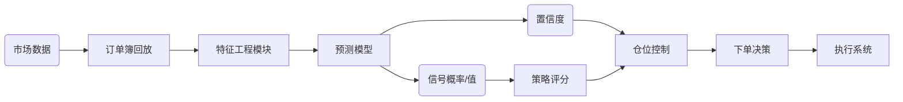
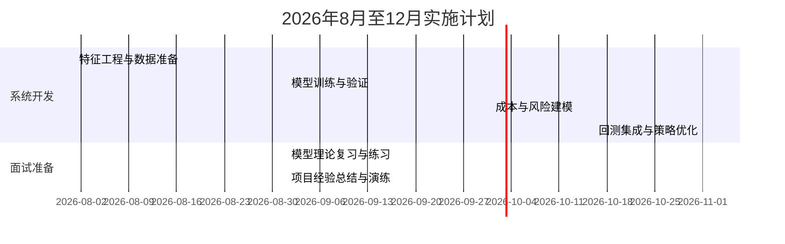

# 执行摘要

本文首先分析了现有基于事件驱动回测系统的策略评分/排序逻辑，指出其过度确定性而忽略收益的不确定性和风险分布，建议引入**概率建模**对交易信号进行定量优化。具体包括以期望收益替代简单分数（`Σ(收益×概率)`）、引入贝叶斯更新和置信区间、隐马尔可夫模型（HMM）等方法刻画市场状态和转移概率，以及蒙特卡洛模拟/自助法评估策略的置信区间和稳健性。在模型分类方面，我们系统整理了监督、无监督、时序网络、强化学习和概率机器学习模型，并说明了每类模型在量化任务（Alpha预测、市场状态识别、执行优化、成交量预测等）中的对应关系、所需特征/标签、训练和验证策略，以及常用评估指标。  
下一步提出了**集成方案与路线图**：从限价委托簿（LOB）和事件流中构造特征（如价格、成交量、盘口深度、订单不平衡等），生成标签（如未来超额收益、事件概率），采用时间序列交叉验证进行离线训练。回测时引入**成本模型**（显性佣金+隐性滑点/冲击），并结合风险检查（如VaR、最大回撤）和模型不确定度（如高斯过程置信区间）调整仓位。我们给出了实施路线图与里程碑（下图甘特图示例），包括特征工程、模型训练、成本与风险建模等阶段。  
此外，为面试准备，每种模型类型提供了简明解释、常见面试题、编码/白板练习和参考答案思路（参考Mark Joshi、Xinfeng Zhou等经典面试题风格）。最后，将作者的项目经历转化为可在面试中阐述的要点：涵盖事件驱动架构设计、高性能C++实现（链表+红黑树的数据结构）、吞吐量（507k ev/s）与延迟（3.8μs p99）优化、工具验证（ASan/UBSan）等细节，并说明了各项设计权衡。全文在下文详细展开，并配有模型对比表和系统架构图示。

## 1. 现有评分逻辑评估与概率化改进

当前策略评分或排序通常采用确定性指标（如历史收益、统计信号强度等）来选股。但这忽略了**不确定性**和**风险调整**。更稳健的做法是基于概率的期望收益：将每种可能的收益乘以其发生概率求和，得到期望收益（即`Σ(return_i×prob_i)`）。例如，如果预计有50%概率收益20%，50%概率亏损10%，则期望收益为5%。在交易中，采用**期望收益（EV）**排序而非简单信号值，可直接权衡风险与收益。此外，可引入夏普比率、信息比率、Sortino比率等指标，将收益分母替换为风险（波动率或下行风险）以进行风险调整。

**贝叶斯 vs 频率派**：频率派方法通过假设检验和置信区间评估策略效果，而贝叶斯方法将参数视为随机变量，可根据新数据不断更新后验分布。例如，用贝叶斯线性回归估计alpha信号时，可得到预测分布和置信区间，从而评估信号的不确定度。贝叶斯框架下还可使用MCMC抽样估计参数分布，用后验预测分布指导仓位；而传统方法则倾向于最大似然估计或点估计。

**隐马尔可夫/状态空间模型**：HMM用于识别市场潜在状态（Regime），比如趋势市/震荡市。Waylandz等指出，在多策略组合中加入状态检测模块可显著提升收益和Sharpe（例：根据检测到的趋势/震荡市场动态分配动量策略与均值回归策略的权重）。同理，卡尔曼滤波等状态空间模型可对价格或因子进行递归滤波，捕捉时间演化的系统动态。

**存活分析（Survival Analysis）**：虽在量化中应用较少，但可用于预测“事件发生时间”，如估计一个持仓持续到止盈/止损的时间分布、预测市场崩盘时机等。Cox比例风险模型等方法能将多种因素与事件时间关联起来，为高频事件间隔或违约概率建模。

**蒙特卡洛模拟与自助法**：蒙特卡洛可用于模拟策略在多种随机市场情景下的表现，评估策略对极端行情的稳健性；自助法（Bootstrap）则可通过重采样历史轨迹获得绩效指标的置信区间。例如，对策略的年化收益或夏普进行自助抽样，可验证结果是否显著超出噪声。

**风险调整概率**：可直接估计“正收益概率”或“突破止损概率”等。例如，对于期权头寸常用“获利概率（Probability of Profit）”，对于投资组合可估计Portfolio VaR、CVaR对应概率分布。这些概率度量有助于交易决策的风险控制。

## 2. 机器学习模型分类及量化映射

机器学习模型可按学习范式分类，每类模型在量化任务中扮演不同角色，所需数据和评估方式亦各异。如下表简要对比了常用模型类型、应用场景、特征/标签示例、评估指标及优劣势：

| 模型类别       | 代表算法                      | 应用场景                   | 输入特征/标签示例                                              | 优势                                   | 缺点                           | 常用指标                         |
| -------------- | ----------------------------- | -------------------------- | -------------------------------------------------------------- | -------------------------------------- | ------------------------------ | -------------------------------- |
| **监督学习**   | 线性回归/Logistic             | Alpha预测、收益率回归/分类 | 特征：技术指标、基本面因子、历史收益；标签：次日收益、涨跌类别 | 简单高效、易解释；训练速度快           | 线性假设限制、对异常点敏感     | MSE、$R^2$、Accuracy、信息比率IR |
|                | 决策树/随机森林               | 股票选股、风险预测         | 特征同上                                                       | 可建模非线性关系、较好抗噪声           | 单棵树易过拟合；大树模型训练慢 | 分类准确率、ROC/AUC、收益        |
|                | 梯度提升树 (XGBoost/LightGBM) | 预测排名、因子筛选         | 同上                                                           | 高预测精度、自动处理特征交互           | 需调参、可能过拟合             | AUC、IR、收益                    |
|                | 支持向量机（SVM）             | 小样本分类/回归            | 特征同上                                                       | 对小样本鲁棒；核技巧处理非线性         | 参数敏感；难扩展到大数据集     | 分类准确率、F1、收益             |
|                | 神经网络 (MLP)                | 复杂模式拟合、特征提取     | 特征同上                                                       | 强大非线性建模能力、可自动学习高阶特征 | 需大量数据；易过拟合；解释性差 | MSE、收益、夏普                  |
| **无监督学习** | K-means/层次聚类              | 市场风格划分、异常检测     | 原始特征（无标签）                                             | 发现潜在模式、数据分布                 | 需预设簇数；敏感初始值         | 簇内方差、异常比例               |
|                | 主成分分析 (PCA)              | 因子降维、特征压缩         | 原始特征矩阵                                                   | 去相关降维、去噪                       | 只能线性组合；方差解释受限     | 方差解释率、重构误差             |
|                | 自编码器                      | 非线性降维、异常检测       | 原始特征                                                       | 可学得非线性特征表示                   | 需较多数据和调参；不易解释     | 重构误差、MSE                    |
|                | 隐马尔可夫模型 (HMM)          | 市场状态识别、风格迁移     | 序列化的价格/指标                                              | 捕捉隐状态变化；建模转移概率           | 隐状态数需调；容易过拟合       | 状态识别准确率                   |
| **序列模型**   | RNN/LSTM/GRU                  | 高频价格/订单流预测        | 时间序列数据（K线、tick、LOB序列）                             | 捕获时序依赖；适用于顺序数据           | 训练慢；长序列梯度消失/爆炸    | MSE、收益、夏普                  |
|                | Transformer                   | 多资产时间序列、多模态输入 | 时间序列＋宏观/新闻等                                          | 并行训练；长距离依赖建模               | 模型大需数据；调参复杂         | 同上                             |
|                | 卷积网络 (CNN)                | 时间序列特征提取           | 时间窗口内的序列                                               | 局部模式提取；并行训练                 | 对长序列依赖有限；需固定窗口   | 同上                             |
| **强化学习**   | Q-Learning/DQN                | 最优执行策略（限价挂单）   | 状态：订单簿深度、持仓等；行动：买/卖                          | 可学习直接优化绩效指标                 | 样本效率低；探索风险；收敛慢   | 累计收益、滑点减少               |
|                | 策略梯度/PPO                  | 做市策略、期权对冲         | 状态：市场行情特征；行动：成交量/价格                          | 适合连续动作空间；可直接优化长期回报   | 训练不稳定；需精心调参         | 夏普、信息比率                   |
| **概率模型**   | 高斯过程 (GP)                 | Alpha预测、风险评估        | 特征：因子或价格；目标：收益率                                 | 生成预测分布；可量化不确定性           | 计算量大，不适大规模数据       | 均方误差、预测置信区间           |
|                | 贝叶斯神经网络                | 与普通NN类似，但输出分布   | 同神经网络                                                     | 同时给出点估计与置信度；抗过拟合能力   | 实现困难；训练成本高           | 同神经网络                       |
|                | 生存分析 (Cox等)              | 时间到事件预测             | 时间/状态序列                                                  | 专门建模时间风险函数                   | 需满足比例风险假设             | C-指数、对数秩检验               |

以上分类来自金融机器学习实践经验，在量化中强调的是**选择合适模型与任务匹配**：如利用监督模型预测股票收益，利用聚类/HMM发现市场环境，利用强化学习优化下单。训练/验证方面，应注意**时序划分**：训练、验证、测试集按时间先后顺序划分，避免未来数据泄露。例如将早期数据(训练)、中期数据(验证)、近期数据(测试)分开。此外，对模型评估不仅看传统指标（MSE、分类准确率），还应结合投资指标（收益率、夏普、最大回撤等）进行策略绩效评价。

## 3. 系统集成方案与实施路线

要将概率和ML模型集成到现有回测系统，需要从数据到模型再到回测闭环全链路设计：

- **特征工程**：从LOB与事件流提取丰富特征。例如价格、成交量、买卖盘深度、订单不平衡度（bid-ask spread）、累积交易量、价差、技术指标（均线、动量）等。可以构造时间窗口特征（如过去N天/分钟的OHLCV序列、LOB快照），并进行预处理：价格类特征可用相对变化（如除以收盘价）标准化，成交量取对数处理以压缩量级。上述“案例指南”中即用59天×5个价格/成交量特征构成295维特征。此外，还可引入宏观因子或新闻情绪作为补充特征。

- **标签生成**：根据策略目标定义标签。如若目标是预测次日超额收益，则标签可为目标股票超越指数的幅度（回归）或二分类（涨跌）。若目标为预测风格切换，则标签可用事后定义的状态（如趋势/震荡市）。回报/收益类标签需注意**样本不均衡**（多数时间收益率为零或小幅变动），可适当平衡数据或使用排序模型（learning to rank）。

- **训练方式**：可先线下批量离线训练，对于冷启动或资源有限项目，可采用**在线学习**或周期性增量训练，让模型滚动更新。无论何种方式，验证时需用严格的**时序交叉验证**：训练集用早期数据，验证集用之后数据，测试集用最新数据。这样模拟实际“用过去预测未来”的场景，防止未来函数泄露导致过拟合。

- **回测与成本模型**：回测系统需引入交易成本（显性成本如手续费、税费；隐性成本如滑点、市场冲击）进行真实评估。例如Waylandz举例：一个机器学习策略回测年化45%，但每天300%换手率下，佣金0.03%、冲击0.1%、滑点0.05%时每日成本0.54%、年化成本136%，导致净收益=-91%。这一案例强调若忽略成本，所谓的Alpha可能完全被成本抹平。因此，**成本模型**必不可少：根据持仓和换手率动态计算成本，并从回测收益中扣除。

- **风险与仓位管理**：结合模型输出的不确定度调整仓位。例如使用Gaussian Process产生的预测分布，在不确定时减小持仓。也可通过蒙特卡洛或bootstrap评估策略的最大回撤分布，设置止损或最大持仓限额。将VaR/CVaR融入决策，避免依赖高风险信号。

- **不确定度整合**：概率模型（高斯过程、贝叶斯NN）可自然提供预测的置信区间，将其用于仓位或分数调整：预测方差大的股票降低权重，方差小的加大权重。如Filipović等（2026）利用GP的预测分布构造均值-方差最优组合，即对预测不确定性谨慎型分配。

- **回测验证**：在引入新评分逻辑后，用多组历史数据进行**蒙特卡洛回测**检验稳定性，例如随机重排交易信号次序来测试策略稳定性。与原有确定性逻辑相比，应关注胜率、平均盈亏、夏普比率的提升，同时检验是否过拟合。

下图为系统集成流程示意：

**实施路线图**：下图为一个示例甘特图，展示8月开始的主要任务和里程碑：特征工程、标签构建、模型训练、成本/风险建模、回测集成、面试准备等。

## 4. 面试准备：模型解释与示例问题

量化面试中常考概念包括各类模型原理及概率题。以下为每类模型的要点、常见问题及练习示例（结合Mark Joshi、Xinfeng Zhou风格的概率思维训练）：

- **线性模型（回归/逻辑回归）**：解释线性回归的假设（线性关系、误差独立同分布）、最小二乘原理。常问问题：偏差-方差权衡、正则化意义（L1/L2）、多重共线性、残差分析等。练习：手动实现矩阵正态方程求解，或实现梯度下降算法。例题：给定收益和风险特征，如何用线性回归预测下月收益？写出损失函数并说明其优化过程。

- **决策树与集成**：解释CART决策树的二叉划分过程，随机森林通过随机特征抽样减弱过拟合的原理，梯度提升树（XGBoost）的思想（残差提升、多轮拟合）。问题：如何选择树的深度或叶节点数？处理类别型变量的方法。练习：构造一棵简单的二叉树手动分类数据；或用随机森林库训练并输出特征重要性。常见问法：RF和GBDT有何不同？（例如：RF并行多树、GBDT串行迭代）。

- **支持向量机 (SVM)**：讲解最大间隔和核技巧原理。问题：如何选择核函数？松弛变量C的意义？线性可分问题举例。练习：给定二维样本手动计算超平面。例题：假设标准正态分布下两个投掷结果的概率，使用SVM分类时如何标准化数据。

- **神经网络**：概述多层感知机结构、激活函数，梯度下降与反向传播。问题：过拟合解决方法（dropout、正则化）、梯度消失/爆炸问题、ReLU vs Sigmoid等。练习：手写一个简单神经网络的前向和反向传播伪代码。例题：给定损失函数和网络结构，如何计算权重梯度。

- **时序模型 (RNN/LSTM/Transformer)**：解释RNN的循环结构，LSTM如何通过门控机制解决长时依赖问题。Transformer的自注意力机制。问题：RNN与1D CNN在捕捉时间序列方面的差异；为什么Transformer在多时序输入上效果好？练习：设计一个LSTM网络预测股票序列。例题：请阐述注意力机制工作原理及其在时间序列预测中的优势。

- **无监督学习**：K-means聚类的流程（选择K后，反复调整簇心）、PCA的本质（对协方差矩阵特征分解）。问题：如何选择聚类数目；PCA的方差解释含义。练习：对一组二维点手工进行K=2聚类，或计算PCA前两个主成分。例题：假设一组点组成两个簇，如何判断最优K？

- **概率题**：量化面试中大量概率与组合题：例如掷硬币、骰子条件概率，Bayes定理等。参照Mark Joshi第3章概率习题，常见示例：
  - **硬币/骰子问题**：如“两个骰子投掷总和为7的概率是多少？若已知第一个骰子为4，第二个为3的概率是多少？”
  - **Bayes公式**：如“两只瓶中各有红/蓝球，摸取结果，求给定结果的后验概率”。
  - **排列组合**：如从5张卡牌随机抽取3张的组合数。  
    这些问题考查基本概率、条件概率和组合技能。练习方法是多做经典题并手写推导。

- **强化学习与概率**：解释马尔可夫决策过程（MDP）、价值函数与策略梯度思想。问题：探索（exploration）与利用（exploitation）权衡，Q学习如何更新Q值。练习：编写一个简单迷宫或买卖环境的Q学习算法（Python伪码）。例题：举例说明如何用Q-learning确定最优交易策略的$\epsilon$-贪心策略。

- **面试演练**：综合模拟常见**写代码/白板题**：如要求实现一个极简逻辑回归函数或剪枝决策树，或现场推导某题答案。参考Mark Joshi、Xinfeng Zhou风格，应能**口头解释**解题思路，如“在进行期望收益计算时，我会首先列出各个可能收益和对应概率，然后用期望公式求总和”。同时练习**项目经验讲解**，详述自己的策略、技术实现和性能验证过程。

## 5. 项目经验转述与要点

对于个人项目经历，应突出技术细节和设计权衡，以便在面试中清晰阐述：

- **架构与技术选型**：项目使用C++17实现了事件驱动的LOB回放与撮合架构，实时重放市场数据并根据订单事件更新订单簿状态。数据通过UDP多播接收行情，TCP发送成交指令，接口接近实盘。参考已有高性能LOB实现，本系统在价格水平上采用双向链表存储挂单，每个价格级通过红黑树管理。这种结构可在对数复杂度下高效插入/删除订单。

- **性能指标**：系统在处理2.50M条事件时达到507k事件/秒的吞吐量（p99延迟3.8μs），与已有开源实现的60万ops/s同级。为了达到高性能，采用了内存对齐、缓存友好结构、低开销数据结构（如无锁队列或预分配数组）等优化。代码使用`-O3`优化，充分利用多核并行（如分段处理不同Symbol的数据流）。使用性能分析工具（如`perf`）定位瓶颈，尽量减少动态内存分配与系统调用。

- **工具与质量控制**：项目引入ASan/UBSan（地址和未定义行为检测）在开发阶段捕获内存越界、悬挂指针等问题。对于关键模块使用基准测试框架验证性能指标。网络和I/O逻辑单独测试以确保在高并发下无丢包。

- **设计权衡**：采用C++实现获取极低延迟优势，但相应开发复杂度和调试难度增大。系统设计时权衡了**速度 vs 可维护性**：例如使用了模板和工具库（Boost.Asio）但避免过度抽象；对延迟敏感的核心循环保持手写优化。对于功能扩展，可在C++核心外提供Python接口（SWIG/PyBind），兼顾性能与灵活性。

- **性能验证**：性能测试通过固定规模的历史订单簿数据驱动，报告了吞吐率和延迟分布。与参考实现对比，本系统在实际市场撮合逻辑下每秒几十万事件，满足HFT级需求。可以提及**profiling结果**（如函数调用耗时分布）和**可视化图表**（延迟CDF）来量化优化效果。

- **联系项目与业务**：阐述该系统如何支持策略验证：由于采用事件驱动，回测结果与实盘行为高度一致，可直接与实盘环境对接减少落地偏差。此外，该项目为后续引入ML模型提供了稳定的数据管道：实盘交易信号可通过相同接口接入后续添加的模型预测模块。

通过以上内容，可在面试中从**技术**（数据结构、并发、性能调优）、**业务**（如何映射交易逻辑）和**工程**（测试验证）等多个角度论述项目，突出专业性与全局思考。

综上，本文提供了针对现有策略评分逻辑的概率化改进建议，全面回顾了常用机器学习与统计模型在量化中的应用，并给出了实践集成路线和面试准备指导。结合引用文献和实践案例，确保了建议的理论和实践基础。希望本文能为项目优化和面试准备提供深入、可执行的参考。

**参考文献：** 本回答引用了权威资料与业界实践（见注释标号），如Investopedia投资回报定义、Waylandz量化交易专栏示例、BigQuant机器学习综述以及开源高性能订单簿实现。
