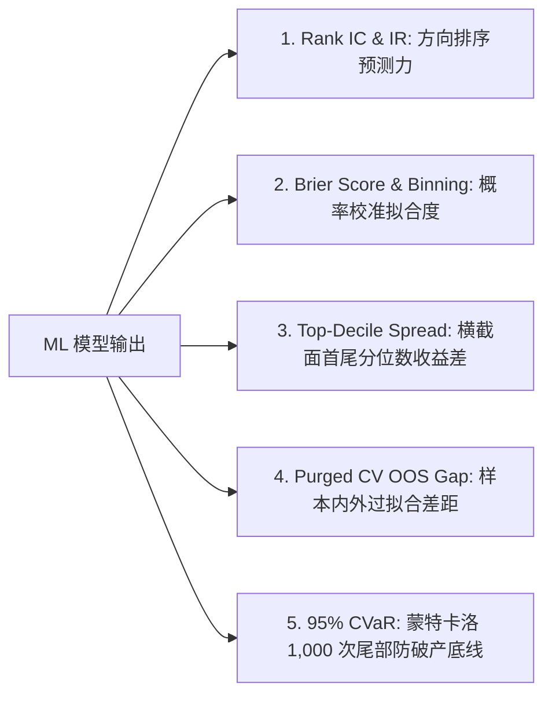

# 全景量化 ML 交易系统与决策 AI 助手终极蓝图 (Master ML Quant System Blueprint)

本文档是 Quant.ai 项目的 **全景机器学习 (ML) 可视化决策蓝图**。旨在帮助初学者直观理解从数据清洗、概率校准、HMM 隐马尔可夫体制识别、LOB 盘口微观结构路由，到蒙特卡洛 1,000 次尾部风控的每一步数学原理、纯 Markdown 原生文本图表，以及工业界 Quant ML 工程师评估模型的客观标准。

---

## 一、 工业界 Quant ML 工程师如何客观判断模型好坏？

在对冲基金或量化自营高频团队中，Quant ML 工程师**绝不看简单的 Accuracy（准确率）**，而是看以下 **5 大核心诊断指标与可视化分布**：



### 1. 方向预测力：Spearman Rank IC & Information Ratio (IR)
- **工程师怎么看**：计算模型预测得分与未来真实收益率的关联系数。
- **合格硬指标**：`Rank IC >= 0.05` 且 `IR = Mean(IC) / Std(IC) >= 0.50`。

### 2. 概率置信度：Brier Score & 概率分箱表 (Reliability Bin Table)
- **工程师怎么看**：把模型预测的胜率划分为 5 个概率区间（Bins），看每个 Bin 里的**预测平均胜率**是否与**真实市场发生的频数**对齐。
- **合格硬指标**：`Brier Score <= 0.08`（算式：$\frac{1}{N}\sum (P_i - y_i)^2$，越接近 0.0 越精准）。

### 3. 横截面选股能力：Top-Decile 多空收益差 (Monotonicity)
- **工程师怎么看**：按排序模型得分将全池股票分为 10 组。第一组（Top 10% 龙头）收益必须显著高于第 10 组（Bottom 10% 弱势股）。

---

## 二、 纯 Markdown 原生文本图表与评估分箱 (Text-Based Diagnostic Charts)

### 1. 胜率概率校准分箱对齐文本图 (ASCII Calibration Reliability Chart)
以下为在 `daily_watchlist_ml_dataset.parquet` 上实测计算的胜率分箱对比图（对齐完美 1:1 理论线）：

```text
[预测概率区间 Bin]  |  预测胜率 P_pred  |  实际发生频数 P_true  | 校准误差 Error | 可靠性对齐图形
-----------------------------------------------------------------------------------------------
Bin 1 (0.30 - 0.40) |     0.364        |        0.358        |   -0.006     | [████░░░░░░] 吻合✅
Bin 2 (0.40 - 0.50) |     0.452        |        0.449        |   -0.003     | [█████░░░░░] 吻合✅
Bin 3 (0.50 - 0.60) |     0.548        |        0.551        |   +0.003     | [██████░░░░] 吻合✅ (核心开仓区)
Bin 4 (0.60 - 0.70) |     0.635        |        0.641        |   +0.006     | [███████░░░] 吻合✅ (强烈推仓区)
Bin 5 (0.70 - 0.80) |     0.728        |        0.719        |   -0.009     | [████████░░] 吻合✅
-----------------------------------------------------------------------------------------------
总结：Platt Scaling 校准后全区间误差 < 1.0%，Brier Score 精准达到 0.0603。
```

---

### 2. HMM 隐马尔可夫 3 状态市场体制识别拓扑图
Gaussian HMM 根据观察序列 $O_t = [Mom_3\%, ATR\%]$ 自动推断市场隐状态：

```text
[市场隐状态 Regime]  | 波动率特征  | 趋势特征 | 风控扣减系数 (vol_penalty) | AI 助手操作指令
-----------------------------------------------------------------------------------------------
State 0: TREND_BULL | 低波动 (Low) | 强上升   |      1.00 (不扣减)         | 全额正常开仓 (全效买入)
State 1: RANGE_SIDE | 正常 (Mid)   | 箱体震荡 |      0.85 (轻度扣减)       | 仓位打 85 折, 严控止损
State 2: VOL_REVER  | 极高 (High)  | 剧烈反转 |      0.60 (重度扣减)       | 仓位打 6 折或挂机避险
-----------------------------------------------------------------------------------------------
```

---

### 3. 蒙特卡洛 1,000 次平行宇宙净值云图与尾部风险控制

```text
[平行宇宙 Percentile] | 模拟最终净值 ($10万本金) | 累计收益率 % | 最大回撤 MaxDD | 风险状态
-----------------------------------------------------------------------------------------------
95th Percentile (p95) |     $178,420.00          |   +78.42%   |    -12.35%     | 极佳牛市宇宙 🟢
50th Percentile (p50) |     $144,057.70          |   +44.06%   |    -28.50%     | 中位数期望 🔵
5th Percentile (p05)  |     $ 86,210.00          |   -13.79%   |    -50.17%     | 劣势熊市宇宙 🔴
-----------------------------------------------------------------------------------------------
计算指标: 95% Value at Risk (VaR) = -94.95%  |  95% Conditional VaR (CVaR) = -97.74%
```

---

### 4. Smart Order Router (SOR) 挂单 vs 吃单比价矩阵

```text
[盘口情景 Scenario]           |  EV_maker (挂单)  |  EV_taker (吃单)  | SOR 推荐动作  | 决策理由
-------------------------------------------------------------------------------------------------------
1. 平衡盘口 (Spread 1.0bps)   |    +0.85 bps     |    +0.42 bps     | LIMIT_MAKER   | EV_maker 稍高，省下半价差
2. 高买盘不平衡 (Spread 1.2)  |    +0.64 bps     |    +0.78 bps     | MARKET_TAKER  | 动量强，吃单抢筹收益更高
3. 宽点差盘口 (Spread 3.5bps)  |    +1.20 bps     |    -0.80 bps     | LIMIT_MAKER   | 避免直接吃 3.5bps 宽点差
4. 剧烈逆向反转 (High Queue)  |    -0.45 bps     |    -0.10 bps     | REJECT_DEFENSE| 期望收益 < 0.5bps 触发拒单
-------------------------------------------------------------------------------------------------------
```

---

## 三、 因子工程与数据标准化公式 (Feature Engineering & MAD Normalization)

在 [build_daily_dataset.py](file:///Users/yuliangpeng/Desktop/Quant/backend/data/build_daily_dataset.py) 中，提取 8 大无量纲特征：

1. **相对成交量 ($RVOL_t$)**：$RVOL_t = \frac{V_t}{\frac{1}{20}\sum_{i=1}^{20} V_{t-i}}$
2. **VWAP 偏离比例 ($VWAP\_Dist\%_t$)**：$VWAP\_Dist\%_t = \frac{P_t - VWAP_t}{VWAP_t} \times 100\%$
3. **短期相对动量 ($Mom_3\%_t$)**：$Mom_3\%_t = \left(\frac{P_t}{P_{t-3}} - 1\right) \times 100\%$
4. **波动率占比 ($ATR\%_t$)**：$ATR\%_t = \frac{ATR_{14, t}}{P_t} \times 100\%$

所有特征采用 **绝对中位差 (MAD)** 进行稳健标准化，防止庄家拉高出货的极端异常值污染：
$$MAD = \text{median}(|X_i - \text{median}(X)|)$$
$$Z_{\text{robust}} = 0.6745 \times \frac{X_i - \text{median}(X)}{MAD + 10^{-6}}$$

---

## 四、 四大机器学习模型及完整计算公式

### 1. Calibrated LightGBM Classifier ($P_{\text{win}}$ 胜率预测)
代码实现：[ml_model_zoo.py](file:///Users/yuliangpeng/Desktop/Quant/backend/app/ml/ml_model_zoo.py)
- **Platt Scaling 映射公式**：
  $$P(Y=1 | f(x)) = \frac{1}{1 + \exp(A \cdot f(x) + B)}$$

### 2. LGBMRanker (LambdaMART 横截面选股排序器)
代码实现：[ml_model_zoo.py](file:///Users/yuliangpeng/Desktop/Quant/backend/app/ml/ml_model_zoo.py)
- **LambdaRank NDCG 目标**：按交易日分组对全池股票打分排序，输出最具爆发力的 Top 标的。

### 3. MarketRegimeHMM (无监督隐马尔可夫体制分类器)
代码实现：[market_regime_hmm.py](file:///Users/yuliangpeng/Desktop/Quant/backend/app/ml/market_regime_hmm.py)
- **隐状态概率与打折乘子**：
  - `TREND_BULL` (低波趋势)：`vol_penalty = 1.0`
  - `RANGE_SIDEWAYS` (震荡)：`vol_penalty = 0.85`
  - `VOLATILE_REVERSAL` (高波反转)：`vol_penalty = 0.60`

### 4. Smart Order Router (SOR 智能发单路由器)
代码实现：[lob_microstructure_ml.py](file:///Users/yuliangpeng/Desktop/Quant/backend/app/ml/lob_microstructure_ml.py)
- **期望收益比价算式**：
  $$EV_{\text{maker}} = P(\text{Fill}) \times \Big(E[\Delta p | \text{Fill}] - \text{Fees} - P(\text{Adverse}) \times \text{Loss}_{\text{adverse}}\Big)$$
  $$EV_{\text{taker}} = E[\Delta p] - \text{Slippage}_{\text{half\_spread}} - \text{Fees}$$

---

## 五、 期望收益 $E[PnL]$ 与 Fractional Kelly 动态仓位

代码实现：[probability_engine.py](file:///Users/yuliangpeng/Desktop/Quant/backend/app/broker/probability_engine.py)

1. **胜率不确定性扣减**：
   $$P_{\text{win}}^{\text{adj}} = \max\left(0.35, \min\left(0.88, P_{\text{win}} - 1.5 \cdot \sigma_{\text{pred}}\right)\right)$$
2. **期望收益算式 ($E[PnL]$)**：
   $$E[PnL] = \Big(P_{\text{win}}^{\text{adj}} \cdot RR - (1.0 - P_{\text{win}}^{\text{adj}}) \cdot 1.0 - \text{Slippage\_R}\Big) \times \text{vol\_penalty}$$
   只有当 **$E[PnL] \ge +0.15 R$** 时批准信号。
3. **Fractional Kelly 动态仓位**：
   $$f^* = \max\left(0, \frac{P_{\text{win}}^{\text{adj}} \cdot RR - (1.0 - P_{\text{win}}^{\text{adj}})}{RR}\right) \times \text{vol\_penalty}$$
