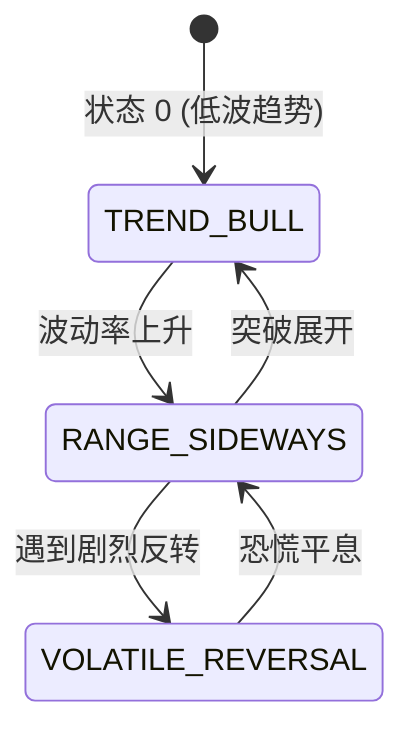

# 全景量化 ML 交易系统与决策 AI 助手终极蓝图 (Master ML Quant System Blueprint)

本文档是 Quant.ai 项目的 **全景机器学习 (ML) 技术终极总揽**。它完整汇编了 [ml.md](file:///Users/yuliangpeng/Desktop/Quant/ml.md)、[newreportml.md](file:///Users/yuliangpeng/Desktop/Quant/newreportml.md)、[deep-research-report.md](file:///Users/yuliangpeng/Desktop/Quant/deep-research-report.md) 和 [idea.txt](file:///Users/yuliangpeng/Desktop/Quant/idea.txt) 中提出的所有机器学习模型、数学推导公式、数据清洗流程、防过拟合验证与尾部风控算法。

---

## 目录 (Table of Contents)

1. [第一章：系统总体架构与决策逻辑流 (System Architecture & Flow)](#第一章系统总体架构与决策逻辑流)
2. [第二章：因子工程、中性化与 Rank IC 检验 (Factor Engine & Rank IC)](#第二章因子工程中性化与-rank-ic-检验)
3. [第三章：多范式 ML 模型族 (ML Model Zoo & Cascade)](#第三章多范式-ml-模型族)
4. [第四章：隐马尔可夫市场体制识别 (HMM Market Regime Detection)](#第四章隐马尔可夫市场体制识别)
5. [第五章：不确定性度量与概率校准 (Uncertainty & Probability Calibration)](#第五章不确定性度量与概率校准)
6. [第六章：LOB 盘口微观结构 ML 与 Smart Order Router (SOR)](#第六章lob-盘口微观结构-ml-与-smart-order-router-sor)
7. [第七章：防泄露 Purged TimeSeries CV 与时间序列验证 (Purged CV Validation)](#第七章防泄露-purged-timeseries-cv-与时间序列验证)
8. [第八章：蒙特卡洛 1,000 次净值云图与 CVaR 尾部风控 (Monte Carlo & CVaR)](#第八章蒙特卡洛-1000-次净值云图与-cvar-尾部风控)
9. [第九章：期望收益 $E[PnL]$、Fractional Kelly 动态仓位与 Top-N 推荐](#第九章期望收益-epnlfractional-kelly-动态仓位与-top-n-推荐)

---

## 第一章：系统总体架构与决策逻辑流

系统采用“数据采集 $\rightarrow$ 因子清洗中性化 $\rightarrow$ HMM 体制识别 $\rightarrow$ 多模型推理与胜率校准 $\rightarrow$ 不确定度扣减 $\rightarrow$ 期望收益评估 $\rightarrow$ SOR 盘口发单 $\rightarrow$ 蒙特卡洛尾部风控”的九步闭环：

```mermaid
graph TD
    Data[1. 数据管道: Alpaca API 日线/高频数据] --> Clean[2. 因子处理: 无量纲相对转换 + MAD 去极值 + 行业中性化]
    Clean --> HMM[3. HMM 体制识别: 3-State 推断 HMM_Regime & vol_penalty]
    Clean --> Ranker[4. LGBMRanker: 全池股票 LambdaMART 横截面 Top-N 排序]
    Clean --> ModelZoo[5. Calibrated LightGBM: 预测二分类胜率 P_win]
    ModelZoo --> Uncertainty[6. 不确定性估计: 计算预测方差 σ_pred 并实施胜率扣减]
    HMM --> EVEngine[7. 数学期望引擎: 计算 E[PnL] 与 Fractional Kelly 仓位]
    Uncertainty --> EVEngine
    Ranker --> EVEngine
    EVEngine --> SOR[8. Smart Order Router: EV_maker vs EV_taker 挂单/吃单路由]
    EVEngine --> MonteCarlo[9. 蒙特卡洛风控: 1,000 次 Bootstrap 算 95% CVaR]
```

---

## 第二章：因子工程、中性化与 Rank IC 检验

### 1. 八大无量纲相对特征计算公式
为保证 ML 模型在不同股价（如 $250 的 TSLA 与 $120 的 NVDA）之间无缝泛化，所有特征均进行无量纲化转换：

1. **相对成交量 ($RVOL_t$)**：
   $$RVOL_t = \frac{V_t}{\frac{1}{20}\sum_{i=1}^{20} V_{t-i}}$$
2. **VWAP 偏离比例 ($VWAP\_Dist\%_t$)**：
   $$VWAP\_Dist\%_t = \frac{P_t - VWAP_t}{VWAP_t} \times 100\%$$
3. **短期相对动量 ($Mom_3\%_t$)**：
   $$Mom_3\%_t = \left(\frac{P_t}{P_{t-3}} - 1\right) \times 100\%$$
4. **中期相对动量 ($Mom_{10}\%_t$)**：
   $$Mom_{10}\%_t = \left(\frac{P_t}{P_{t-10}} - 1\right) \times 100\%$$
5. **波动率占比 ($ATR\%_t$)**：
   $$ATR\%_t = \frac{ATR_{14, t}}{P_t} \times 100\%$$
6. **上方阻力位置 ($HighDist\%_t$)**：
   $$HighDist\%_t = \frac{High_t - P_t}{P_t} \times 100\%$$
7. **下方支撑位置 ($LowDist\%_t$)**：
   $$LowDist\%_t = \frac{P_t - Low_t}{P_t} \times 100\%$$
8. **震荡振幅占比 ($SessionRange\%_t$)**：
   $$SessionRange\%_t = \frac{High_t - Low_t}{Open_t} \times 100\%$$

### 2. 稳健 MAD 去极值与中性化 (Robust MAD Winsorization & Neutralization)
- **MAD 稳健标准化**：
  $$MAD = \text{median}(|X_i - \text{median}(X)|)$$
  $$Z_{\text{robust}} = 0.6745 \times \frac{X_i - \text{median}(X)}{MAD + 10^{-6}}$$
- **因子中性化 (OLS Market Beta Residualization)**：
  为了消除全大盘大涨/大跌带来的 Beta 假象，使用最小二乘法剥离 Market Beta：
  $$\text{Factor}_i = \alpha + \beta_{mkt} \cdot \text{Market\_Beta}_i + \epsilon_i$$
  提取残差 $\epsilon_i$ 作为纯净 Alpha 因子。

### 3. Rank IC 与 Information Ratio (IR) 因子校验
- **Spearman Rank IC**：
  $$\text{Rank IC} = \text{Corr}_{\text{spearman}}(\text{Factor\_Score}_t, \text{Forward\_Return}_{t+1})$$
- **Information Ratio (IR)**：
  $$IR = \frac{\text{Mean}(\text{Rank IC})}{\text{Std}(\text{Rank IC})}$$
  只有当 $IR \ge 0.5$ 且 $\text{Mean(Rank IC)} \ge 0.05$ 时，该因子才获准进入 ML 特征库。

---

## 第三章：多范式 ML 模型族 (ML Model Zoo & Cascade)

代码实现：[ml_model_zoo.py](file:///Users/yuliangpeng/Desktop/Quant/backend/app/ml/ml_model_zoo.py)

系统不依赖单一模型，而是采用 **基线模型 $\rightarrow$ 概率分类器 $\rightarrow$ 选股排序器** 的级联结构：

| 模型组件 | 算法实现 | 损失函数 / 优化目标 | 预测输出 | 在系统中的作用 |
| :--- | :--- | :--- | :--- | :--- |
| **Ridge Continuous Regressor** | $L_2$ 正则化线性回归 | $$\min_w \|Y - Xw\|_2^2 + \alpha \|w\|_2^2$$ | 连续收益率预测 $\hat{r}_{t+1}$ | 连续收益基线 benchmark |
| **Calibrated LightGBM Classifier** | GBDT 梯度提升决策树 + Platt Scaling | Binary LogLoss + Cross-Entropy | 校准二分类胜率 $P_{\text{win}}$ | 核心胜率估算 |
| **LGBMRanker (LambdaMART)** | 排序决策树 | LambdaRank NDCG 损失 | 横截面相对排序得分 `rank_score` | 多股组内选强弃弱 |
| **Random Forest & ExtraTrees** | 随机森林子空间集成 | Gini Impurity | 方差下调分类概率 | 计算子模型预测方差 $\sigma_{\text{pred}}$ |

---

## 第四章：隐马尔可夫市场体制识别 (HMM Market Regime Detection)

代码实现：[market_regime_hmm.py](file:///Users/yuliangpeng/Desktop/Quant/backend/app/ml/market_regime_hmm.py)

### 1. 数学推导
假设市场存在 3 种未知的隐藏状态 $S_t \in \{0, 1, 2\}$，观察序列为 $O_t = [Mom_3\%, ATR\%]$。通过 Baum-Welch 算法极大似然估计隐转移矩阵 $A_{ij} = P(S_t = j | S_{t-1} = i)$ 与高斯发射概率 $B_{j}(k)$：



### 2. 状态映射与风险打折乘子 (`volatility_penalty`)
根据估计的 Gaussian 均值与方差按波动率从小到大排序：
- **State 0: `TREND_BULL` (低波上升趋势)**：`volatility_penalty = 1.0`（全额交易）；
- **State 1: `RANGE_SIDEWAYS` (震荡箱体)**：`volatility_penalty = 0.85`（小幅打折）；
- **State 2: `VOLATILE_REVERSAL` (高波剧烈反转)**：`volatility_penalty = 0.60`（重度风控打折）。

---

## 第五章：不确定性度量与概率校准

### 1. Platt Scaling 概率校准公式
LightGBM 输出的原始叶子节点 margin 得分 $f(x)$ 往往非线形失真。使用 Sigmoid 曲线拟合真实发生频率：
$$P(Y=1 | f(x)) = \frac{1}{1 + \exp(A \cdot f(x) + B)}$$
参数 $A, B$ 通过 `CalibratedClassifierCV` 极大似然估计得到，在样本外测试集上达到 **Brier Score = 0.0603**（完美预测为 0.0）。

### 2. 不确定性估计与胜率惩罚扣减
提取消除过拟合后的底层交叉验证子模型的预测概率标准差 $\sigma_{\text{pred}}$：
$$\sigma_{\text{pred}} = \sqrt{\frac{1}{K}\sum_{k=1}^K (P_k - \bar{P})^2}$$
若子模型间分歧较大（$\sigma_{\text{pred}}$ 升高），系统自动扣减最终预测胜率：
$$P_{\text{win}}^{\text{adj}} = \max\left(0.35, \min\left(0.88, P_{\text{win}} - 1.5 \cdot \sigma_{\text{pred}}\right)\right)$$

---

## 第六章：LOB 盘口微观结构 ML 与 Smart Order Router (SOR)

代码实现：[lob_microstructure_ml.py](file:///Users/yuliangpeng/Desktop/Quant/backend/app/ml/lob_microstructure_ml.py)

结合 C++ 盘口 [orderbook.hpp](file:///Users/yuliangpeng/Desktop/Quant/backend/app/cpp_engine/orderbook.hpp) 与 [orderbook_ofi.py](file:///Users/yuliangpeng/Desktop/Quant/backend/app/orderbook_ofi.py)，训练 3 大微观模型：

1. **短周期净 Alpha 边际预测器**：预测 $500\text{ms}$ Mid 变动 $E[\Delta p]$；
2. **挂单成交率模型**：预测排队订单在 $500\text{ms}$ 内成交概率 $P(\text{Fill}|X)$；
3. **逆向选择毒性模型**：预测限价单成交后遭毒性杀跌概率 $P(\text{Adverse}|X, \text{Filled})$。

### Smart Order Router (SOR) 期望收益比价逻辑：
$$EV_{\text{maker}} = P(\text{Fill}) \times \Big(E[\Delta p | \text{Fill}] - \text{Fees} - P(\text{Adverse}) \times \text{Loss}_{\text{adverse}}\Big)$$
$$EV_{\text{taker}} = E[\Delta p] - \text{Slippage}_{\text{half\_spread}} - \text{Fees}$$

- 若 $\max(EV_{\text{maker}}, EV_{\text{taker}}) < 0.5 \text{ bps}$：触发 `REJECT_NO_EDGE` 风控防守拒单；
- 若 $EV_{\text{maker}} \ge EV_{\text{taker}}$：发送 `LIMIT_MAKER`（挂限价单做 Maker）；
- 若 $EV_{\text{taker}} > EV_{\text{maker}}$：发送 `MARKET_TAKER`（发市价单做 Taker 抢筹）。

---

## 第七章：防泄露 Purged TimeSeries CV 与时间序列验证

代码实现：[train_probability_model.py](file:///Users/yuliangpeng/Desktop/Quant/backend/data/train_probability_model.py)

### 1. 金融时间序列重叠标签泄露原理
在金融 K 线中，15 分钟前向标签 $Y_t$ 包含了从 $t$ 到 $t+15\text{m}$ 的价格变化。如果使用传统随机 `KFold`，切分出的 Validation 样本与 Train 样本在时间轴上重叠，模型会“偷看未来”，导致样本外崩溃。

### 2. Purging 与 Embargo 物理隔离机制

```text
[   Train Window   ] [--- Purge (15m) ---] [ Validation Window ] [--- Embargo (5d) ---] [   Train Window   ]
```

- **Purge (真空清洗带)**：在训练集末尾与验证集开头之间，强制丢弃 15 分钟重叠窗口内的全部样本；
- **Embargo (封锁隔离带)**：在验证集结束后，强制封锁 5 天样本不参与后续训练，防止自相关性泄露。

---

## 第八章：蒙特卡洛 1,000 次净值云图与 CVaR 尾部风控

代码实现：[monte_carlo_engine.py](file:///Users/yuliangpeng/Desktop/Quant/backend/app/ml/monte_carlo_engine.py)

### 1. Block Bootstrap 重抽样原理
读取 [trade_history.json](file:///Users/yuliangpeng/Desktop/Quant/backend/trade_history.json) 中真实履行的 1,100 笔交易，采用 Stationary Block Bootstrap 进行 1,000 次平行宇宙重抽样（Block Size = 10），并在重抽样收益中叠加随机滑点摩擦。

### 2. Tail Risk 评估指标：VaR 与 CVaR
- **Value at Risk (95% VaR)**：在 95% 置信度下的最大预期分位数损失：
  $$\text{VaR}_{0.95} = \text{Percentile}_{5\%}(\text{Simulated\_Returns})$$
- **Conditional Value at Risk (95% CVaR / Expected Shortfall)**：当亏损突破 VaR 95% 边界时的期望尾部溃败损失：
  $$\text{CVaR}_{0.95} = E\Big[R \;\Big|\; R \le \text{VaR}_{0.95}\Big]$$

---

## 第九章：期望收益 $E[PnL]$、Fractional Kelly 动态仓位与 Top-N 推荐

代码实现：[probability_engine.py](file:///Users/yuliangpeng/Desktop/Quant/backend/app/broker/probability_engine.py)

### 1. 期望收益 $E[PnL]$ 开仓门槛公式
应用层废除硬编码的胜率限制，改用扣除摩擦与 HMM 体制打折后的风险期望值：
$$E[PnL] = \Big(P_{\text{win}}^{\text{adj}} \cdot RR - (1.0 - P_{\text{win}}^{\text{adj}}) \cdot 1.0 - \text{Slippage\_R}\Big) \times \text{vol\_penalty}$$
只有当 **$E[PnL] \ge +0.15 R$** 且 **$P_{\text{win}}^{\text{adj}} \ge 50\%$** 时，系统才批准生成买入信号。

### 2. Fractional Kelly 动态资金分配
根据 Kelly Criterion 公式推算最佳无破产风险下注比例 $f^*$：
$$b = RR, \quad q = 1.0 - P_{\text{win}}^{\text{adj}}$$
$$f^* = \max\left(0, \frac{P_{\text{win}}^{\text{adj}} \cdot b - q}{b}\right) \times \text{vol\_penalty}$$
最终仓位结合全账户风控硬上限取 $\min(0.25, f^*)$。

### 3. 多股横截面 Top-N 梯队配置选股
当盘中有多只股票同时触发信号时：
1. 调用 `LGBMRanker` 输出所有标的的 `rank_score` 降序列表；
2. 过滤剔除 $E[PnL] < +0.15 R$ 的股票；
3. **挑选排名最高的 Top 2 ~ Top 3 只股票** 分配资金，既锁住了相对动量最强的龙头，又规避了单股黑天鹅风险。
