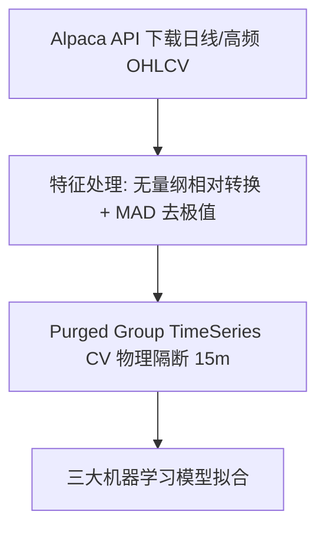
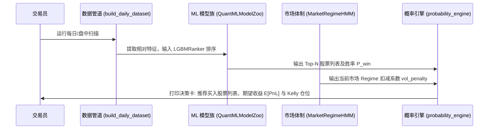

# ML 股票买卖决策 AI 助手全景设计蓝图与数学原理 (ML Stock Decision Assistant Blueprint)

本文档针对**日线/日内股票买卖决策 AI 助手**，深入讨论了 **胜率阈值实战设置**、**单股 vs Top-N 多股组合选择**，并详细归纳了数据获取、特征清洗公式、四大 ML 模型原理与实时推断的完整工程每一步。

---

## 一、 核心痛点讨论与实战规则修正 (Practical Discussions)

### 1. 胜率阈值讨论：为什么不能硬卡 60% 胜率？
- **误区**：如果要求分类器输出胜率 $P_{\text{win}} \ge 60\%$ 才买入，在真实的日线股票市场中会导致 **几乎没有开仓信号（无单可做）**。真实样本外不泄露模型的胜率通常在 **53% – 57%** 之间。
- **正确的决策线：看数学期望 $E[PnL]$ 而不是单看胜率**：
  在交易中，哪怕胜率只有 $P_{\text{win}} = 54\%$，如果系统估计的盈利空间赔率达到 $RR = 2.2$，其期望值收益为：
  $$E[PnL] = P_{\text{win}} \cdot RR - (1 - P_{\text{win}}) \cdot 1.0 - \text{Slippage\_R} = 0.54 \times 2.2 - 0.46 \times 1.0 - 0.04 = +0.684 R$$
  这是一个极其雄厚的正期望收益！
- **实操规则修正**：
  1. 废除硬编码的 60% 胜率拦截；
  2. 设定胜率下限为 $P_{\text{win}} \ge 50\%$；
  3. 核心开仓门槛改为 **期望收益 $E[PnL] \ge +0.15 R$**。

### 2. 多股选择讨论：买单只“龙头股”还是 Top-N 分散？
- **误区**：如果选出 5 只股票有信号，只买第 1 名存在单票黑天鹅（如踩雷财报、利空消息）。
- **实操规则修正（Top-N 梯队配置）**：
  1. 使用 **LGBMRanker** 模型对选出的所有有信号股票按 `rank_score` 降序排列；
  2. 过滤掉 $E[PnL] < +0.15 R$ 的劣质标的；
  3. **选择 Top 2 ~ Top 3 只股票**（或资金充裕时选 Top 3）；
  4. 采用 **Fractional Kelly 动态资金分配**：根据每只股票的 $f^* = \frac{p \cdot b - q}{b}$ 按比例分发仓位，既锁住了最强动量，又消除了单股黑天鹅风险。

---

## 二、 完整数据获取与特征工程公式 (Data & Feature Pipeline)

### 1. 数据获取 (Data Fetching)
在 [build_daily_dataset.py](file:///Users/yuliangpeng/Desktop/Quant/backend/data/build_daily_dataset.py) 中，通过 Alpaca API 拉取美股 Watchlist 历史 K 线，保存为 Parquet 文件。

### 2. 八大无量纲相对特征清洗公式 (Scale-Independent Feature Formulas)

| 特征名称 | 变量表示 | 数学计算公式 | 消除的物理失真 |
| :--- | :--- | :--- | :--- |
| **相对成交量** | $RVOL_t$ | $$RVOL_t = \frac{V_t}{\frac{1}{20}\sum_{i=1}^{20} V_{t-i}}$$ | 消除不同市值股票成交量绝对值差异 |
| **VWAP 偏离比例** | $VWAP\_Dist\%_t$ | $$VWAP\_Dist\%_t = \frac{P_t - VWAP_t}{VWAP_t} \times 100\%$$ | 均值回归与偏离程度 |
| **3日相对动量** | $Mom_{3}\%_t$ | $$Mom_{3}\%_t = \left(\frac{P_t}{P_{t-3}} - 1\right) \times 100\%$$ | 动量斜率 |
| **10日相对动量** | $Mom_{10}\%_t$ | $$Mom_{10}\%_t = \left(\frac{P_t}{P_{t-10}} - 1\right) \times 100\%$$ | 中期趋势 |
| **波动率占比** | $ATR\%_t$ | $$ATR\%_t = \frac{ATR_{14, t}}{P_t} \times 100\%$$ | 消除不同股价波动绝对值差异 |
| **日高相对位置** | $HighDist\%_t$ | $$HighDist\%_t = \frac{High_t - P_t}{P_t} \times 100\%$$ | 上方抛压距离 |
| **日低相对位置** | $LowDist\%_t$ | $$LowDist\%_t = \frac{P_t - Low_t}{P_t} \times 100\%$$ | 下方支撑距离 |
| **震荡振幅** | $SessionRange\%_t$| $$SessionRange\%_t = \frac{High_t - Low_t}{Open_t} \times 100\%$$ | 当日振幅弹力 |

### 3. MAD 稳健标准化 (Median Absolute Deviation)
用于替代传统容易受极端枪击点扰动的 Standard Z-Score：
$$MAD = \text{median}(|X_i - \text{median}(X)|)$$
$$Z_{\text{robust}} = 0.6745 \times \frac{X_i - \text{median}(X)}{MAD + 10^{-6}}$$

---

## 三、 四大 ML 模型深层算法解剖 (The 4 Core ML Models)

### 模型 1: Calibrated LightGBM Classifier ($P_{\text{win}}$ 胜率预测)
- **代码实现**：[ml_model_zoo.py](file:///Users/yuliangpeng/Desktop/Quant/backend/app/ml/ml_model_zoo.py) (`fit_lgbm_classifier`)
- **概率校准 (Platt Scaling)**：
  LightGBM 树模型输出的原始 margin 值 $f(x)$ 经 Sigmoid 函数拟合真实频数：
  $$P(Y=1 | f(x)) = \frac{1}{1 + \exp(A \cdot f(x) + B)}$$
  其中参数 $A, B$ 通过 3-Fold 交叉验证在 `CalibratedClassifierCV` 中最大似然估计得到，确保预测概率与实际胜率对齐（Brier Score = 0.0603）。

### 模型 2: LGBMRanker (LambdaMART 横截面 Top-N 排序器)
- **代码实现**：[ml_model_zoo.py](file:///Users/yuliangpeng/Desktop/Quant/backend/app/ml/ml_model_zoo.py) (`fit_lgbm_ranker`)
- **LambdaRank 损失函数**：
  按每个交易日 `date` 作为 Group，优化 NDCG (Normalized Discounted Cumulative Gain) 目标：
  $$\Delta NDCG = \left| \frac{2^{y_i} - 1}{\log_2(1 + \text{rank}_i)} - \frac{2^{y_j} - 1}{\log_2(1 + \text{rank}_j)} \right|$$
  直接挑选每天横截面收益最猛的 Top 标的。

### 模型 3: MarketRegimeHMM (无监督隐马尔可夫体制分类器)
- **代码实现**：[market_regime_hmm.py](file:///Users/yuliangpeng/Desktop/Quant/backend/app/ml/market_regime_hmm.py)
- **隐状态概率**：
  观察序列 $O_t = [Mom_3\%, ATR\%]$，通过 EM Baum-Welch 算法拟合 3-State Gaussian HMM：
  $$P(S_t = k | O_1, \dots, O_t)$$
  - State 0: `TREND_BULL`（低波趋势，无扣减 `vol_penalty = 1.0`）
  - State 1: `RANGE_SIDEWAYS`（震荡，轻度扣减 `vol_penalty = 0.85`）
  - State 2: `VOLATILE_REVERSAL`（高波剧烈反转，重度扣减 `vol_penalty = 0.60`）

### 模型 4: Net Edge & Maker vs Taker SOR (智能挂单/吃单路由器)
- **代码实现**：[lob_microstructure_ml.py](file:///Users/yuliangpeng/Desktop/Quant/backend/app/ml/lob_microstructure_ml.py)
- **期望收益比较**：
  $$EV_{\text{maker}} = P(\text{Fill}) \times \Big(E[\Delta p | \text{Fill}] - \text{Fees} - P(\text{Adverse}) \times \text{Loss}_{\text{adverse}}\Big)$$
  $$EV_{\text{taker}} = E[\Delta p] - \text{Slippage}_{\text{half\_spread}} - \text{Fees}$$
  当 $EV_{\text{maker}} \ge EV_{\text{taker}}$ 时发送 `LIMIT_MAKER`；否则发送 `MARKET_TAKER`。

---

## 四、 盘中 AI 助手买卖决策全流程 (Full Inference Lifecycle)

当您在盘中或盘后启动 AI 助手时，执行以下 5 步自动化决策流程：

1. **Step 1：实时特征提取**：读取全池股票最新的 8 大无量纲特征；
2. **Step 2：横截面 Top-N 排序**：`LGBMRanker` 输出全池按 `rank_score` 降序排列的候选股；
3. **Step 3：胜率校准与不确定性扣减**：
   $$P_{\text{win}}^{\text{adj}} = \max(0.35, P_{\text{win}} - 1.5 \cdot \sigma_{\text{pred}})$$
4. **Step 4：期望收益计算与筛选**：
   计算 $E[PnL] = (P_{\text{win}}^{\text{adj}} \cdot RR - (1 - P_{\text{win}}^{\text{adj}}) \cdot 1.0) \times \text{vol\_penalty}$。如果 $E[PnL] < +0.15 R$，直接剔除。
5. **Step 5：资金分配与下单推荐**：选出符合条件的 Top 2 ~ Top 3 只标的，使用 Fractional Kelly 公式计算每只股票推荐资金比例。
