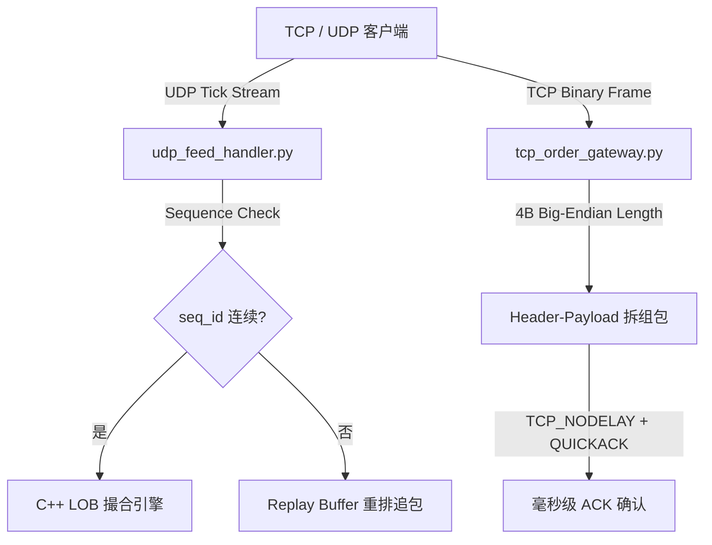

# 低延迟网络 Socket 优化与 HFT 协议实现指南 (Low-Latency Network Socket Optimizations)

本文档归纳了在 [udp_feed_handler.py](file:///Users/yuliangpeng/Desktop/Quant/backend/app/udp_feed_handler.py) 与 [tcp_order_gateway.py](file:///Users/yuliangpeng/Desktop/Quant/backend/app/tcp_order_gateway.py) 中实现的底层 **操作系统 Kernel Socket 调优与应用层网络协议**，专为顶级量化高频交易 (HFT) 系统设计。

---

## 一、 操作系统内核 Socket 调优 (Kernel Socket Options)

在 C++ / Python 网络层中，通过 `setsockopt()` 设置以下核心内核参数：

### 1. `TCP_NODELAY` (禁用 Nagle 算法)
- **编译/系统选项**：`socket.IPPROTO_TCP, socket.TCP_NODELAY, 1`
- **优化原理**：操作系统默认开启 Nagle 算法，会将多个小的发单 Byte 包在内核缓冲里等待攒成大包，导致 **40ms ~ 200ms 的严重发单延迟**。开启 `TCP_NODELAY` 强制内核在收到数据时无延迟直发网卡。

### 2. `SO_BUSY_POLL` (内核 Busy Polling 轮询)
- **编译/系统选项**：`socket.SOL_SOCKET, socket.SO_BUSY_POLL, 50`
- **优化原理**：传统网络 Socket 依赖 OS 中断 (Interrupt)，会导致上下文切换 (Context Switch) 与 CPU 调度抖动 (Jitter)。开启 `SO_BUSY_POLL` 允许 CPU 在 Socket 接收队列上进行 **50 微秒的轮询忙等**，大幅降低网卡数据包到达后的识别延迟。

### 3. `TCP_QUICKACK` (禁用延迟 ACK)
- **编译/系统选项**：`socket.IPPROTO_TCP, socket.TCP_QUICKACK, 1`
- **优化原理**：TCP 默认会等待 40ms 以便将 ACK 与响应数据合并发送。开启 `TCP_QUICKACK` 强制服务端在收到发单数据后立即向客户端回发 ACK 确认包。

### 4. `SO_RCVBUF` / `SO_SNDBUF` (扩展 Socket 缓冲区)
- **编译/系统选项**：`socket.SOL_SOCKET, socket.SO_RCVBUF, 8 * 1024 * 1024` (8MB)
- **优化原理**：在极端高波行情（Micro-bursts）下，交易所 Tick 数据会海量涌入。将接收缓冲区扩展至 8MB 可有效避免 Linux 内核 Ring Buffer 溢出导致的 UDP 隐性丢包。

---

## 二、 应用层协议设计与可靠性 (Application-Level Resilience)

### 1. UDP 序列号与缺包重排 (Sequence Gap Detection & Replay Buffer)
- **二进制数据包格式**：`[4B uint32 seq_num][8B double ts][4B char symbol][8B double price][4B uint32 volume]` (28 Bytes 紧凑包)；
- **缺包检测 (Gap Detection)**：通过包头递增的 `seq_num` 识别丢包与乱序；
- **重复抑制与重排 (Replay Buffer)**：过滤延迟或重复数据包，并将乱序包暂存至 Replay Buffer 恢复确定性执行顺序。

### 2. TCP 二进制组包与断线重连 (Binary Framing & Auto Reconnect)
- **Framing 结构**：`[4B Big-Endian uint32 Payload Length] + [Binary Payload]`；
- **流式解包**：维持 `bytearray` 缓存区，处理 TCP 粘包与半包 (Partial Read)；
- **自动恢复**：心跳与连接断开时，客户端自动触发指数退避重连。

---

## 三、 面试高频追问标准回答 (Interview Q&A Defense)

**Q: 为什么高频交易里用 UDP 抓行情，用 TCP 做发单？**
> **回答**：UDP 无需三次握手，延迟最低，非常适合无状态的广播行情播发；TCP 具备 ACK 确认机制与有序字节流，能够确保发单和撤单 100% 不丢包。我们在 UDP 上增加了 `seq_num` 缺包检测与 Replay Buffer 解决乱序；在 TCP 上显式关闭了 Nagle 算法 (`TCP_NODELAY`) 和 Delayed ACK (`TCP_QUICKACK`)，彻底消除了内核层的攒包延迟。
