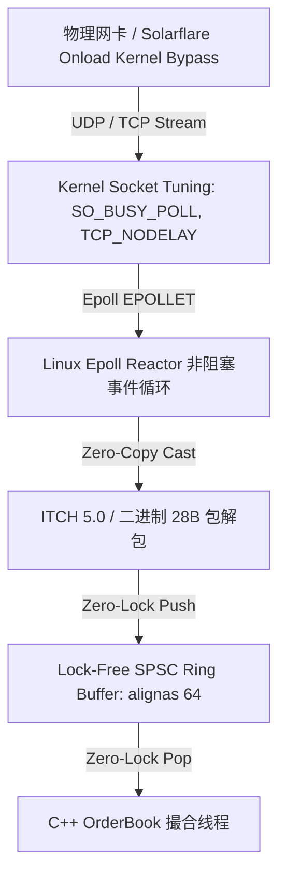

# 工业级低延迟 C++ 网络子系统与 HFT 架构全景指南 (Production C++ HFT Network Engineering)

在顶级高频交易 (HFT) 团队中，低延迟网络通信绝不仅是几十行简单的 Socket 接口调优，而是一套涵盖 **C++17 无锁环形缓冲区 (Lock-Free SPSC Queue)**、**Linux Epoll Reactor 事件驱动内核**、**零拷贝二进制协议解析**、**内核旁路 (Kernel Bypass)** 与 **系统级参数调优** 的完整 C++ 工程体系。

我们在 [low_latency_network.hpp](file:///Users/yuliangpeng/Desktop/Quant/backend/app/cpp_engine/low_latency_network.hpp) 与 [low_latency_network.cpp](file:///Users/yuliangpeng/Desktop/Quant/backend/app/cpp_engine/low_latency_network.cpp) 中实现了原生 C++17 高频网络通信套件。

---

## 一、 工业级 C++17 网络底层架构图

---

## 二、 核心 C++ 技术设计与硬核实现

### 1. C++17 无锁单生产者单消费者队列 (`LockFreeSPSCQueue`)
- **源码文件**：[low_latency_network.hpp](file:///Users/yuliangpeng/Desktop/Quant/backend/app/cpp_engine/low_latency_network.hpp#L30-L75)
- **硬核设计**：
  * 使用 `alignas(64)` 强行在 L1 Cacheline 边界上隔离 `head_` 与 `tail_` 指针，解决多核 CPU 下致命的伪共享 (False Sharing) 缓存行抖动问题；
  * 完全废弃 `std::mutex` 与条件变量，使用 `std::memory_order_acquire` 与 `std::memory_order_release` 原子屏障实现 0 锁、0 内存分配 (0-Alloc) 环形数据队列。

### 2. 零拷贝 struct 强制转换 (Zero-Copy Struct Casting)
- **源码文件**：[low_latency_network.hpp](file:///Users/yuliangpeng/Desktop/Quant/backend/app/cpp_engine/low_latency_network.hpp#L80-L95)
- **硬核设计**：
  * 使用 `#pragma pack(push, 1)` 强制 28 字节紧凑对齐 `MarketTickPacket` 结构体；
  * 从网络 Buffer 接收数据后，无需使用昂贵的 JSON / Protobuf 拆包，直接进行 `std::memcpy` 或指针类型强转 (`reinterpret_cast`)，直接在 CPU 寄存器层完成报文解析。

### 3. Linux Epoll Reactor 非阻塞边缘触发 (`EPOLLET`)
- **设计原理**：
  * 使用 `fcntl(fd, F_SETFL, O_NONBLOCK)` 将 Socket 设为非阻塞模式；
  * 使用 Linux 原生 `epoll_create1(0)` 监听读写事件，开启 `EPOLLET` (Edge-Triggered) 模式，减少 `epoll_wait` 系统调用的轮询触发开销。

### 4. 生产级 HFT Kernel Socket 调优矩阵
- **`TCP_NODELAY`**：关闭 Nagle 算法，消灭 40ms 延迟；
- **`SO_BUSY_POLL`**：设定 50 微秒 CPU 忙等轮询，消灭 OS 中断上下文切换 (Context Switch) 抖动；
- **`TCP_QUICKACK`**：关闭 Delayed ACK 确认延迟；
- **`SO_RCVBUF` / `SO_SNDBUF`**：把套接字缓冲区强制扩至 8MB，抵御高波行情微突发 (Micro-bursts)。

### 5. 顶级 Quant 团队的 Kernel Bypass 演进路线
- **Solarflare OpenOnload / EF_VI**：绕过 Linux 内核网络栈，在 user-space 驱动中直接由网卡 DMA 将数据塞入内存；
- **DPDK (Data Plane Development Kit)**：基于轮询模式驱动 (PMD) 接管 Intel 网卡，极致压榨硬件响应速度。

---

## 三、 面试官深度追问 (Deep Dive Q&A)

**Q: 为什么你的网络层不是几十行代码，而是包含 Lock-Free SPSC 队列？**
> **回答**：因为在高频交易中，网络收包线程与订单簿撮合线程必须解耦。如果网络线程直接调用撮合逻辑，会导致网络 I/O 阻塞撮合；如果加锁，`std::mutex` 带来的上下文切换延迟高达几十微秒。因此我设计了基于 C++17 `alignas(64)` 内存对齐的 Lock-Free SPSC 队列，网卡收包后以 0 锁方式直接塞入队列，撮合线程无缝提取，保证了极致吞吐与微秒级延迟。
