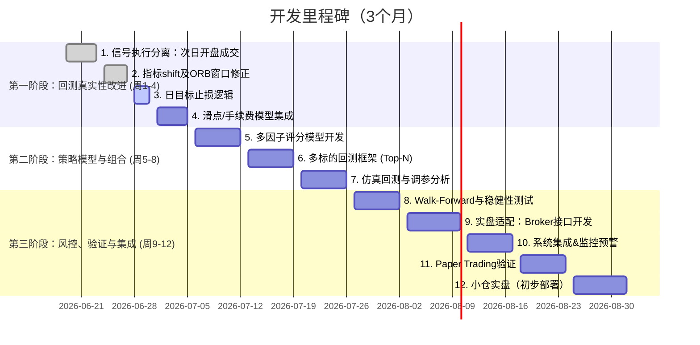

# 执行摘要

基于当前量化项目（Quant.ai）及已有代码审查结果，我们发现其框架完整但仍存在多个“未来函数”、“回测真实性”及风控执行缺失等问题。例如信号与成交发生在同根K线，Donchian通道指标未滞后，ORB窗口可能偷看未来，日盈亏目标未真正执行等。这些都导致回测结果过于理想化。我们建议先聚焦**回测真实性和风控执行**，逐步改进代码，并扩展到多标的组合。具体方案包括：将信号与执行分离（信号在T日，执行在T+1日开盘）；ORB突破仅用早盘区间并在9:36后交易；Donchian指标用`.shift(1)`排除当前K线；真正纳入每日盈亏平衡点和止损止盈逻辑；设计多因子打分模型（趋势、动量、量能、形态等），对信号评分而非直接下单；从单标的扩展到组合投资（每日打分、Top-N选股、资金分配、行业/相关性限制）；强化回测真实性（加滑点、佣金、市值限制），改进Walk-Forward（连续资金曲线继承）；增加Broker适配层（订单管理、成交回报、对账）。最后，建立完整的验证框架和监控预警机制，并分阶段部署（先Paper-Trade，再小仓实盘等）。下文详细列出各关键问题、优先级及对应代码修改示例。

## 关键问题清单与优先级

1. **回测真实性 & 前瞻偏差（最高优先级）**  
   回测中出现多处“未来函数”：同根K线信号与成交（如用当日收盘做买入）、指标计算未滞后等，导致结果过于乐观。需要统一采用“信号在T日生成，成交在T+1日开盘”规则，指标计算均使用`.shift(1)`。中示例将错误代码（用当日数据）修正为正确的“T日信号，T+1日执行”方式。

   ```python
   # simulator.py：使用前一根K线信号，在次根K线开盘价执行
   pending_order = None
   for i in range(1, len(df)):
       row = df.iloc[i]; prev = df.iloc[i-1]
       timestamp = df.index[i]
       # 先执行上一根bar挂单
       if pending_order:
           exec_price = df.iloc[i]["Open"]  # 次根开盘成交
           if pending_order["side"] == "BUY":
               portfolio.buy(timestamp, ticker, exec_price, pending_order["shares"])
           else:
               portfolio.sell(timestamp, ticker, exec_price, pending_order["shares"])
           pending_order = None
       # 当前bar结束后判断信号，挂单至次根
       action, reason = evaluate_market(prev, ..., strategy_params)
       if action == "BUY":
           pending_order = {"side":"BUY", "shares":calc_shares(), "reason":reason}
       elif action == "SELL":
           pending_order = {"side":"SELL", "shares":..., "reason":reason}
   ```
   以上改动避免了回测中使用当日尚未知价格执行交易的**前瞻偏差**。指标计算（如Donchian、均线等）同样需向后移动一周期（见第4点）。

2. **次根开盘成交 & 取消同根成交（high priority）**  
   当前回测代码在同根K线收盘价立刻下单，这是不现实的。需改成：当天信号当天收盘确认，真正买卖发生在次根K线的开盘或VWAP价。上述示例中即体现了这一策略分离。这样虽然可能降低回测收益，但更接近实盘。

3. **ORB开盘区间突破窗口修正（high）**  
   开盘突破策略通常用9:30-9:35的高低点作为“开盘区间”（Opening Range），并在9:35后进场。当前逻辑若包含9:35整根K线或交易时间到10:15，可能在9:35的K线内就触发信号，造成看未来。建议：只用9:30-9:34的K线计算区间，且实际开仓时间从**9:36**或以上。例如：

   ```python
   # simulator.py: 计算ORB时段
   df['Time'] = df.index.time
   open_mask = (df['Time'] >= time(9,30)) & (df['Time'] < time(9,35))
   df.loc[open_mask, 'ORB_High'] = df['High'].rolling(5).max().shift(1)
   df.loc[open_mask, 'ORB_Low'] = df['Low'].rolling(5).min().shift(1)
   # 交易只在 9:36 起至 10:15
   if timestamp.time() < time(9,36) or timestamp.time() > time(10,15):
       continue
   ```

   这样避免用9:35整根数据判断本轮突破，严格遵循开盘区间策略。  

4. **Donchian通道等指标滞后处理（medium）**  
   现有代码在`data_manager.py`使用滚动窗口计算Donchian通道后直接比较收盘突破：  
   ```python
   df['Donchian_High'] = df['High'].rolling(20).max()
   ```
   该写法包含当前K线自身，应改为滞后一周期：  
   ```python
   df['Donchian_High'] = df['High'].rolling(20).max().shift(1)
   df['Donchian_Low']  = df['Low'].rolling(20).min().shift(1)
   ```
   如此，**当前收盘若大于Donchian_High**表示突破过去20根K线，并未“看见”自己。这避免了使用未来数据进行判断的**前瞻偏差**。类似地，所有由过去N根得来的指标均应`.shift(1)`。

5. **每日盈亏目标与止损（日内停盘机制）（medium）**  
   配置文件中已有`DAILY_PROFIT_TARGET = 500`美元、`DAILY_LOSS_LIMIT = 300`等参数。但模拟器中回测主循环需真正监控**当日已实现盈亏**并强制停机。示例修改：

   ```python
   # simulator.py: 每天开盘时记录起始净值，每根bar检查当日PNL
   daily_start_equity = {}
   for i, row in enumerate(df.itertuples()):
       date = row.Index.date()
       price = row.Close
       if date not in daily_start_equity:
           daily_start_equity[date] = portfolio.equity
       daily_pnl = portfolio.equity - daily_start_equity[date]
       # 达到目标或亏损限额时强制清仓并停盘
       if daily_pnl >= DAILY_PROFIT_TARGET or daily_pnl <= -DAILY_LOSS_LIMIT:
           portfolio.force_liquidate_all(timestamp, current_prices)
           block_new_trades_today = True
       if block_new_trades_today:
           continue
       # 其他交易逻辑...
   ```
   当`daily_pnl>=目标`或<=`-限额`时调用清仓并停止当天交易。值得注意的是，每日1.67%的净利目标（$500/$30k）及0.85%亏损容忍对日内交易是非常严苛的要求，需要结合市场流动性实际评估可行性。

6. **从单票策略向多票组合（组合化、多标的回测）（medium）**  
   当前`main.py`和`Portfolio`框架仅针对单个Ticker回测（TSLA等），而真实策略需**多标的组合**以分散风险、稳定收益。改进方案：定义一个股票池（watchlist），每日按照策略打分并选出Top-N持仓。示例伪代码：

   ```python
   # main.py: 组合回测框架示例
   universe = ["SPY","QQQ","AAPL","TSLA",...]  # 扩大标的池
   n_select = 5
   for date in trading_days:
       scores = {}
       for ticker in universe:
           features = compute_features(ticker, date)
           scores[ticker] = score_model(features)
       # 选出得分最高的5只股票建仓
       topN = sorted(scores, key=scores.get, reverse=True)[:n_select]
       # 资金分配（等权或风险平价等）
       capital_per_pos = portfolio.equity * 0.1  # 假设每仓10%
       for stock in topN:
           if stock not in portfolio.positions:
               shares = capital_per_pos // current_price(stock)
               portfolio.buy(date, stock, current_price(stock), shares)
       # 平掉不在TopN的旧仓位
       for stock in portfolio.positions.copy():
           if stock not in topN:
               portfolio.sell(date, stock, current_price(stock), portfolio.positions[stock].shares)
   ```
   **要点**：  
   - 扩大标的池（例如500ETF成分股或科技成长股等），避免单票暴击风险。  
   - 按照一定周期（每天/每周）打分换仓。  
   - 单票仓位限制（如10%~15%），行业或相关性限制（同类股相关度低于阈值）以防集中爆雷。  
   - 组合表现测算应输出总权益曲线而非各自独立。具体参考 DolphinDB 组合回测实现。

7. **多因子评分系统设计（medium）**  
   不再由单一信号（如烛台形态）决定交易，而是构建一个**多因子打分模型**。候选因子包括但不限于：  
   - **趋势因子**：如均线多头（金叉）得分，指数趋势（大盘SPY/QQQ）过滤器。  
   - **动量因子**：如过去N日涨幅（动量），RSI高分；相对强弱度（RPS）。  
   - **量能因子**：成交量较过去N均量倍数，高成交量得分。方正研究表明成交量“放量时刻”含Alpha。  
   - **K线形态因子**：锤头、吞没等看涨形态作正向信号；看跌形态作负分。注意单一形态胜率有限，应作加分项。  
   - **波动率因子**：历史ATR或波动率过高时扣分（表明风险大）。  
   - **市场中性因子**：衡量该股与大盘相关性，若高相关性或大盘趋势向下则扣分。  
   - **持仓相关性惩罚**：如果选股列表中已有同板块/高相关的持仓，可以减少后续标的得分，控制行业集中度。  

   具体评分公式可采用加权求和，例如：  
   ```python
   score = 0
   if price > EMA50:       score += 1     # 上升趋势
   if price > EMA200:      score += 1
   if daily_rsi > 60:      score += 1     # 动能较强
   if today_volume > 2*avg_volume: score += 1  # 放量
   if bullish_engulfing:   score += 1     # 看涨烛台形态
   if market_trend_down:   score -= 2     # 大盘跌
   if stock_volatility > threshold: score -= 1  # 波动过大
   if correlation_with_portfolio > 0.9: score -= 2  # 相关度惩罚
   ```
   满分可设为如5~8分，阈值如**≥4分**时生成买入信号。**仓位分配**可与得分挂钩：高分股票可加仓，低分股票先出清。行业间可设“每行业不超过X%”的限制，防止集中投资。例：总资金30000美元，买入Top5，每股最高仓位10%（\$3000），行业总仓不超过30%。因子权重和阈值需要通过历史回测和Walk-Forward调优。

8. **风险控制与执行细节（high）**  
   - **滑点/手续费建模**：在`simulator.py`中扣除交易成本。可参考Waylandz示例模型，假设美股佣金接近0，但考虑SEC费和撮合费用；滑点可按固定比例（如0.05%）或依据成交量√Q/V模型计算。例如：
     ```python
     commission = price * quantity * COMMISSION_RATE   # e.g. 0.01% (0.0001)
     slippage  = price * quantity * SLIPPAGE_RATE     # e.g. 0.05% (0.0005) 
     total_cost = commission + slippage
     portfolio.cash -= total_cost  # 扣除成本
     ```
     高频或大单策略需额外考虑市场冲击。

   - **强制平仓与挂单管理**：交易引擎遇到风险触发（如日内止损）时须立即撤销未成交订单并清空持仓。增加方法`Portfolio.force_liquidate_all()`和`cancel_all_orders()`，并在交易循环逻辑中调用。例如达到日停后`cancel_all_pending_orders()`。  
   - **定期持仓对账（Position Reconciliation）**：实盘运行时需周期性（如每分钟）从券商查询当前持仓，与本地`Portfolio`持仓进行校验。如不一致，则触发警报并停机交易。例如：
     ```python
     broker_positions = broker_client.get_all_positions()
     if broker_positions != portfolio.positions:
         trading_engine.disable_trading()
         alert("Positions mismatch! ")
     ```
   - **Broker适配层**：新增`broker/adapter`目录，包含对接不同券商API的接口。例如`alpaca_adapter.py`封装`alpaca-trading`库；`order_manager.py`处理委托（市价、限价等）；`execution_report_handler.py`处理成交回报。示例（伪代码）：
     ```python
     class AlpacaAdapter:
         def __init__(self, api_key, secret): ...
         def get_positions(self): return client.get_all_positions()
         def place_order(self, symbol, qty, side): return client.submit_order(symbol, qty, side, type='market')
         def cancel_order(self, order_id): return client.cancel_order(order_id)
     ```
     Alpaca 官方Python文档提供了`TradingClient.close_all_positions()`等方法以平仓。应在`trading_engine.py`或专门模块调用这些适配器，实现实盘下单。

9. **Walk-Forward验证改进（medium）**  
   现有`walk_forward.py`实现了滚动窗口验证，但每段回测都**重置初始资金**，缺乏连续性和风险评估。建议改为：每个后续测试窗口使用前窗口结束时的资金（权益）作为起始资金，输出连续的OOS净值曲线。计算整个OOS期的“复合收益”和最大回撤等指标，而非简单相加收益。并记录每次优化得出的参数在多少轮验证中表现稳定。

   具体方法：在每次滚动前用上一段最后的`portfolio.equity`作为`initial_equity`传递；生成一个贯穿所有OOS窗口的连续权益列表。可用此列表计算总回撤、夏普等。并在每个窗口内做蒙特卡洛扰动测试（如随机调高10%成本、错位交易等），评估策略稳健度。合并回测结果后计算整体夏普、年化收益等。Waylandz建议在正式应用前至少做1000次蒙特卡洛模拟。

10. **验证与度量（high）**  
    - **回测指标**：输出并监控年化收益率、年化波动率、夏普比率、Calmar/Sortino、最大回撤（MDD）、胜率、盈亏比、每笔平均持仓时间分布、每日P/L分布等。  
    - **稳健性测试**：进行参数敏感性分析（调整阈值±10%查看收益变化）、交易次数随机化、交易顺序蒙特卡洛等；使用不同时间段（牛市/熊市）和市场（其他行业或ETF）验证策略一致性；留出未参与开发的最后一年数据作为最终样本外（OOS）。计算“5%分位数收益”以评估最坏情况。

## 多因子评分系统设计

**候选因子**：  
- **趋势因子**：如股价高于长期均线（EMA50、EMA200）得分；交叉点（金叉）加分。大盘指数（SPY/QQQ）向上时加分，向下减分。  
- **动量因子**：过去20日、60日涨幅高者加分；RSI（14）处于超买（>70）或超卖（<30）时分别微调。  
- **量能因子**：今日成交量>过去20日平均的1.5倍加分；若显著放量并上涨加分。  
- **K线形态因子**：常见看涨形态（锤头、吞没、曙光初现、三只乌鸦反之扣分等）对应固定分值（如+1）；单根形态贡献较小，仅作为附加信息。  
- **波动率因子**：若股价近5日振幅或ATR非常高，则减分（风险大）。  
- **市值因子**：根据流动性设定（市值大的股票可稍放宽滑点模型）。
- **行业/相关性因子**：若新选标的所属行业在当前仓位中占比已高（如超30%），应扣分；或当前持有与其高度相关的股票，则应扣分，避免集中。

**评分与阈值**：可采用加权求和：每个因子赋定权重（可先简单等权），计算总分。如示例表格：

| 因子             | 条件                                      | 权重 |
|-----------------|------------------------------------------|-----|
| 趋势（EMA）      | 收盘 > EMA50                            | +1  |
| 趋势（金叉）     | EMA50 上穿 EMA200                       | +2  |
| 动量             | 过去20日涨幅 > 10%                      | +1  |
| 量能             | 今日量 > 1.5×过去20日均量                | +1  |
| 看涨形态         | 出现看涨形态（锤头/吞没/启明星等）       | +1  |
| 大盘状态         | SPY/QQQ 涨势 (EMA50上行)                 | +1  |
| 行业敞口         | 同行业持仓比例 ≥ 30%                    | –2  |
| 相关性           | 与现持仓相关系数 > 0.9                   | –1  |
| 波动率过高       | ATR > 阈值                               | –1  |

**示例决策**：
```python
score = 0
if close > ema50:        score += 1
if ema50 > ema200:       score += 1
if momentum_20d > 0.1:   score += 1
if volume_today > 1.5*avg_volume20: score += 1
if bullish_engulfing:    score += 1
if market_trend == 'up': score += 1
if sector_exposure > 0.3: score -= 2
if corr_with_portfolio > 0.9: score -= 1
if atr_today > atr_threshold: score -= 1

# 若得分>=4，则考虑买入
if score >= 4:
    action = "BUY"
else:
    action = "HOLD"
```

**仓位分配**：可按分数动态调整，如满分股票仓位上限15%，较低分股票10%，或使用风险预算（如基于ATR计算每股仓位）。行业间设置「**行业上限**」，若拟买股票使某行业超限则跳过。组合中每日保持持仓数量范围（例如3~5只），对剩余资金可持现金或配置市场ETF对冲。

## 组合回测框架

从单票回测到多票组合，需搭建一个**扫描-选股-调仓**流程：  
1. **Universe 扩展**：定义一组高流动性标的（如SPY/QQQ、主要科技股、龙头中小盘股等），数量可从几十到百级。  
2. **每日扫描**：回测每个交易日收盘后，对Universe中每只股票计算因子、得分。  
3. **Top-N选股**：取得分最高的N只作为次日建仓标的。N值根据资金和风险决定（如5只）。  
4. **资金分配**：总仓位可设为50%-100%，个股仓位上限10%-15%。等权或风险平价分配，保证行业/相关度约束。  
5. **再平衡频率**：可每日、每周或动量变化时再平衡。上述示例用每日。调整时卖出不在TopN的仓位，新买入TopN中缺失的。  
6. **组合净值输出**：记录每日组合市值（持仓+现金），绘制连续曲线。Walk-Forward时不重置资金，而是接力运转。  
7. **OOS资金继承**：在滚动验证时，将上一期OOS结束的资金作为下一期IS的起始资金，模拟真实资金演化。  
8. **指标计算**：最后输出组合的累计收益率曲线、年化收益、夏普、最大回撤等，作为整体策略表现。

## 风控与执行设计

- **日内风控**：前述日盈利/亏损限额；最大持仓时间限制（若某交易日未到止盈目标且持仓过久，可考虑逐步减仓）；连续亏损（如连续3次亏损时暂停交易）。  
- **挂单逻辑**：使用交易所接口下达真实订单时，处理交易状态：当下单后设置超时或撤单逻辑（若指定价格挂单未成交，T+1日再撤销）。适配器层可统一封装“市价成交”“限价单”“止损单”等。  
- **滑点与手续费**：前文已示例建模。交易引擎每成交一次就扣除成本，并记在回测日志。  
- **位置对账**：已述，通过Broker API周期检查。例如使用Alpaca的`client.get_all_positions()`，与本地持仓比对；如果出现偏差（可能由于网络或程序错误），立刻报警并停机。

## 验证与度量

- **回测绩效指标**：年化收益、年化波动率、夏普、Calmar、最大回撤、平均持仓周期、胜率、盈亏比、每天盈利分布等。绘制回撤曲线、资金曲线。  
- **蒙特卡洛模拟**：对策略逻辑进行不确定性测试。例如随机扰动交易成本、错位交易时间（延迟/提前1天）、随机丢失部分交易信号等。汇总多次模拟的收益分布，观测5%-95%分位结果，判断策略鲁棒性。若多数情况下收益为负，则策略过于脆弱。  
- **参数敏感性**：改变阈值±10%检查结果变化；使用不同历史区间验证策略稳定性（交叉验证）；避免仅选取最优参数运行。Waylandz建议OOS测试只使用一次“干净数据”。

## 实盘部署注意事项与阶段路线

- **阶段划分**：  
  1. **Paper Trading**：使用真实行情（可接入模拟账户的API）但不下单。校验策略信号与回测是否一致。  
  2. **仿真实盘（含滑点模型）**：在接近实盘环境（网络延迟、真实成交）中测试，比如使用Alpaca仿真账号，加入人为滑点延迟。  
  3. **低频小仓实盘**：以小资金/小仓位实盘运行（例如\$5000建仓\$50\$100），检查订单执行与账户对账流程。  
  4. **全自动交易**：确认稳定后，逐步增加仓位与资金，开启全天候自动化。  

- **监控与报警**：搭建日志/报警系统，例如：  
  - 持仓与资金对账报警（本地与券商不一致时）；  
  - 触发风险规则报警（如日停触发、连续亏损、参数外滑等）；  
  - 策略绩效异常报警（超出指定最大回撤范围）；  
  - 资源监控（程序是否运行、网络连接状态）。  

- **安全措施**：严格控制下单权限，设置“杀死开关”（遇极端情况立即平仓停机）；保证配置文件中API密钥安全；每日切换至只读或模拟模式前做一次完整回测。

## 模块对照表

| 当前模块（文件）    | 功能概览                           | 建议修改/新增功能                               | 优先级    |
|-----------------|----------------------------------|-------------------------------------------|---------|
| **config.py**       | 参数配置（资金、滑点、止盈止损等）        | 无需大改，但需确保滑点/手续费率可配置（示例：`COMMISSION_RATE`、`SLIPPAGE_RATE`）  | 低      |
| **simulator.py**    | 回测核心循环：信号、交易、风控          | - 彻底实现信号→执行T+1（挂单逻辑）<br>- 引入每日盈亏检查和停盘<br>- 添加滑点/手续费扣除<br>- ORB窗口调整 | 最高    |
| **data_manager.py** | 数据预处理（计算指标）                | - 所有滚动计算加`.shift(1)`（如Donchian、ATR、RSI等）<br>- ORB计算时段筛选             | 高      |
| **patterns.py**     | K线形态识别（锤头、吞没等）          | - 保留现有模式函数，但将其输出改为“因子分数”而非直接下单<br>- 可新增更多形态模式（参考文献或数据）| 中      |
| **strategy.py**     | 买卖策略规则                        | - 改为多因子打分模型（示例见上文）<br>- 输入形态因子、趋势因子等，输出“BUY/HOLD/SELL”<br>- 综合评分逻辑 | 高      |
| **trading_engine.py** | 交易执行与风险控制（虚拟执行）       | - 实盘改进：对接BrokerAdapter实例，支持实际下单<br>- 强制清仓逻辑（回测时为本地，实盘时调用券商）<br>- 对账检查接口     | 高      |
| **walk_forward.py** | 滚动回测和参数优化                  | - 改进资金继承：每轮OOS使用上轮结算资金<br>- 输出连续OOS权益曲线，评估整体表现<br>- 扩展参数网格；记录稳定性     | 中      |
| **broker/adapter/**  | *新增文件夹*：券商接入相关             | - `alpaca_adapter.py`、`ibkr_adapter.py`：封装下单、撤单、查询等方法<br>- `order_manager.py`：统一订单对象<br>- `reconciler.py`：本地VS券商持仓校验 | 中      |
| **fastapi/ 前端**    | UI与API框架（前端）                 | 可延后：确保后端逻辑稳定后，再整合前端显示交易状态和指标               | 低      |

## 代码改动清单

| 文件名           | 位置/函数        | 修改内容                     | 目的                   | 风险点               |
|------------------|------------------|------------------------------|------------------------|--------------------|
| `simulator.py`   | 回测循环入口     | 使用`pending_order`变量实现“T日信号T+1开盘执行” | 消除同根成交的lookahead偏差 | 回测收益可能下降，但更真实 |
| `simulator.py`   | 回测循环内        | 加入每日盈亏检查逻辑（参见示例代码） | 实现`DAILY_PROFIT_TARGET`/`DAILY_LOSS_LIMIT` | 需确保对方差无误的处理；手动停止会影响资金曲线连贯性 |
| `data_manager.py` | 计算Donchian等处 | 为滚动指标添加`.shift(1)` | 排除当前Bar数据避免未来函数 | 忽视此修改回测误差极大 |
| `data_manager.py` | ORB计算部分      | 限定时间窗和`.shift(1)`         | 修正开盘突破逻辑              | 需校准时间区间 |
| `patterns.py`    | 各形态函数      | 返回布尔或强度得分，不再直接下单 | 供多因子评分模型使用          | 形态识别容错（噪声） |
| `strategy.py`    | 买入/卖出逻辑   | 改用多因子评分决定交易， | 提升策略稳定性，防止单因子误判 | 因子权重需调参；易出现过拟合 |
| `main.py`        | 回测主流程      | 扩展为多标的扫描，加入Top-N选股逻辑 | 实现组合化、多股策略         | 计算量增大；需优化性能 |
| `walk_forward.py`| 滚动回测逻辑    | 资金继承与连续输出权益曲线        | 真实模拟资金曲线，检测参数鲁棒性 | 编码复杂度提高 |
| `trading_engine.py` | 执行方法      | 对接BrokerAdapter接口（下单、撤单） | 准备实盘执行                | 接口稳定性、异常处理 |
| `broker/adapter/alpaca_adapter.py` | 初始化、下单 | 使用Alpaca API进行实际交易     | 实盘下单适配               | 网络延迟，API错误 |
| `broker/reconciler.py` | `reconcile()`函数 | 本地仓位与券商仓位对比，差异报警 | 防止重复持仓与虚假撤单       | 需要券商实时数据 |

## 开发里程碑（3个月内周计划）



## 参考文献

- AI量化交易课程（第7课）— 回测陷阱与实盘风控  
- StarQube《Trading strategies backtesting pitfalls》  
- BigQuant量化社区关于组合回测的案例  
- Alpaca官方Python API文档  
- Waylandz等博客：交易成本与稳健性建模  

以上资料提供了回测与实盘最佳实践指导。如指出，“T日信号，T+1日执行”是避免前瞻偏差的基本原则；演示了真实手续费、滑点的计算方法；强调组合回测需要关注多标的权重调整和风险分散；指出忽略交易成本会严重扭曲回测结果。我们将在实际开发中贯彻这些最佳实践，并持续验证改进效果。